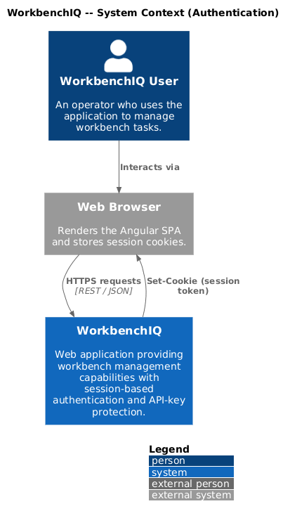
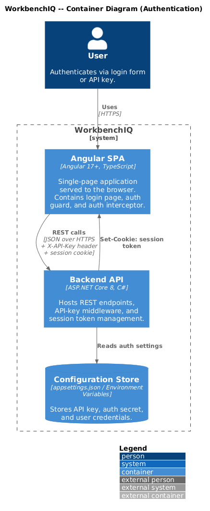
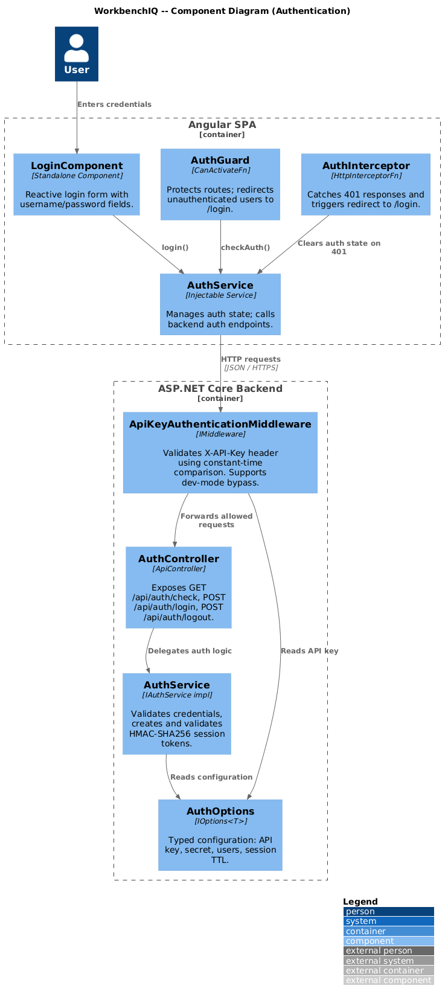
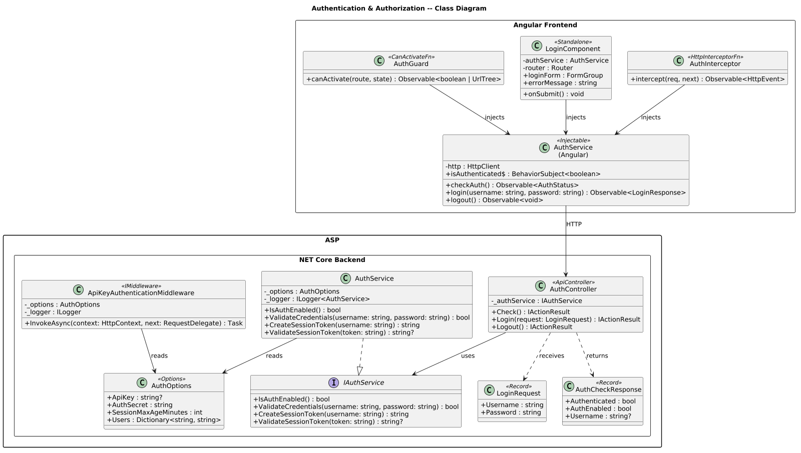
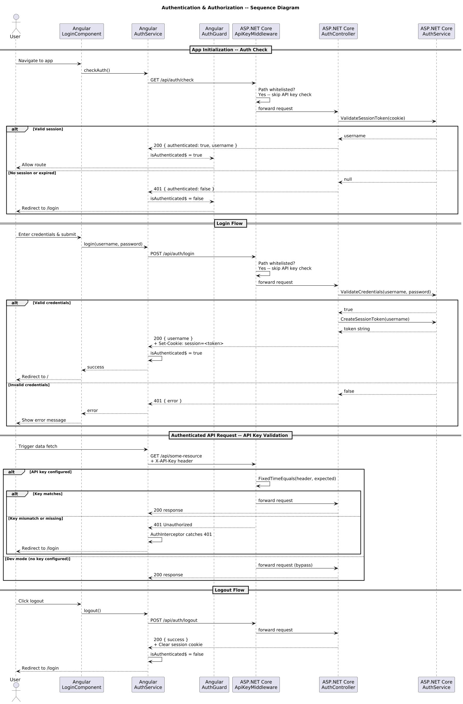

# Authentication & Authorization

## Overview

This document describes the authentication and authorization behavior for the WorkbenchIQ rewrite targeting **.NET 8 (ASP.NET Core)** on the backend and **Angular 17+** on the frontend. The design preserves the semantics of the existing Python/Next.js implementation while adopting idiomatic patterns for each new platform.

### Key behaviors carried forward

| Behavior | Current implementation | .NET / Angular design |
|---|---|---|
| API-key header authentication | `X-API-Key` validated with `hmac.compare_digest` | ASP.NET Core middleware using `CryptographicOperations.FixedTimeEquals` |
| Dev-mode bypass | No `API_KEY` env var = all requests allowed | `IsDevelopmentMode` flag in `AuthOptions`; middleware skips validation |
| Session tokens (HMAC-SHA256) | Cookie-based `session` token with 24 h TTL | Same algorithm, issued by `AuthService`, stored in `HttpOnly` cookie |
| Login / Logout endpoints | `POST /api/auth/login`, `POST /api/auth/logout` | `AuthController` with identical routes |
| Auth check endpoint | `GET /api/auth/check` | `AuthController.Check()` |
| Frontend route guard | Next.js middleware redirects to `/login` | Angular `AuthGuard` (functional `CanActivateFn`) |
| Login page | Next.js page at `/login` | Angular `LoginComponent` (standalone) |

---

## Architecture diagrams

### C4 Context



### C4 Container



### C4 Component



### Class diagram



### Sequence diagram



---

## Backend components (.NET 8 / ASP.NET Core)

### AuthOptions

Configuration POCO bound from `appsettings.json` section `"Auth"`.

| Property | Type | Description |
|---|---|---|
| `ApiKey` | `string?` | Expected API key. `null` = dev-mode (all requests allowed). |
| `AuthSecret` | `string` | HMAC-SHA256 secret for session tokens. |
| `SessionMaxAgeMinutes` | `int` | Token TTL (default 1440 = 24 h). |
| `Users` | `Dictionary<string, string>` | Username-to-password map (mirrors `AUTH_USER_*` env vars). |

### ApiKeyAuthenticationMiddleware

Implements `IMiddleware`. Registered early in the pipeline.

- Reads `X-API-Key` from the request header.
- If `AuthOptions.ApiKey` is null, passes the request through (dev mode).
- Otherwise performs constant-time comparison via `CryptographicOperations.FixedTimeEquals`.
- Returns `401 Unauthorized` on mismatch.
- Skips validation for paths matching `/api/auth/*` and `/health`.

### IAuthService / AuthService

Domain service behind the controller.

| Method | Returns | Description |
|---|---|---|
| `IsAuthEnabled()` | `bool` | True when at least one user is configured. |
| `ValidateCredentials(string username, string password)` | `bool` | Constant-time password comparison. |
| `CreateSessionToken(string username)` | `string` | HMAC-SHA256 token: `{hmac}.{username}.{timestamp}`. |
| `ValidateSessionToken(string token)` | `string?` | Returns username if valid and not expired; `null` otherwise. |

### AuthController

`[ApiController]` at route `api/auth`.

| Endpoint | Method | Description |
|---|---|---|
| `/api/auth/check` | `GET` | Returns `{ authenticated, authEnabled, username? }`. Reads `session` cookie. |
| `/api/auth/login` | `POST` | Accepts `{ username, password }`. Sets `HttpOnly` session cookie on success. |
| `/api/auth/logout` | `POST` | Clears the session cookie. |

---

## Frontend components (Angular 17+)

### AuthService (Angular)

Injectable service in `core/services/auth.service.ts`.

| Method | Returns | Description |
|---|---|---|
| `checkAuth()` | `Observable<AuthStatus>` | Calls `GET /api/auth/check`. |
| `login(username, password)` | `Observable<LoginResponse>` | Calls `POST /api/auth/login`. |
| `logout()` | `Observable<void>` | Calls `POST /api/auth/logout`. |
| `isAuthenticated$` | `BehaviorSubject<boolean>` | Reactive auth state for components. |

### AuthGuard

Functional `CanActivateFn` guard in `core/guards/auth.guard.ts`.

- Calls `AuthService.checkAuth()`.
- If not authenticated, redirects to `/login` via `Router.createUrlTree`.
- Registered on the root route in `app.routes.ts`.

### LoginComponent

Standalone component at route `/login`.

- Reactive form with `username` and `password` controls.
- Calls `AuthService.login()` on submit.
- Displays inline error messages on 401.
- Redirects to `/` on success.

### AuthInterceptor

`HttpInterceptorFn` in `core/interceptors/auth.interceptor.ts`.

- Catches `401` responses globally.
- Redirects to `/login` and clears local auth state.

---

## Configuration

### appsettings.json (excerpt)

```json
{
  "Auth": {
    "ApiKey": null,
    "AuthSecret": "change-me-in-production",
    "SessionMaxAgeMinutes": 1440,
    "Users": {
      "admin": "secret"
    }
  }
}
```

### Environment variable mapping

| Env var | Maps to |
|---|---|
| `AUTH__ApiKey` | `AuthOptions.ApiKey` |
| `AUTH__AuthSecret` | `AuthOptions.AuthSecret` |
| `AUTH__Users__admin` | `AuthOptions.Users["admin"]` |

ASP.NET Core's configuration system binds `__` delimiters to nested keys automatically.

---

## Security considerations

1. **Constant-time comparison** -- Both API key and session HMAC are compared using `CryptographicOperations.FixedTimeEquals` to prevent timing side-channels.
2. **HttpOnly / Secure cookies** -- Session cookies are `HttpOnly`, `Secure` (in production), and `SameSite=Lax`.
3. **Minimum key length** -- API key must be at least 32 characters.
4. **Token expiration** -- Session tokens embed a UTC timestamp and are rejected after `SessionMaxAgeMinutes`.
5. **Dev-mode bypass** -- When no API key or users are configured, authentication is disabled for local development convenience. This must never be used in production.
