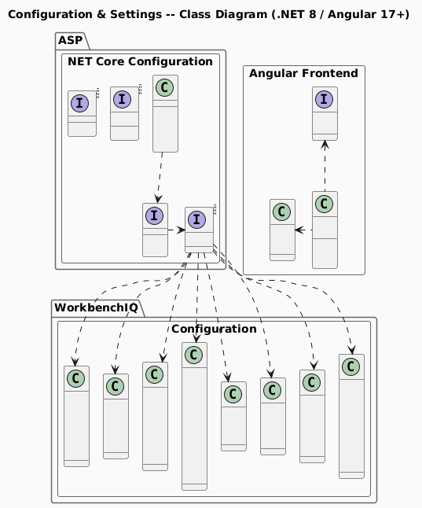
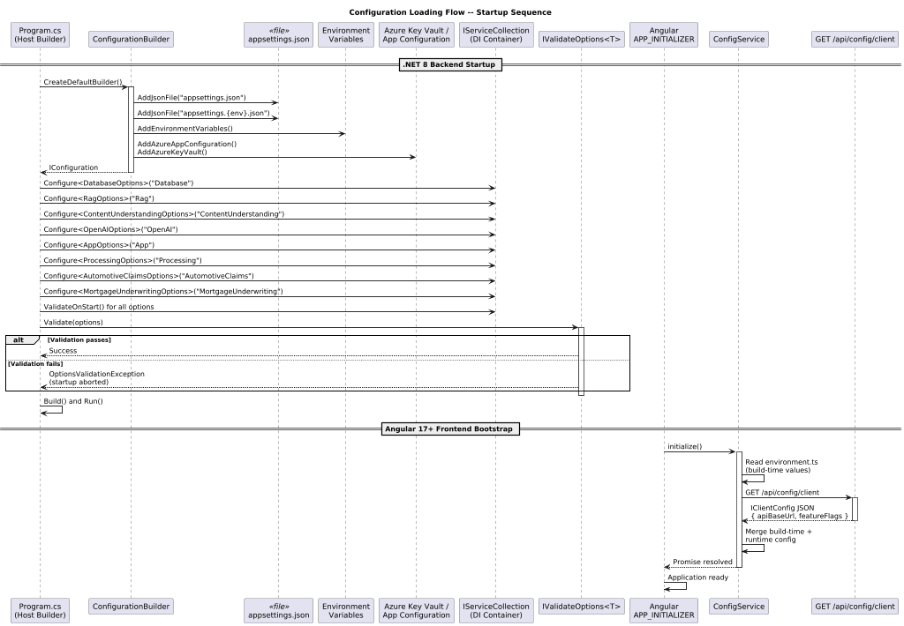
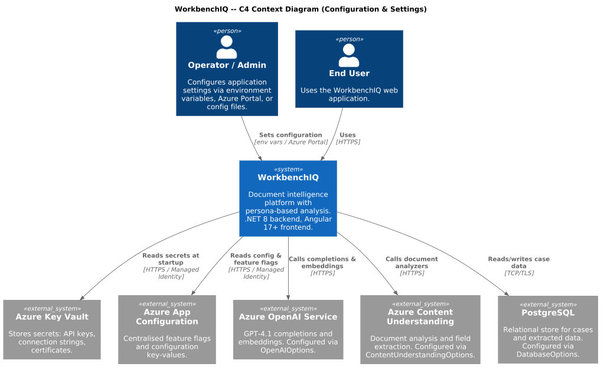
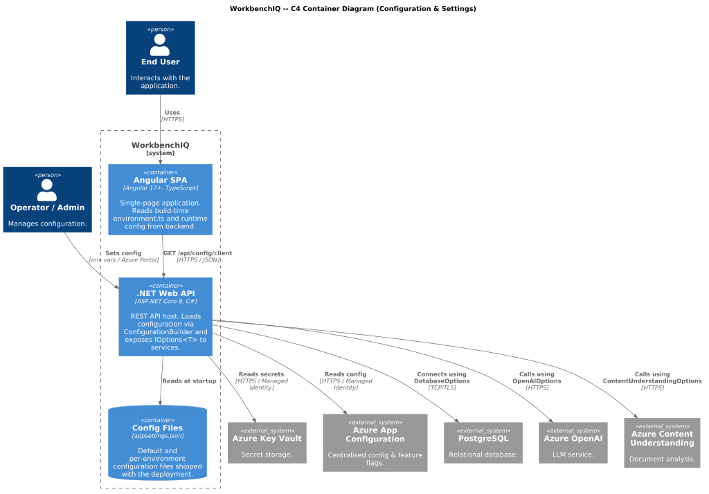
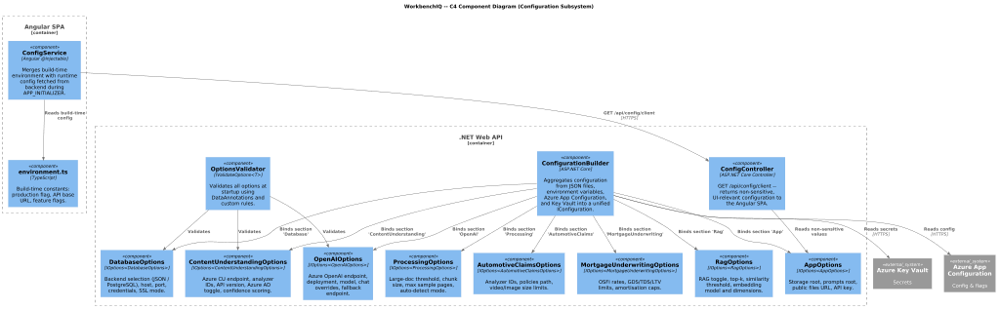

# Configuration & Settings

## Overview

This document describes the **Configuration & Settings** behavior for the
WorkbenchIQ rewrite targeting **.NET 8** (backend) and **Angular 17+**
(frontend). The design replaces the current Python `dataclass`-based settings
loaded via `python-dotenv` with the idiomatic ASP.NET Core **Options pattern**
(`IOptions<T>` / `IOptionsSnapshot<T>`) on the backend and Angular
**environment files** plus a `ConfigService` on the frontend.

All configuration values originate from the same sources they do today
(environment variables, `.env` files, Azure App Configuration, Key Vault) but
are bound through the .NET configuration pipeline
(`IConfiguration` / `ConfigurationBuilder`) so that every service receives
strongly-typed, validated option objects via dependency injection.

---

## Diagrams

| Diagram | Description |
|---------|-------------|
|  | Options classes, Angular config service, and their relationships |
|  | Startup configuration loading flow for both .NET and Angular |
|  | System context -- WorkbenchIQ and external actors |
|  | Container-level view of backend, frontend, and infrastructure |
|  | Component-level view inside the Configuration subsystem |

---

## Backend (.NET 8) Components

### Options Classes

Each Python `dataclass` maps to a C# **POCO** registered through the Options
pattern. The table below summarises the mapping:

| Python Class | .NET Options Class | Config Section | Purpose |
|--------------|--------------------|----------------|---------|
| `DatabaseSettings` | `DatabaseOptions` | `Database` | Storage backend selection (JSON / PostgreSQL), connection string parts |
| `RAGSettings` | `RagOptions` | `Rag` | RAG toggle, top-k, similarity threshold, embedding model |
| `ContentUnderstandingSettings` | `ContentUnderstandingOptions` | `ContentUnderstanding` | Azure CU endpoint, analyzer IDs, API version, Azure AD toggle |
| `OpenAISettings` | `OpenAIOptions` | `OpenAI` | Azure OpenAI endpoint, deployment, fallback, chat-specific overrides |
| `AppSettings` | `AppOptions` | `App` | Storage root, prompts root, public file URL, API key |
| `ProcessingSettings` | `ProcessingOptions` | `Processing` | Large-doc thresholds, chunk sizes, auto-detect mode |
| `AutomotiveClaimsSettings` | `AutomotiveClaimsOptions` | `AutomotiveClaims` | Persona: analyzer IDs, policies path, media limits |
| `MortgageUnderwritingSettings` | `MortgageUnderwritingOptions` | `MortgageUnderwriting` | Persona: OSFI rates, GDS/TDS/LTV limits, amortisation caps |

### Registration Pattern

```csharp
// Program.cs
builder.Services
    .AddOptionsWithValidation<DatabaseOptions>("Database")
    .AddOptionsWithValidation<RagOptions>("Rag")
    .AddOptionsWithValidation<ContentUnderstandingOptions>("ContentUnderstanding")
    .AddOptionsWithValidation<OpenAIOptions>("OpenAI")
    .AddOptionsWithValidation<AppOptions>("App")
    .AddOptionsWithValidation<ProcessingOptions>("Processing")
    .AddOptionsWithValidation<AutomotiveClaimsOptions>("AutomotiveClaims")
    .AddOptionsWithValidation<MortgageUnderwritingOptions>("MortgageUnderwriting");
```

Each options class implements `IValidateOptions<T>` so that missing or invalid
values surface immediately at startup rather than at first use.

### Configuration Sources (priority, lowest to highest)

1. `appsettings.json` -- defaults checked into source control
2. `appsettings.{Environment}.json` -- per-environment overrides
3. Environment variables (flat `SECTION__KEY` convention)
4. Azure App Configuration / Key Vault (production)
5. User Secrets (local development)

---

## Frontend (Angular 17+) Components

### `environment.ts` / `environment.prod.ts`

Static, build-time configuration (API base URL, feature flags). Replaced at
deploy time via token substitution in the CI pipeline.

### `ConfigService`

An injectable Angular service (`@Injectable({ providedIn: 'root' })`) that:

1. Reads values from the `environment` object.
2. Optionally fetches runtime configuration from the backend
   `GET /api/config/client` endpoint during `APP_INITIALIZER`.
3. Exposes typed accessors (`apiBaseUrl`, `featureFlags`, etc.) consumed by
   other services and components.

---

## Validation

| Layer | Mechanism |
|-------|-----------|
| .NET Options | `IValidateOptions<T>` + `DataAnnotations` (`[Required]`, `[Range]`, `[Url]`) |
| .NET Startup | `ValidateOnStart()` -- fails fast before the host begins accepting requests |
| Angular | `ConfigService` guards in `APP_INITIALIZER`; runtime checks before first HTTP call |

---

## Security Considerations

* Secrets (API keys, connection-string passwords) are **never** stored in
  `appsettings.json`. Use Azure Key Vault references or environment variables.
* The Angular `ConfigService` only receives non-sensitive, UI-relevant settings
  from the backend `/api/config/client` endpoint.
* `IOptionsSnapshot<T>` is preferred over `IOptions<T>` for scoped services so
  that configuration hot-reload works without restarting the process.
