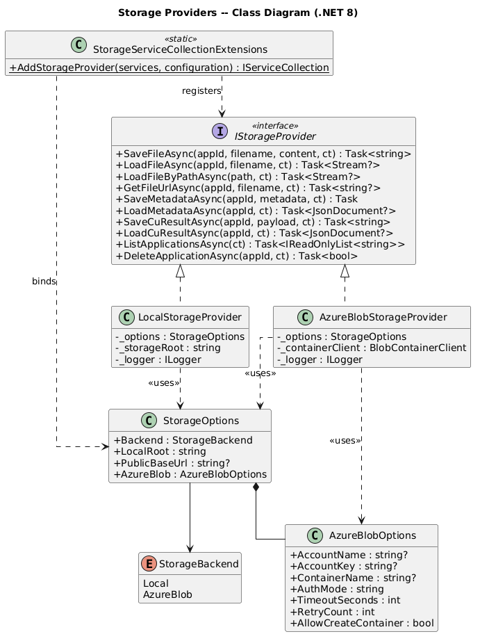
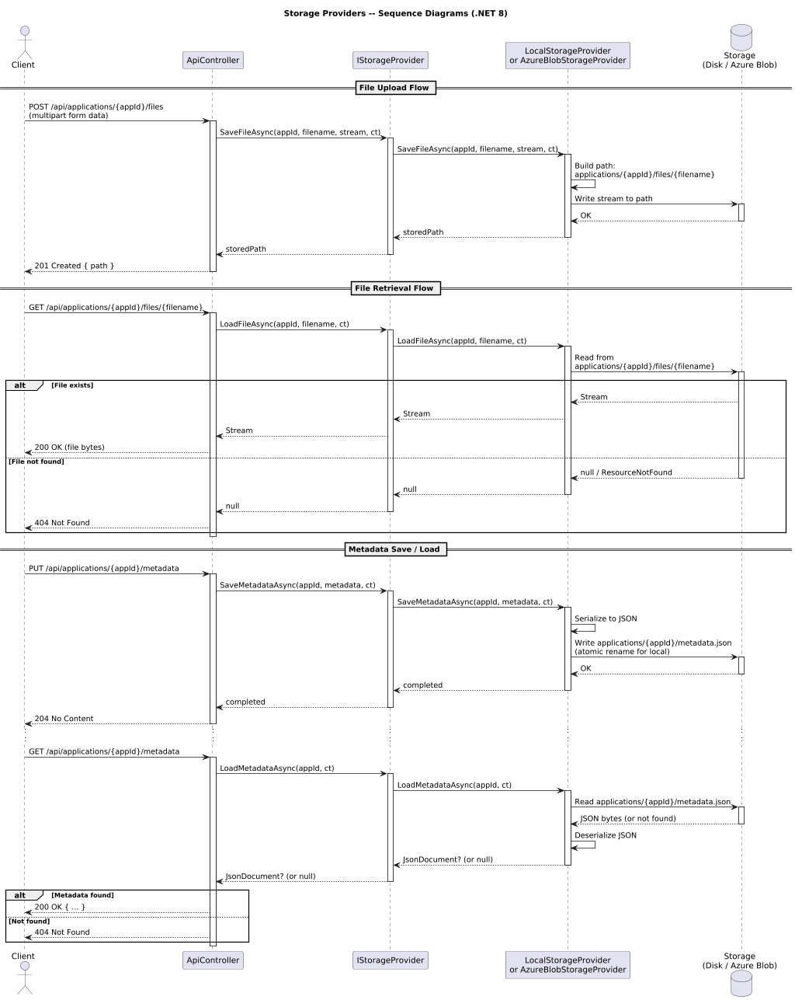
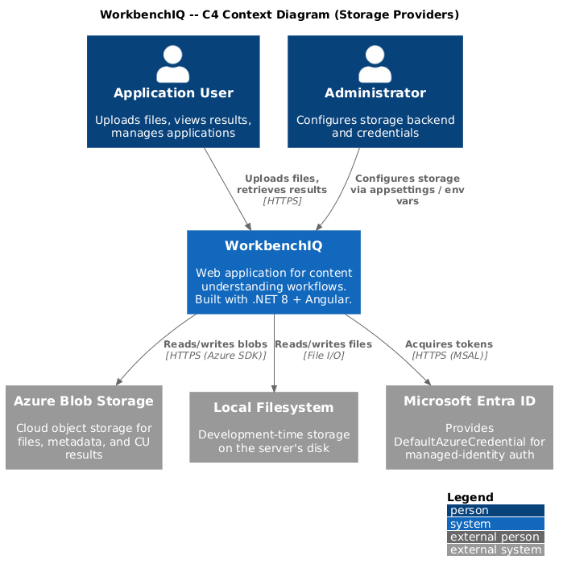
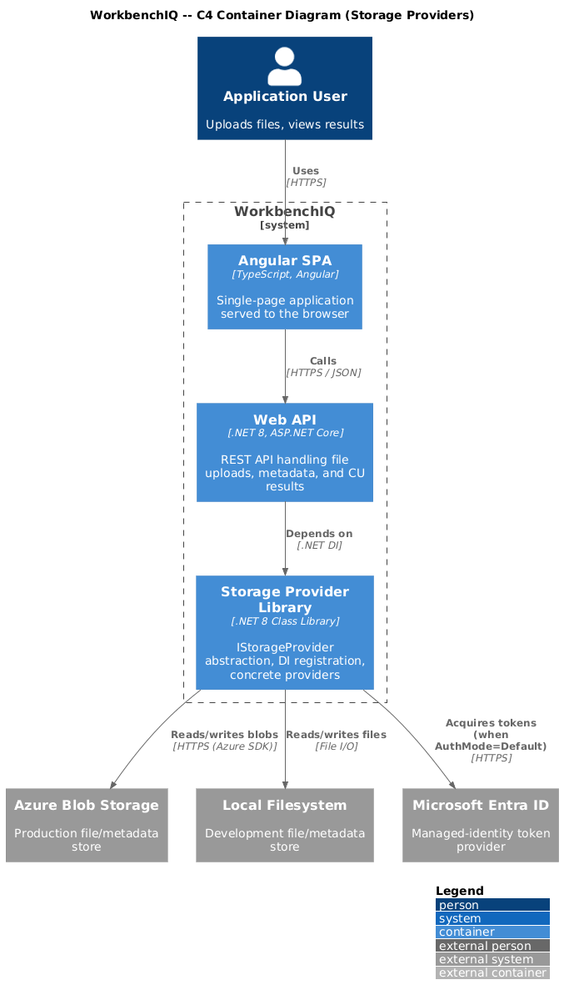
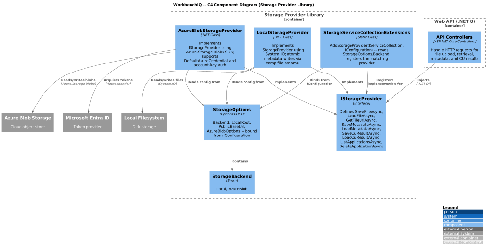

# Storage Providers -- Design Document

This document describes the **Storage Providers** subsystem for the .NET 8 + Angular rewrite of WorkbenchIQ. Storage Providers give the application a pluggable abstraction over file and metadata persistence, allowing the same API surface to target local disk during development and Azure Blob Storage in production.

## Current Python Implementation (Reference)

| Python Module | Responsibility |
|---|---|
| `app/storage_providers/base.py` | `StorageProvider` Protocol, `StorageBackend` enum, `StorageSettings` dataclass |
| `app/storage_providers/local.py` | Local filesystem provider (nested directory layout, atomic metadata writes) |
| `app/storage_providers/azure_blob.py` | Azure Blob Storage provider (retries, timeouts, DefaultAzureCredential / account-key auth, optional container auto-creation) |
| `app/storage_providers/__init__.py` | `StorageSettings.from_env()`, `init_storage_provider()`, `get_storage_provider()` singleton factory |

## .NET 8 Target Design

### Key Decisions

1. **Interface over Protocol** -- The Python `Protocol` becomes `IStorageProvider`, registered in the DI container as a scoped or singleton service.
2. **Options pattern** -- `StorageSettings.from_env()` is replaced by `StorageOptions` bound to `IConfiguration` (appsettings / env vars) via `IOptions<StorageOptions>`.
3. **DI registration** -- An `IServiceCollection.AddStorageProvider()` extension method reads `StorageOptions.Backend` and registers the correct concrete type.
4. **Async by default** -- All I/O methods return `Task<T>` or `ValueTask<T>`. `CancellationToken` is threaded through every call.
5. **`Stream` over `byte[]`** -- File payloads use `Stream` to avoid large-object-heap pressure on big files.

### Components

| .NET Type | Namespace | Role |
|---|---|---|
| `IStorageProvider` | `WorkbenchIQ.Storage` | Interface defining all storage operations |
| `LocalStorageProvider` | `WorkbenchIQ.Storage.Local` | Filesystem implementation (`{root}/applications/{appId}/...`) |
| `AzureBlobStorageProvider` | `WorkbenchIQ.Storage.AzureBlob` | Azure Blob implementation with `Azure.Storage.Blobs` SDK |
| `StorageBackend` | `WorkbenchIQ.Storage` | Enum: `Local`, `AzureBlob` |
| `StorageOptions` | `WorkbenchIQ.Storage` | POCO bound from configuration section `"Storage"` |
| `StorageServiceCollectionExtensions` | `WorkbenchIQ.Storage.DependencyInjection` | `AddStorageProvider(IConfiguration)` extension |

### Directory Layout (on disk / in blob container)

```
{root}/
  applications/
    {appId}/
      files/
        {filename}
      metadata.json
      content_understanding.json
```

This layout is identical for both providers, matching the current Python implementation.

### Authentication (Azure)

| Mode | Config Value | Credential |
|---|---|---|
| Default | `AzureBlob:AuthMode = "Default"` | `DefaultAzureCredential` (managed identity, Azure CLI, etc.) |
| Key | `AzureBlob:AuthMode = "Key"` | `AzureBlob:AccountName` + `AzureBlob:AccountKey` |

Container auto-creation is gated by `AzureBlob:AllowCreateContainer` (default `false`) to follow the principle of least privilege.

### Resilience

`AzureBlobStorageProvider` configures `BlobClientOptions.Retry` with exponential backoff. Timeout is set via `AzureBlob:TimeoutSeconds` (default 30). The local provider uses atomic write-then-rename for metadata to prevent corruption.

## Diagrams

### Class Diagram



Source: [class-diagram.puml](class-diagram.puml)

### Sequence Diagram -- File Upload, Retrieval, and Metadata Flows



Source: [sequence-diagram.puml](sequence-diagram.puml)

### C4 Context Diagram



Source: [c4-context.puml](c4-context.puml)

### C4 Container Diagram



Source: [c4-container.puml](c4-container.puml)

### C4 Component Diagram



Source: [c4-component.puml](c4-component.puml)

## Configuration Example (appsettings.json)

```json
{
  "Storage": {
    "Backend": "AzureBlob",
    "LocalRoot": "data",
    "PublicBaseUrl": null,
    "AzureBlob": {
      "AccountName": "myaccount",
      "AccountKey": null,
      "ContainerName": "workbenchiq",
      "AuthMode": "Default",
      "TimeoutSeconds": 30,
      "RetryCount": 3,
      "AllowCreateContainer": false
    }
  }
}
```

## DI Registration (Program.cs)

```csharp
builder.Services.AddStorageProvider(builder.Configuration);
```

This single call reads `Storage:Backend`, binds `StorageOptions`, and registers the matching `IStorageProvider` implementation as a singleton.
