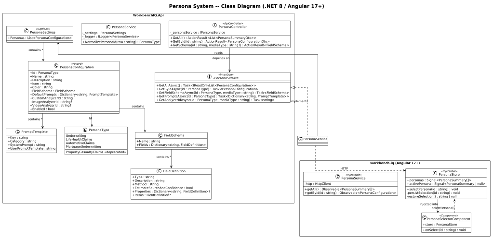
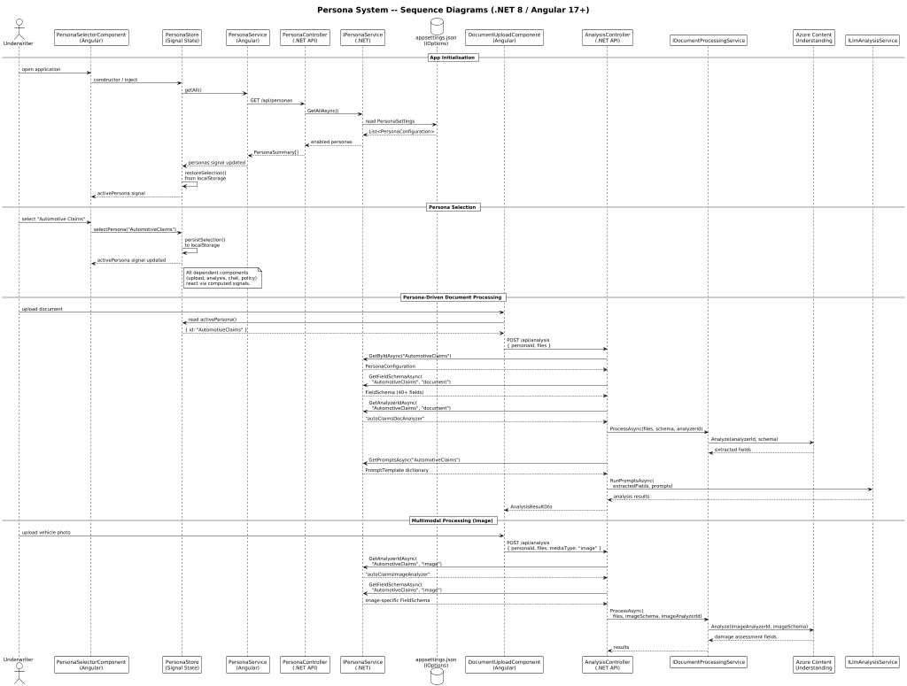

# 04 - Persona System

## Overview

The Persona System is the central configuration axis in WorkbenchIQ. A **persona** represents an insurance vertical (e.g., Life Underwriting, Automotive Claims, Mortgage Underwriting) and drives every downstream behaviour: which Azure Content Understanding analyzer is called, which field-extraction schema is sent, which LLM prompt templates are executed, which policy documents are loaded for RAG, and how the UI is themed.

In the .NET 8 + Angular 17+ rewrite the persona concept is modelled as a strongly-typed configuration subsystem backed by `IOptions<T>` on the server and signal-based state on the client.

---

## Architecture Diagrams

| Diagram | File | Description |
|---------|------|-------------|
| C4 Context | [c4-context.puml](c4-context.puml) | System-level context showing WorkbenchIQ and external actors |
| C4 Container | [c4-container.puml](c4-container.puml) | Container-level view: API, SPA, database, Azure services |
| C4 Component | [c4-component.puml](c4-component.puml) | Component-level breakdown of persona-related .NET and Angular components |
| Class Diagram | [class-diagram.puml](class-diagram.puml) | Domain model: `PersonaConfiguration`, `IPersonaService`, `PersonaType` enum, Angular services |
| Sequence Diagram | [sequence-diagram.puml](sequence-diagram.puml) | Runtime flows: persona selection, persona-driven document processing |





---

## Component Descriptions

### Backend (.NET 8)

#### PersonaType Enum

Strongly-typed enumeration of all supported persona identifiers. Legacy aliases (`Claims`, `Mortgage`) are handled by `PersonaTypeConverter` during deserialization so callers can use either the canonical or legacy ID.

```
Underwriting, LifeHealthClaims, AutomotiveClaims,
MortgageUnderwriting, PropertyCasualtyClaims (deprecated)
```

#### PersonaConfiguration Record

Immutable record loaded from `appsettings.json` via `IOptions<PersonaSettings>`. Each instance contains:

| Property | Type | Purpose |
|----------|------|---------|
| `Id` | `PersonaType` | Canonical identifier |
| `Name` | `string` | Display name |
| `Description` | `string` | UI description |
| `Icon` | `string` | Icon identifier (Material Symbols name) |
| `Color` | `string` | Hex theme colour |
| `FieldSchema` | `FieldSchema` | Azure CU extraction schema (30-50+ fields per persona) |
| `DefaultPrompts` | `Dictionary<string, PromptTemplate>` | Keyed LLM prompt templates |
| `CustomAnalyzerId` | `string` | Azure CU document analyzer name |
| `ImageAnalyzerId` | `string?` | Image analyzer (multimodal personas only) |
| `VideoAnalyzerId` | `string?` | Video analyzer (multimodal personas only) |
| `Enabled` | `bool` | Feature-flag for gradual rollout |

#### IPersonaService / PersonaService

Application-layer service responsible for:

- Resolving a persona by ID (with legacy-alias normalisation).
- Returning the list of enabled personas for the frontend.
- Providing the correct `FieldSchema` for a given persona and media type.
- Providing prompt templates and analyzer IDs to downstream processing services.

#### PersonaController

Thin ASP.NET Core controller exposing REST endpoints:

| Endpoint | Verb | Returns |
|----------|------|---------|
| `/api/personas` | GET | List of enabled personas (id, name, icon, colour) |
| `/api/personas/{id}` | GET | Full `PersonaConfiguration` for a single persona |
| `/api/personas/{id}/schema` | GET | `FieldSchema` with optional `?mediaType=image` query |

### Frontend (Angular 17+)

#### PersonaService (Angular)

Injectable service that calls the `/api/personas` endpoints and caches the result. Exposes typed observables / signals for the rest of the application.

#### PersonaStore (Signal-based State)

Lightweight state container using Angular signals:

- `personas` -- all enabled personas loaded at app init.
- `activePersona` -- currently selected persona, persisted to `localStorage`.
- `selectPersona(id)` -- sets the active persona and emits to dependents.

Components that depend on the persona (document upload, analysis pipeline, chat, policy viewer) read `activePersona()` and reactively reconfigure.

#### PersonaSelectorComponent

Dropdown / segmented control rendered in the top navigation bar. Displays each persona's icon, name, and theme colour. On selection change it calls `PersonaStore.selectPersona()`, which cascades through the entire application.

---

## Persona Catalogue

| Persona | Analyzer ID | Theme | Fields | Multimodal |
|---------|------------|-------|--------|------------|
| Underwriting | `underwritingAnalyzer` | Indigo `#6366f1` | 50+ | No |
| Life & Health Claims | `lifeHealthClaimsAnalyzer` | Cyan `#0891b2` | 30+ | No |
| Automotive Claims | `autoClaimsDocAnalyzer` | Red `#dc2626` | 40+ | Yes (image + video) |
| Mortgage Underwriting | `mortgageDocAnalyzer` | Emerald `#059669` | 35+ | No |

---

## How Persona Flows Through the System

1. **User selects persona** in the Angular top nav (`PersonaSelectorComponent`).
2. **Angular `PersonaStore`** updates `activePersona` signal; all dependent components react.
3. **API calls include persona** -- every request to the .NET backend carries `personaId` as a route segment or query parameter.
4. **`PersonaService` resolves config** -- the backend maps the ID to a `PersonaConfiguration` record, normalising legacy aliases.
5. **Document processing** uses `FieldSchema` and `CustomAnalyzerId` to call the correct Azure Content Understanding analyzer with the correct extraction schema.
6. **LLM analysis** selects the matching `PromptTemplate` set from `DefaultPrompts` to run persona-specific summarisation, risk assessment, and compliance checks.
7. **Policy / RAG lookup** filters the vector index by persona, ensuring only relevant policy documents are returned.
8. **UI theming** -- the active persona's `Color` is applied as a CSS custom property, colouring headers, accents, and status indicators.

---

## Configuration (appsettings.json)

```jsonc
{
  "PersonaSettings": {
    "Personas": [
      {
        "Id": "Underwriting",
        "Name": "Underwriting",
        "Description": "Life insurance underwriting workbench...",
        "Icon": "assignment",
        "Color": "#6366f1",
        "CustomAnalyzerId": "underwritingAnalyzer",
        "Enabled": true,
        "FieldSchema": { /* ... */ },
        "DefaultPrompts": { /* ... */ }
      }
    ]
  }
}
```

Personas are bound via `IOptions<PersonaSettings>` and validated at startup with `IValidateOptions<PersonaSettings>`.
