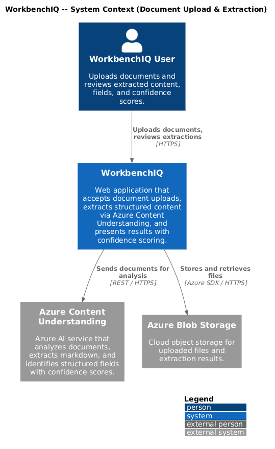
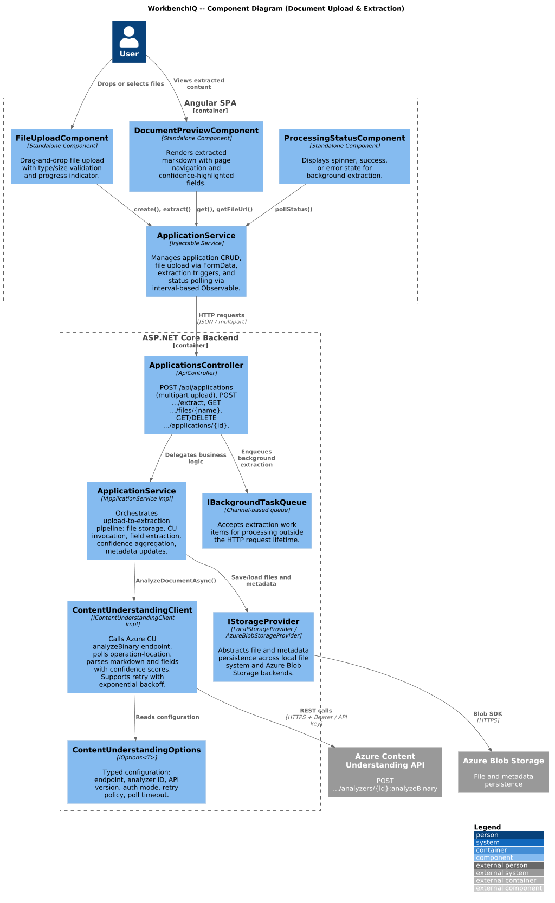
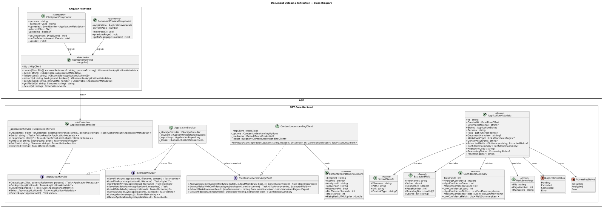
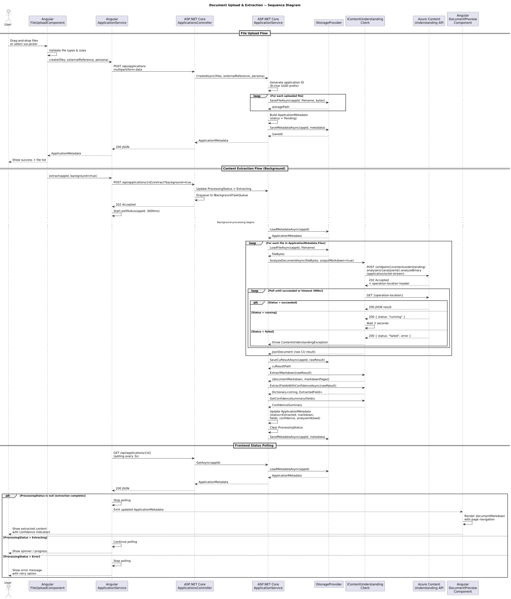

# Document Upload & Extraction

## Overview

This document describes the document upload and extraction behavior for the WorkbenchIQ rewrite targeting **.NET 8 (ASP.NET Core)** on the backend and **Angular 17+** on the frontend. The design preserves the semantics of the existing Python/Next.js implementation while adopting idiomatic patterns for each new platform.

### Key behaviors carried forward

| Behavior | Current implementation | .NET / Angular design |
|---|---|---|
| Multipart file upload | `POST /api/applications` with `UploadFile` list | `ApplicationsController.Create()` accepting `IFormFileCollection` |
| Storage abstraction | `StorageProvider` protocol with local and Azure Blob backends | `IStorageProvider` interface with `LocalStorageProvider` and `AzureBlobStorageProvider` |
| Content extraction | `content_understanding_client.analyze_document()` calling Azure CU REST API | `IContentUnderstandingClient.AnalyzeDocumentAsync()` with `HttpClient` |
| Confidence scoring | `extract_fields_with_confidence()` and `get_confidence_summary()` | `IContentUnderstandingClient.ExtractFieldsWithConfidenceAsync()` returning typed models |
| Long-running poll | `poll_result()` polling `operation-location` header | `ContentUnderstandingClient.PollResultAsync()` with `CancellationToken` support |
| Metadata persistence | `ApplicationMetadata` dataclass saved as JSON via `StorageProvider` | `ApplicationMetadata` record persisted via `IApplicationRepository` |
| Background extraction | `asyncio.to_thread(run_content_understanding_for_files)` | `IApplicationService.ExtractAsync()` dispatched to background via `IBackgroundTaskQueue` |
| File drag-and-drop | Next.js component with `FormData` POST | Angular `FileUploadComponent` with `HttpClient` multipart POST |
| Document preview | Markdown rendering + page navigation | Angular `DocumentPreviewComponent` with markdown pipe and page selector |
| Processing status polling | Frontend polls `GET /api/applications/{id}` | Angular `ApplicationService.pollStatus()` with `interval()` + `switchMap()` |

---

## Architecture diagrams

### C4 Context



### C4 Container


### C4 Component



### Class diagram



### Sequence diagram



---

## Backend components (.NET 8 / ASP.NET Core)

### ApplicationsController

ASP.NET Core `ApiController` exposing document upload and extraction endpoints.

| Endpoint | Method | Description |
|---|---|---|
| `/api/applications` | `POST` | Accepts multipart form data (files + optional `externalReference` and `persona` fields). Creates an `ApplicationMetadata` record and stores files via `IStorageProvider`. Returns the created metadata as JSON. |
| `/api/applications/{id}` | `GET` | Returns full `ApplicationMetadata` including extraction results, confidence summary, and processing status. Used by the frontend for polling. |
| `/api/applications/{id}/extract` | `POST` | Triggers Content Understanding extraction. Supports `?background=true` to dispatch via `IBackgroundTaskQueue` and return `202 Accepted`. |
| `/api/applications/{id}/files/{filename}` | `GET` | Serves an uploaded file from storage for frontend preview. |
| `/api/applications` | `GET` | Lists applications with optional `?persona=` filter. Returns lightweight `ApplicationListItem` DTOs. |
| `/api/applications/{id}` | `DELETE` | Deletes an application and all associated files from storage. |

### IApplicationService / ApplicationService

Orchestrates the upload-to-extraction pipeline.

| Method | Description |
|---|---|
| `CreateAsync(files, externalReference, persona)` | Generates an application ID, delegates file storage to `IStorageProvider`, creates `ApplicationMetadata` via `IApplicationRepository`, and returns the metadata. |
| `ExtractAsync(applicationId)` | Loads metadata, iterates stored files, calls `IContentUnderstandingClient.AnalyzeDocumentAsync()` for each, aggregates markdown and extracted fields, computes `ConfidenceSummary`, saves CU raw results, and updates metadata status to `extracted`. |
| `GetAsync(applicationId)` | Returns `ApplicationMetadata` by ID. |
| `ListAsync(persona?)` | Returns filtered, sorted list of `ApplicationListItem`. |
| `DeleteAsync(applicationId)` | Removes application and files from storage and repository. |

### IContentUnderstandingClient / ContentUnderstandingClient

Encapsulates all communication with the Azure Content Understanding REST API.

| Method | Description |
|---|---|
| `AnalyzeDocumentAsync(fileBytes, outputMarkdown, cancellationToken)` | Sends `POST {endpoint}/contentunderstanding/analyzers/{analyzerId}:analyzeBinary`, polls the `operation-location` header until completion, and returns the raw JSON result. Supports retry with exponential backoff. |
| `ExtractFieldsWithConfidenceAsync(rawResult)` | Parses the CU raw result and returns a dictionary of `ExtractedField` objects with confidence scores, page numbers, bounding boxes, and source text grounding. |
| `ExtractMarkdown(rawResult)` | Extracts the `documentMarkdown` string and per-page `MarkdownPage` list from the raw CU result. |
| `GetConfidenceSummary(fields)` | Aggregates extracted fields into a `ConfidenceSummary` with counts and lists for high/medium/low confidence tiers. |

Authentication is resolved via `ContentUnderstandingOptions`:
- **Azure AD (default):** Uses `DefaultAzureCredential` from `Azure.Identity` to obtain a bearer token for the Cognitive Services scope.
- **Subscription key:** Falls back to `Ocp-Apim-Subscription-Key` header when configured for APIM-based endpoints.

### IStorageProvider

Abstraction over file and metadata persistence, mirroring the Python `StorageProvider` protocol.

| Method | Description |
|---|---|
| `SaveFileAsync(applicationId, filename, content)` | Stores file bytes and returns the storage path. |
| `LoadFileAsync(applicationId, filename)` | Returns file bytes or `null`. |
| `GetFileUrlAsync(applicationId, filename)` | Returns a public/SAS URL if available, or `null`. |
| `SaveMetadataAsync(applicationId, metadata)` | Persists application metadata as JSON. |
| `LoadMetadataAsync(applicationId)` | Loads application metadata. |
| `SaveCuResultAsync(applicationId, payload)` | Stores Content Understanding raw JSON result. |
| `LoadCuResultAsync(applicationId)` | Loads Content Understanding raw JSON result. |
| `ListApplicationsAsync()` | Returns all application IDs. |
| `DeleteApplicationAsync(applicationId)` | Removes application directory/blobs. |

Implementations: `LocalStorageProvider` (file system) and `AzureBlobStorageProvider` (Azure Blob Storage with `DefaultAzureCredential` or account key).

### Data models

#### ApplicationMetadata

| Property | Type | Description |
|---|---|---|
| `Id` | `string` | 8-character UUID prefix. |
| `CreatedAt` | `DateTimeOffset` | UTC creation timestamp. |
| `ExternalReference` | `string?` | Optional external tracking ID. |
| `Status` | `ApplicationStatus` | `Pending`, `Extracted`, `Completed`, `Error`. |
| `Persona` | `string` | Persona key (e.g., `underwriting`, `life_health_claims`). |
| `Files` | `List<StoredFileInfo>` | Uploaded file metadata. |
| `DocumentMarkdown` | `string?` | Combined markdown extraction from all files. |
| `MarkdownPages` | `List<MarkdownPage>?` | Per-page markdown with file and page number. |
| `CuRawResultPath` | `string?` | Storage path to the raw CU JSON result. |
| `ExtractedFields` | `Dictionary<string, ExtractedField>?` | Fields extracted with confidence. |
| `ConfidenceSummary` | `ConfidenceSummary?` | Aggregated confidence statistics. |
| `AnalyzerIdUsed` | `string?` | CU analyzer ID used for extraction. |
| `ProcessingStatus` | `ProcessingStatus?` | `Extracting`, `Analyzing`, `Error`, or `null` (idle). |
| `ProcessingError` | `string?` | Error message if processing failed. |

#### StoredFileInfo

| Property | Type | Description |
|---|---|---|
| `Filename` | `string` | Original filename. |
| `Path` | `string` | Storage path or blob name. |
| `Url` | `string?` | Public access URL if available. |
| `ContentType` | `string?` | MIME type. |

#### ExtractedField

| Property | Type | Description |
|---|---|---|
| `FieldName` | `string` | Schema field key. |
| `Value` | `object` | Extracted value (typed at runtime). |
| `Confidence` | `double` | 0.0 -- 1.0 confidence score. |
| `PageNumber` | `int?` | Source page number. |
| `BoundingBox` | `double[]?` | Coordinates on the source page. |
| `SourceText` | `string?` | Grounding text from the document. |

#### ConfidenceSummary

| Property | Type | Description |
|---|---|---|
| `TotalFields` | `int` | Number of extracted fields. |
| `AverageConfidence` | `double` | Mean confidence across all fields. |
| `HighConfidenceCount` | `int` | Fields with confidence >= 0.8. |
| `MediumConfidenceCount` | `int` | Fields with confidence >= 0.5 and < 0.8. |
| `LowConfidenceCount` | `int` | Fields with confidence < 0.5. |
| `HighConfidenceFields` | `List<FieldSummaryItem>` | Details of high-confidence fields. |
| `MediumConfidenceFields` | `List<FieldSummaryItem>` | Details of medium-confidence fields. |
| `LowConfidenceFields` | `List<FieldSummaryItem>` | Details of low-confidence fields. |

---

## Frontend components (Angular 17+)

### ApplicationService (Angular)

Injectable service managing application API calls.

| Method | Description |
|---|---|
| `create(files: File[], externalReference?: string, persona?: string)` | Builds a `FormData` payload and sends `POST /api/applications`. Returns the created `ApplicationMetadata`. |
| `get(id: string)` | Fetches `GET /api/applications/{id}`. |
| `list(persona?: string)` | Fetches `GET /api/applications?persona=`. |
| `extract(id: string, background: boolean)` | Sends `POST /api/applications/{id}/extract?background=`. |
| `pollStatus(id: string, intervalMs: number)` | Returns an `Observable` that polls `GET /api/applications/{id}` at the given interval until `processingStatus` clears or errors. Uses `interval()` + `switchMap()` + `takeWhile()`. |
| `getFileUrl(id: string, filename: string)` | Returns the URL for `GET /api/applications/{id}/files/{filename}`. |
| `delete(id: string)` | Sends `DELETE /api/applications/{id}`. |

### FileUploadComponent

Standalone component providing drag-and-drop file upload.

| Input / Output | Type | Description |
|---|---|---|
| `@Input() persona` | `string` | Persona context for the upload. |
| `@Input() acceptedTypes` | `string` | Accepted MIME types (default: `.pdf,.docx,.doc,.txt`). |
| `@Output() uploaded` | `EventEmitter<ApplicationMetadata>` | Emits after successful creation. |

Features:
- Drag-and-drop zone with visual feedback (`dragover`, `dragleave`, `drop` events).
- Manual file picker via hidden `<input type="file" multiple>`.
- Displays file list with names and sizes before submission.
- Upload progress indicator via `HttpClient` `reportProgress` option.
- Validates file types and sizes client-side before upload.

### DocumentPreviewComponent

Standalone component for viewing extracted document content.

| Input | Type | Description |
|---|---|---|
| `@Input() application` | `ApplicationMetadata` | The application whose documents to preview. |

Features:
- Renders `documentMarkdown` using a markdown-to-HTML pipe (e.g., `marked` library).
- Page navigation when `markdownPages` are available (previous/next/page selector).
- Highlights extracted fields inline with confidence color coding (green >= 0.8, amber >= 0.5, red < 0.5).
- Loading skeleton displayed while `processingStatus === 'extracting'`.

### ProcessingStatusComponent

Inline status indicator used across multiple views.

| Input | Type | Description |
|---|---|---|
| `@Input() status` | `ProcessingStatus` | Current processing status. |
| `@Input() error` | `string?` | Error message if status is `Error`. |

Displays a spinner for `Extracting`/`Analyzing`, a checkmark for idle/complete, or an error alert with the message.

---

## Configuration

### Backend (appsettings.json)

```json
{
  "ContentUnderstanding": {
    "Endpoint": "https://<resource>.cognitiveservices.azure.com",
    "ApiKey": null,
    "AnalyzerId": "prebuilt-documentSearch",
    "ApiVersion": "2025-11-01",
    "UseAzureAd": true,
    "PollTimeoutSeconds": 900,
    "MaxRetries": 3,
    "RetryBackoffMultiplier": 1.5
  },
  "Storage": {
    "Backend": "AzureBlob",
    "LocalRoot": "data",
    "AzureAccountName": null,
    "AzureContainerName": null,
    "AzureTimeoutSeconds": 30,
    "AzureRetryTotal": 3,
    "AzureAuthMode": "Default",
    "AllowCreateContainer": false
  }
}
```

### Frontend (environment.ts)

```typescript
export const environment = {
  apiBaseUrl: '/api',
  uploadMaxFileSizeMb: 50,
  uploadAcceptedTypes: '.pdf,.docx,.doc,.txt,.rtf,.xlsx,.xls',
  statusPollIntervalMs: 3000,
};
```

---

## Error handling

| Scenario | Backend behavior | Frontend behavior |
|---|---|---|
| No files provided | 400 Bad Request | Validation message before submission |
| File too large | 413 Payload Too Large (Kestrel limit) | Client-side size check + error toast |
| Storage write failure | 500 with detail; `ProcessingStatus = Error` | Error alert with retry option |
| CU API timeout | `ContentUnderstandingException` after 900 s poll | Processing status shows "Error" with message |
| CU API 429 rate limit | Retry with exponential backoff (up to 3 attempts) | Transparent to user; shown as "Extracting" |
| CU API auth failure | 401/403 mapped to `ContentUnderstandingException` | Error status with "Configuration error" message |
| Invalid file type | 400 with detail | Client-side type validation prevents upload |
