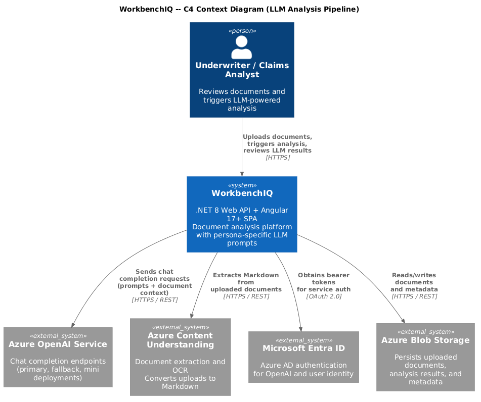
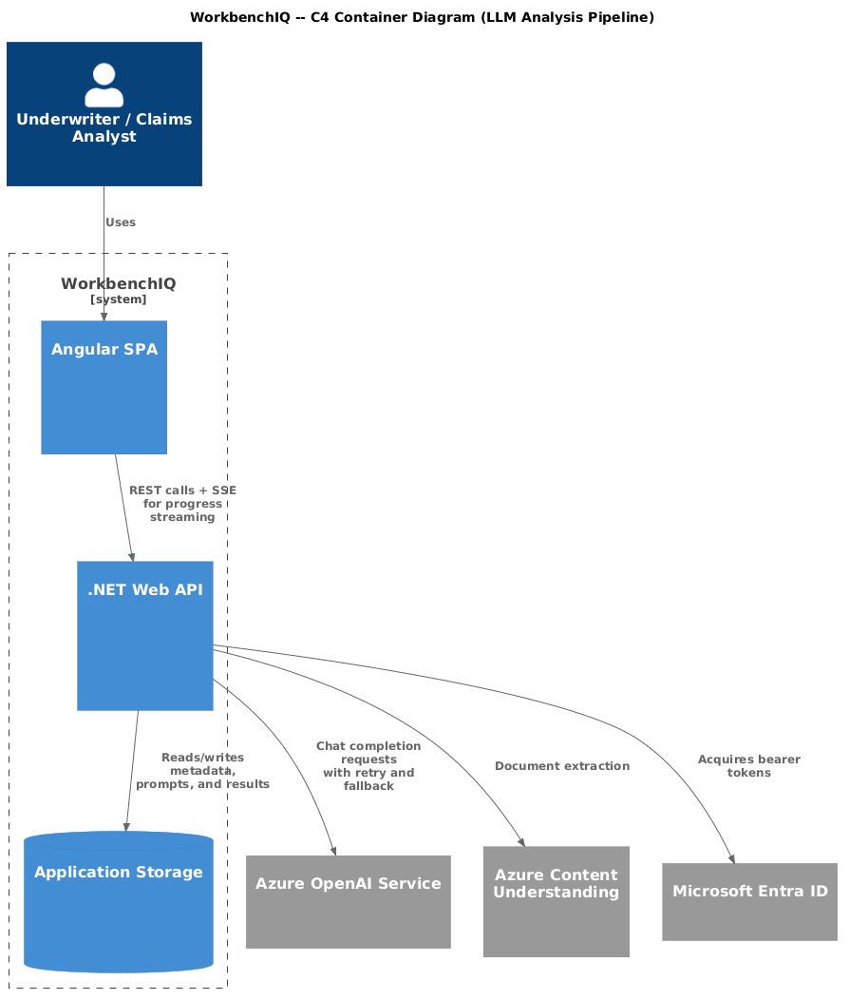
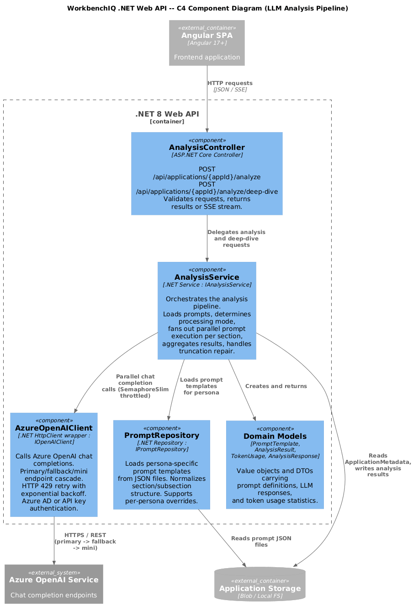
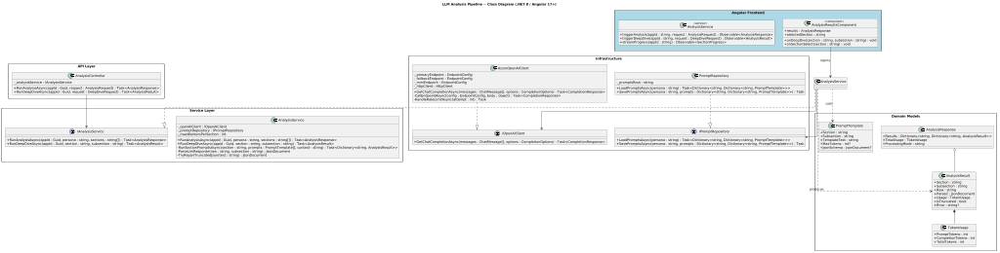
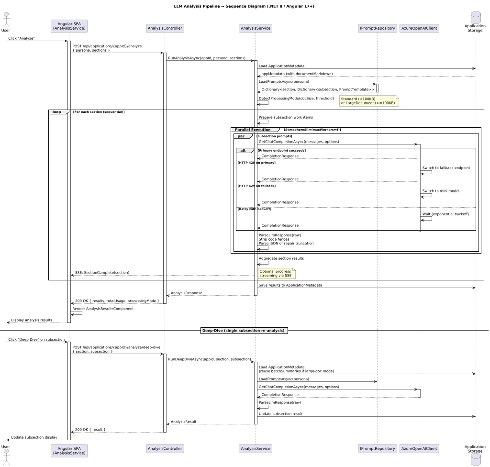

# LLM Analysis Pipeline

This document describes the design of the LLM Analysis Pipeline for the .NET 8 / Angular 17+ rewrite of WorkbenchIQ. The pipeline orchestrates persona-specific prompt execution against extracted document content, manages Azure OpenAI calls with fallback and retry logic, and aggregates structured analysis results for the frontend.

## Current Python Behavior (Reference)

The existing Python implementation works as follows:

1. **Prompt Loading** -- `load_prompts()` reads persona-specific prompt templates from JSON files organized by section and subsection (e.g., `application_summary.customer_profile`, `medical_summary.hypertension`).
2. **Analysis Orchestration** -- `run_underwriting_prompts()` iterates sections sequentially but runs subsection prompts within each section in parallel using a `ThreadPoolExecutor` with up to 4 workers.
3. **LLM Calls** -- `chat_completion()` sends requests to Azure OpenAI with primary/fallback/mini endpoint cascading on HTTP 429, exponential backoff, and configurable `max_tokens` per subsection.
4. **Result Parsing** -- Each prompt produces a `raw` LLM response, a `parsed` JSON object (with truncation repair), and `usage` token statistics. Results are stored in `ApplicationMetadata` keyed by `[section][subsection]`.
5. **Large Document Mode** -- Documents exceeding a size threshold are condensed into batch summaries before prompt execution; deep-dive subsections receive richer batch-summary context.

## .NET 8 + Angular 17+ Design

### Architecture Overview



The rewrite follows Clean Architecture principles with clearly separated layers. The backend exposes REST endpoints consumed by the Angular SPA. Azure OpenAI integration is abstracted behind interfaces to support endpoint fallback, retry policies, and unit testing.



### Component Breakdown



#### Backend (.NET 8 Web API)

| Component | Responsibility |
|---|---|
| **AnalysisController** | Exposes `POST /api/applications/{appId}/analyze` and `POST /api/applications/{appId}/analyze/deep-dive`. Validates requests, delegates to `IAnalysisService`, returns results or streams progress via SSE. |
| **IAnalysisService / AnalysisService** | Orchestrates the full analysis pipeline: loads prompts, determines processing mode (standard vs. large-document), fans out prompt execution per section, aggregates results, persists to storage. |
| **IPromptRepository / PromptRepository** | Loads and persists persona-specific prompt templates from JSON files. Normalizes the section/subsection structure. Supports per-persona overrides. |
| **IOpenAIClient / AzureOpenAIClient** | Wraps Azure OpenAI chat completion calls. Implements primary/fallback/mini endpoint cascading, HTTP 429 retry with exponential backoff, configurable timeouts scaled to `max_tokens`, and Azure AD or API key authentication. |
| **PromptTemplate** | Value object representing a single prompt: section, subsection, template text, optional JSON schema, and max-token override. |
| **AnalysisResult** | Encapsulates one prompt execution result: section, subsection, raw LLM text, parsed JSON, token usage, and error/truncation metadata. |
| **TokenUsage** | Record holding `PromptTokens`, `CompletionTokens`, and `TotalTokens`. |

#### Frontend (Angular 17+)

| Component | Responsibility |
|---|---|
| **AnalysisService** | Angular HTTP service that triggers analysis, polls or subscribes to SSE for progress, and fetches completed results. |
| **AnalysisResultsComponent** | Renders analysis output organized by section/subsection. Displays parsed JSON in structured cards, raw LLM text on demand, and token usage summaries. Supports deep-dive triggering for individual subsections. |

### Class Diagram



The class diagram shows the key types and their relationships across the backend service layer, OpenAI client, prompt repository, and Angular frontend.

### Sequence: Full Analysis Flow



The analysis flow proceeds as follows:

1. The Angular SPA sends `POST /api/applications/{appId}/analyze` to the backend.
2. `AnalysisController` validates the request and invokes `IAnalysisService.RunAnalysisAsync()`.
3. `AnalysisService` loads persona-specific prompts from `IPromptRepository` and determines the processing mode based on document size.
4. For each section, `AnalysisService` dispatches subsection prompts in parallel (up to 4 concurrent) using `Task.WhenAll` with a `SemaphoreSlim` throttle.
5. Each prompt execution calls `IOpenAIClient.GetChatCompletionAsync()`, which attempts the primary endpoint, falls back on 429, and retries with backoff.
6. Raw LLM responses are parsed to JSON (with truncation repair for max-token hits), and results are aggregated into `AnalysisResult` objects.
7. Aggregated results are persisted and returned to the controller, which responds to the client.

### Key Design Decisions

| Decision | Rationale |
|---|---|
| **Interface-based DI** | `IOpenAIClient`, `IAnalysisService`, and `IPromptRepository` enable unit testing with mocks and future provider swaps (e.g., non-Azure OpenAI). |
| **SemaphoreSlim over ThreadPool** | .NET async with `SemaphoreSlim(4)` provides bounded concurrency without thread-pool starvation, matching the Python 4-worker model. |
| **Primary/Fallback/Mini cascade** | Mirrors the existing three-tier endpoint strategy: primary deployment, fallback deployment (on 429), and mini model as tertiary fallback. |
| **Per-subsection max_tokens** | Subsections like `body_system_review` (16,000 tokens) require higher limits. Configuration is maintained in `PromptTemplate.MaxTokens` rather than hardcoded. |
| **SSE for progress** | Long-running analysis benefits from server-sent events to stream section completion status to the Angular client, replacing polling. |
| **Truncation repair** | JSON responses truncated at the token limit are repaired by closing open brackets/braces, preserving partial but usable results. |

### API Endpoints

```
POST /api/applications/{appId}/analyze
  Request:  { "persona": "underwriting", "sections": ["medical_summary"] }
  Response: { "results": { "medical_summary": { "hypertension": { ... } } }, "tokenUsage": { ... } }

POST /api/applications/{appId}/analyze/deep-dive
  Request:  { "section": "medical_summary", "subsection": "body_system_review" }
  Response: { "result": { "raw": "...", "parsed": { ... }, "usage": { ... } } }
```

### Configuration

Analysis pipeline settings map to `appsettings.json`:

```json
{
  "AzureOpenAI": {
    "Endpoint": "https://primary.openai.azure.com",
    "DeploymentName": "gpt-4o",
    "ApiVersion": "2024-12-01-preview",
    "UseAzureAd": true,
    "Fallback": {
      "Endpoint": "https://fallback.openai.azure.com",
      "DeploymentName": "gpt-4o",
      "UseAzureAd": true
    },
    "Mini": {
      "DeploymentName": "gpt-4.1-mini",
      "ModelName": "gpt-4.1-mini"
    }
  },
  "Processing": {
    "MaxWorkersPerSection": 4,
    "LargeDocThresholdKb": 100,
    "AutoDetectMode": true
  }
}
```

### Diagrams Reference

| Diagram | Source | Description |
|---|---|---|
| C4 Context | [c4-context.puml](c4-context.puml) | System context showing WorkbenchIQ and external systems |
| C4 Container | [c4-container.puml](c4-container.puml) | Container-level view of backend API, Angular SPA, and Azure services |
| C4 Component | [c4-component.puml](c4-component.puml) | Component-level view inside the .NET API container |
| Class Diagram | [class-diagram.puml](class-diagram.puml) | Key types and relationships |
| Sequence Diagram | [sequence-diagram.puml](sequence-diagram.puml) | End-to-end analysis flow |
