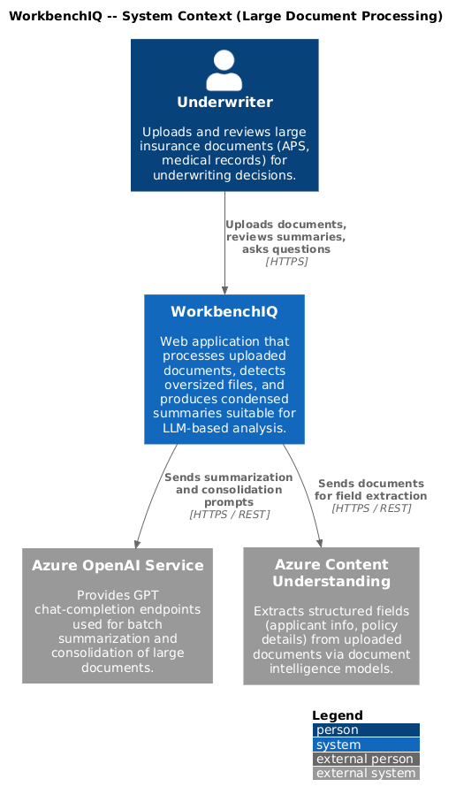
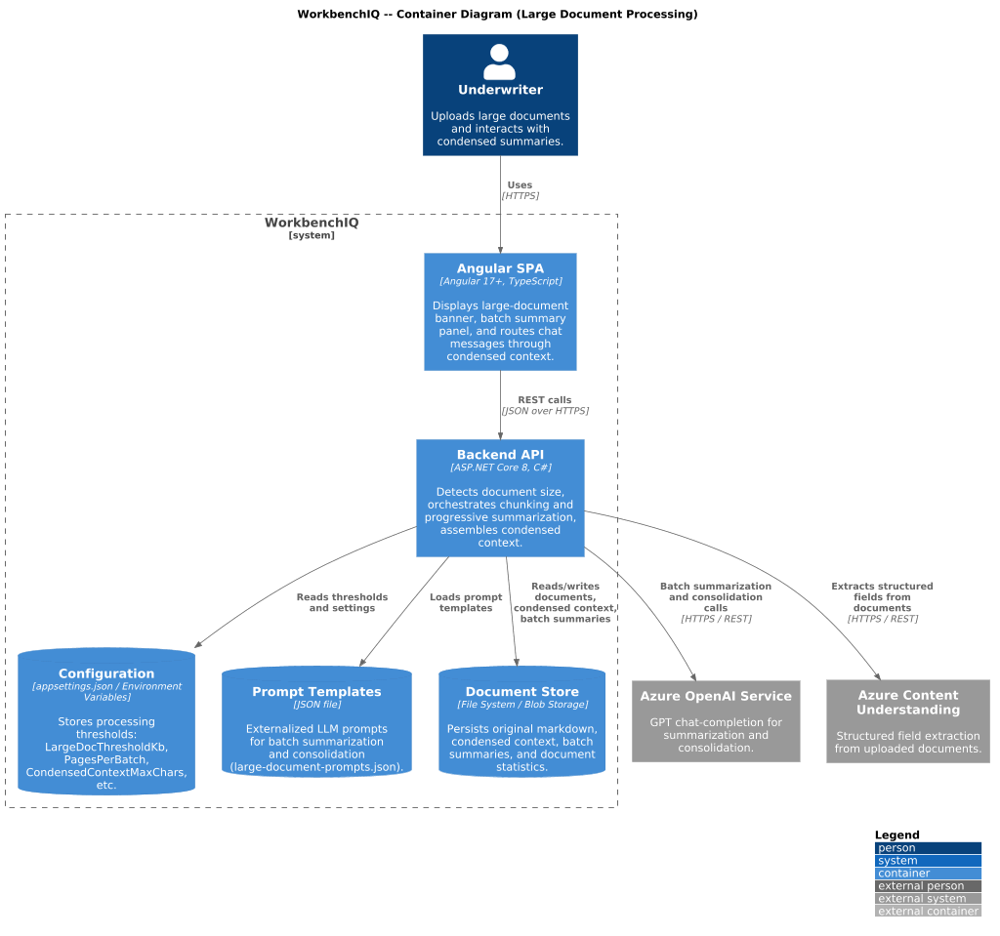
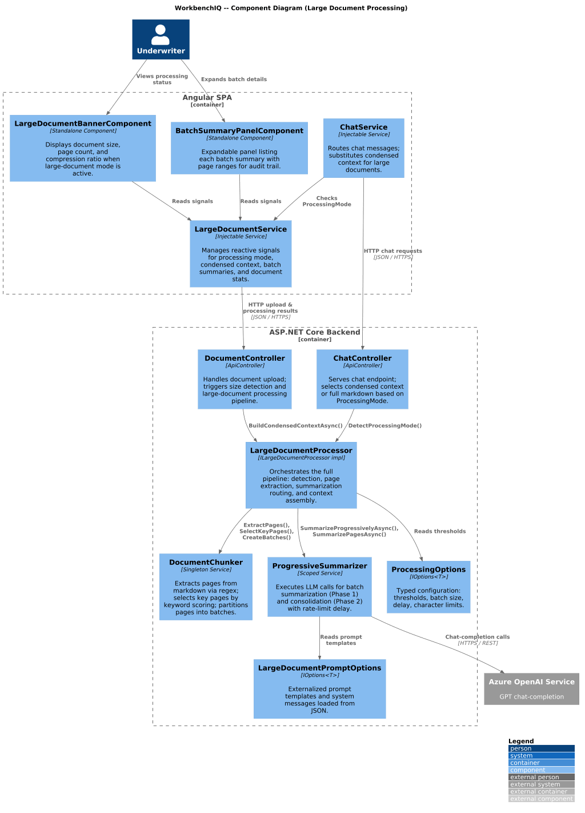
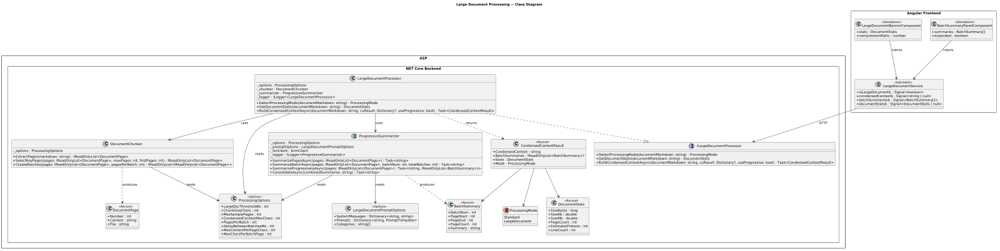
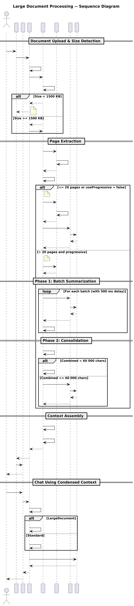

# Large Document Processing

## Overview

This document describes the large document processing behavior for the WorkbenchIQ rewrite targeting **.NET 8 (ASP.NET Core)** on the backend and **Angular 17+** on the frontend. The design preserves the semantics of the existing Python implementation while adopting idiomatic patterns for each new platform.

Documents that exceed the size threshold (default 1 500 KB) cannot be sent directly to the LLM without exceeding token limits and rate-limit quotas. The large document processor detects oversized documents, chunks them into batches, applies progressive summarization across all pages, and assembles a condensed context (~40 KB target) that retains the full scope of the original content. Chat interactions for these documents use the condensed context instead of truncated markdown.

### Key behaviors carried forward

| Behavior | Current implementation | .NET / Angular design |
|---|---|---|
| Auto-detect processing mode | `detect_processing_mode()` compares UTF-8 byte size against 1 500 KB threshold | `ILargeDocumentProcessor.DetectProcessingMode()` returns `ProcessingMode` enum |
| Page extraction from markdown | Regex-based page header parsing (`# File: ... -- Page N`) | `DocumentChunker.ExtractPages()` with the same regex patterns |
| Key-page selection | First 5 pages + keyword-scored medical/financial pages, up to 15 | `DocumentChunker.SelectKeyPages()` with identical scoring heuristic |
| Batch summarization | Sequential batches of ~20 pages with 500 ms delay | `ProgressiveSummarizer.SummarizeBatchAsync()` with configurable delay |
| Progressive summarization | Phase 1: batch summaries, Phase 2: consolidation if combined > 60 000 chars | `ProgressiveSummarizer.SummarizeProgressivelyAsync()` with same two-phase approach |
| Condensed context assembly | Combines CU extracted fields + page summaries + metadata footer | `ILargeDocumentProcessor.BuildCondensedContextAsync()` returns `CondensedContextResult` |
| Prompt externalization | `prompts/large-document-prompts.json` with template substitution | Same JSON file loaded via `IOptions<LargeDocumentPromptOptions>` |
| Chat integration | Chat uses `condensed_context` instead of full markdown for large docs | Angular `ChatService` checks `ProcessingMode`; API returns condensed context |

---

## Architecture diagrams

### C4 Context



### C4 Container



### C4 Component



### Class diagram



### Sequence diagram



---

## Backend components (.NET 8 / ASP.NET Core)

### ProcessingOptions

Configuration POCO bound from `appsettings.json` section `"LargeDocumentProcessing"`.

| Property | Type | Default | Description |
|---|---|---|---|
| `LargeDocThresholdKb` | `int` | `1500` | Size threshold in KB. Documents at or above this use large-document mode. |
| `ChunkSizeChars` | `int` | `50000` | Maximum characters per chunk when building page text for a single summarization call. |
| `MaxSamplePages` | `int` | `15` | Maximum pages selected when using the sampling (non-progressive) path. |
| `CondensedContextMaxChars` | `int` | `40000` | Target ceiling for the final condensed context string. |
| `PagesPerBatch` | `int` | `20` | Number of pages per batch during progressive summarization. |
| `DelayBetweenBatchesMs` | `int` | `500` | Milliseconds to wait between LLM calls for rate-limit protection. |
| `MaxContentPerPageChars` | `int` | `10000` | Per-page truncation limit when building summarization input. |
| `MaxCharsPerBatchPage` | `int` | `8000` | Per-page truncation limit within a batch call. |

### ProcessingMode (enum)

```csharp
public enum ProcessingMode
{
    Standard,
    LargeDocument
}
```

### DocumentStats (record)

```csharp
public record DocumentStats(
    long SizeBytes,
    double SizeKb,
    double SizeMb,
    int PageCount,
    int EstimatedTokens,
    int LineCount);
```

### BatchSummary (record)

```csharp
public record BatchSummary(
    int BatchNum,
    int PageStart,
    int PageEnd,
    int PageCount,
    string Summary);
```

### DocumentPage (record)

```csharp
public record DocumentPage(
    int Number,
    string Content,
    string File);
```

### CondensedContextResult (record)

```csharp
public record CondensedContextResult(
    string CondensedContext,
    IReadOnlyList<BatchSummary>? BatchSummaries,
    DocumentStats Stats,
    ProcessingMode Mode);
```

### ILargeDocumentProcessor / LargeDocumentProcessor

Main orchestrator registered as a scoped service.

| Method | Signature | Description |
|---|---|---|
| `DetectProcessingMode` | `ProcessingMode DetectProcessingMode(string documentMarkdown)` | Compares UTF-8 byte size against `LargeDocThresholdKb`. |
| `GetDocumentStats` | `DocumentStats GetDocumentStats(string documentMarkdown)` | Returns size, page count, estimated tokens, and line count. |
| `BuildCondensedContextAsync` | `Task<CondensedContextResult> BuildCondensedContextAsync(string documentMarkdown, Dictionary<string, object>? cuResult = null, bool useProgressive = true)` | Main entry point. Extracts pages, summarizes (progressive or sampled), combines with CU fields, returns condensed result. |

### DocumentChunker

Stateless helper for splitting and selecting pages.

| Method | Signature | Description |
|---|---|---|
| `ExtractPages` | `IReadOnlyList<DocumentPage> ExtractPages(string markdown)` | Parses page headers via regex. Falls back to single-page if no structure found. |
| `SelectKeyPages` | `IReadOnlyList<DocumentPage> SelectKeyPages(IReadOnlyList<DocumentPage> pages, int maxPages = 15, int firstPages = 5)` | Always includes first N pages, scores remainder by medical/financial keywords, fills remaining slots. |
| `CreateBatches` | `IReadOnlyList<IReadOnlyList<DocumentPage>> CreateBatches(IReadOnlyList<DocumentPage> pages, int pagesPerBatch)` | Partitions pages into sequential batches. |

### ProgressiveSummarizer

Handles LLM interactions for batch and consolidation phases.

| Method | Signature | Description |
|---|---|---|
| `SummarizePagesAsync` | `Task<string> SummarizePagesAsync(IReadOnlyList<DocumentPage> pages)` | Single-call summarization for small page sets. |
| `SummarizeBatchAsync` | `Task<string> SummarizeBatchAsync(IReadOnlyList<DocumentPage> pages, int batchNum, int totalBatches)` | Summarizes one batch of pages with the batch prompt template. |
| `SummarizeProgressivelyAsync` | `Task<(string Summary, IReadOnlyList<BatchSummary> Batches)> SummarizeProgressivelyAsync(IReadOnlyList<DocumentPage> pages)` | Phase 1: batch summaries with rate-limit delay. Phase 2: consolidation if combined text exceeds 60 000 chars. |
| `ConsolidateAsync` | `Task<string> ConsolidateAsync(string combinedSummaries)` | Consolidation call used when batch summaries exceed the direct-use threshold. |

### LargeDocumentPromptOptions

Typed configuration loaded from `prompts/large-document-prompts.json` via `IOptions<LargeDocumentPromptOptions>`.

| Property | Type | Description |
|---|---|---|
| `SystemMessages` | `Dictionary<string, string>` | Keyed system messages: `summarize_pages`, `summarize_batch`, `consolidation`. |
| `Prompts` | `Dictionary<string, PromptTemplate>` | Keyed prompt templates with `Template`, `MaxTokens`, and `Temperature`. |
| `Categories` | `string[]` | Ordered list of underwriting extraction categories. |

---

## Frontend components (Angular 17+)

### LargeDocumentService (Injectable)

| Member | Type | Description |
|---|---|---|
| `isLargeDocument$` | `Signal<boolean>` | Reactive signal reflecting whether the current document uses large-document mode. |
| `condensedContext$` | `Signal<string \| null>` | Holds the condensed context returned by the API. |
| `batchSummaries$` | `Signal<BatchSummary[]>` | List of per-batch summaries for the progress/detail panel. |
| `documentStats$` | `Signal<DocumentStats \| null>` | Document statistics (size, pages, tokens). |

### LargeDocumentBannerComponent (Standalone)

Displays an informational banner when the active document is in large-document mode, showing page count, original size, and compression ratio.

### BatchSummaryPanelComponent (Standalone)

Expandable panel listing each batch summary with page ranges. Useful for auditing which pages contributed to the condensed context.

---

## Processing algorithm

1. **Size detection** -- `DetectProcessingMode` encodes the markdown to UTF-8 bytes and compares against `LargeDocThresholdKb` (1 500 KB). Returns `ProcessingMode.LargeDocument` or `ProcessingMode.Standard`.

2. **Page extraction** -- `DocumentChunker.ExtractPages` splits markdown on page-header patterns (`# File: <name> -- Page <N>`). If no headers are found, the entire document becomes a single page.

3. **Routing** -- If the document has more than `PagesPerBatch` pages (20) and `useProgressive` is true, the progressive path is taken. Otherwise the sampling path is used.

4. **Progressive path (Phase 1)** -- Pages are partitioned into sequential batches of `PagesPerBatch`. Each batch is sent to the LLM via `SummarizeBatchAsync` with a configurable inter-batch delay (`DelayBetweenBatchesMs`) for rate-limit protection. Per-page content is truncated to `MaxCharsPerBatchPage`.

5. **Progressive path (Phase 2)** -- Batch summaries are concatenated. If the combined text is under 60 000 characters it is used directly. Otherwise `ConsolidateAsync` sends it through a consolidation prompt to produce a shorter final summary.

6. **Sampling path** -- `SelectKeyPages` picks up to `MaxSamplePages` (15) pages: the first 5 plus the highest-scoring pages by medical/financial keyword density. These are summarized in a single `SummarizePagesAsync` call.

7. **Context assembly** -- CU-extracted fields (if available) are formatted as a markdown section. The page summary and a metadata footer (page count, original size, processing mode) are appended. The result is returned as `CondensedContextResult`.

8. **Chat integration** -- When the API returns a document with `ProcessingMode.LargeDocument`, the chat endpoint substitutes the condensed context in place of the full (or truncated) markdown, keeping token usage within LLM limits.

---

## Configuration (appsettings.json)

```json
{
  "LargeDocumentProcessing": {
    "LargeDocThresholdKb": 1500,
    "ChunkSizeChars": 50000,
    "MaxSamplePages": 15,
    "CondensedContextMaxChars": 40000,
    "PagesPerBatch": 20,
    "DelayBetweenBatchesMs": 500,
    "MaxContentPerPageChars": 10000,
    "MaxCharsPerBatchPage": 8000
  }
}
```

---

## Dependency registration

```csharp
// Program.cs or a ServiceCollectionExtensions method
services.Configure<ProcessingOptions>(
    configuration.GetSection("LargeDocumentProcessing"));
services.Configure<LargeDocumentPromptOptions>(
    configuration.GetSection("LargeDocumentPrompts"));

services.AddScoped<ILargeDocumentProcessor, LargeDocumentProcessor>();
services.AddSingleton<DocumentChunker>();
services.AddScoped<ProgressiveSummarizer>();
```
