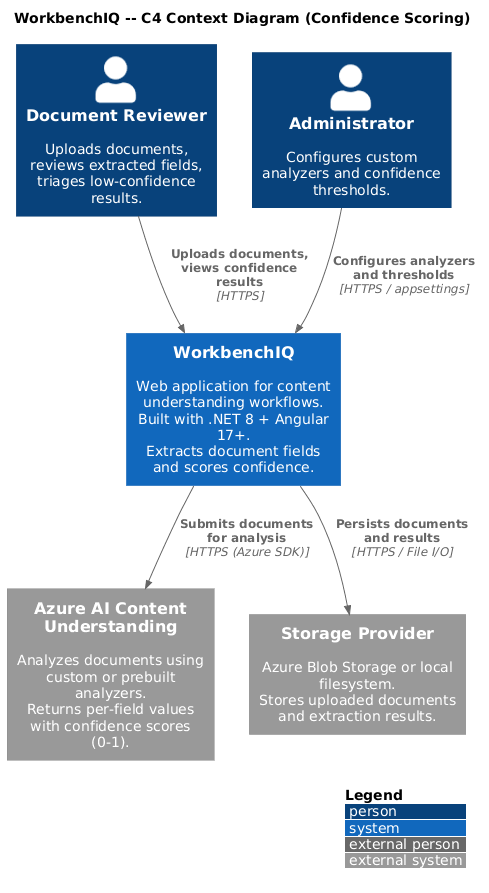
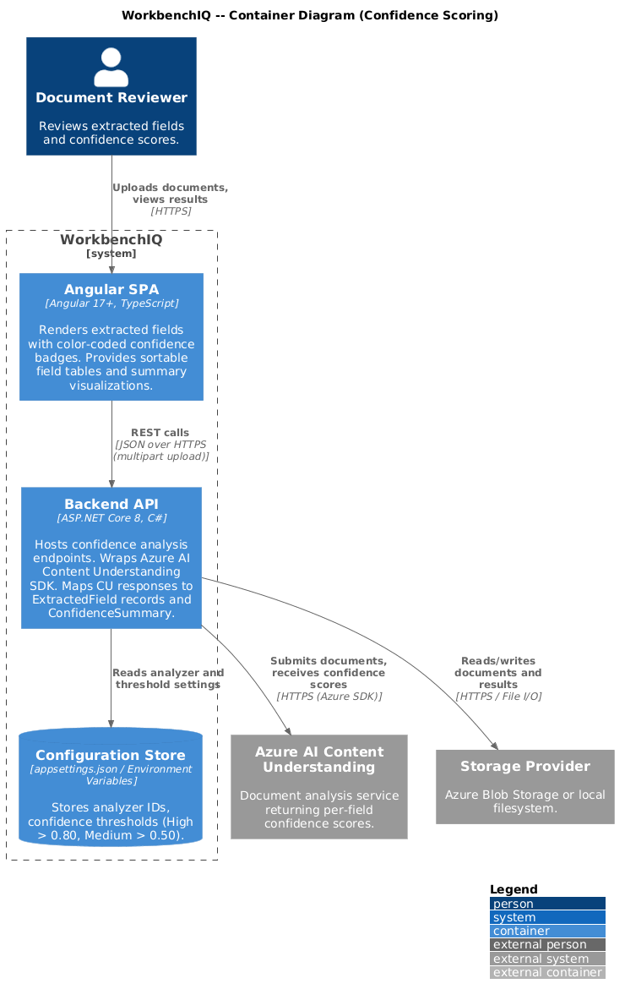
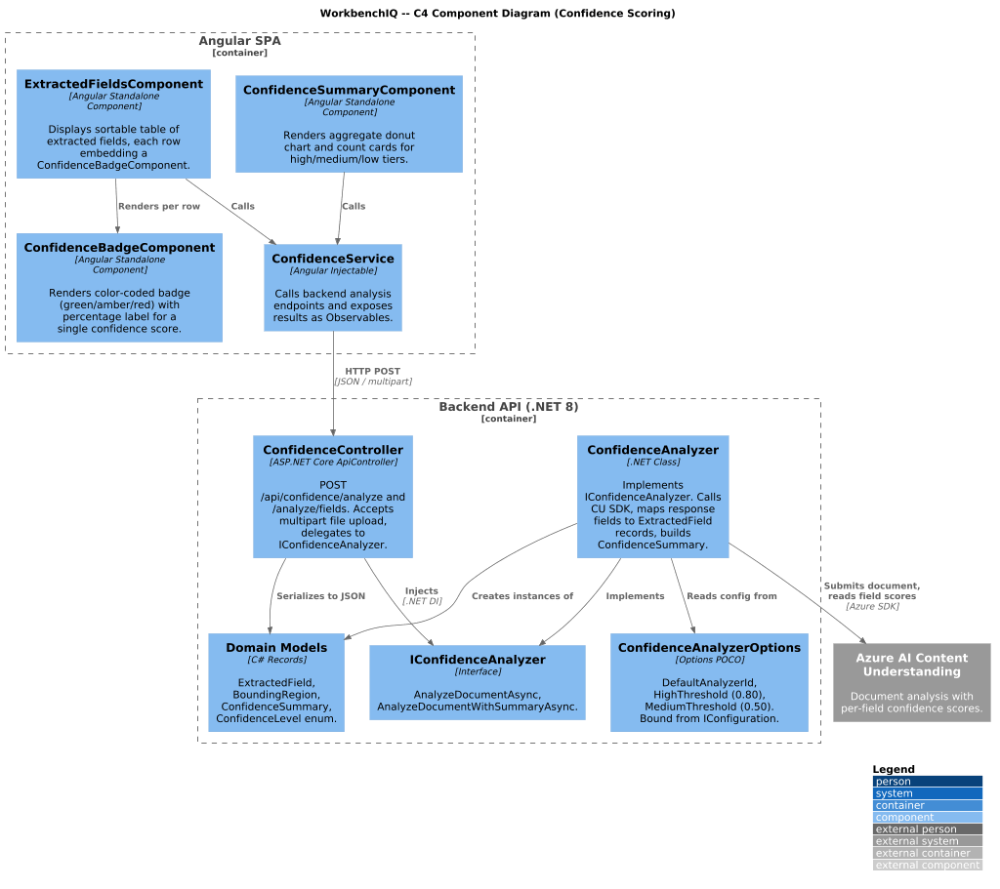
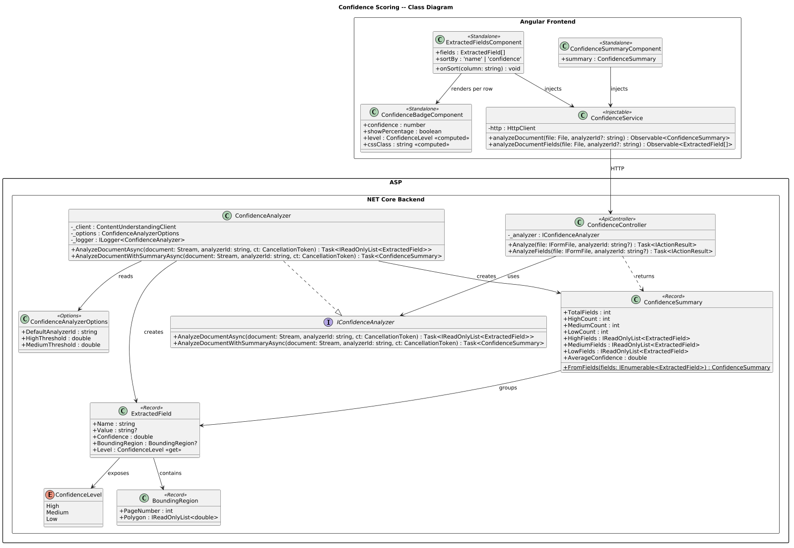
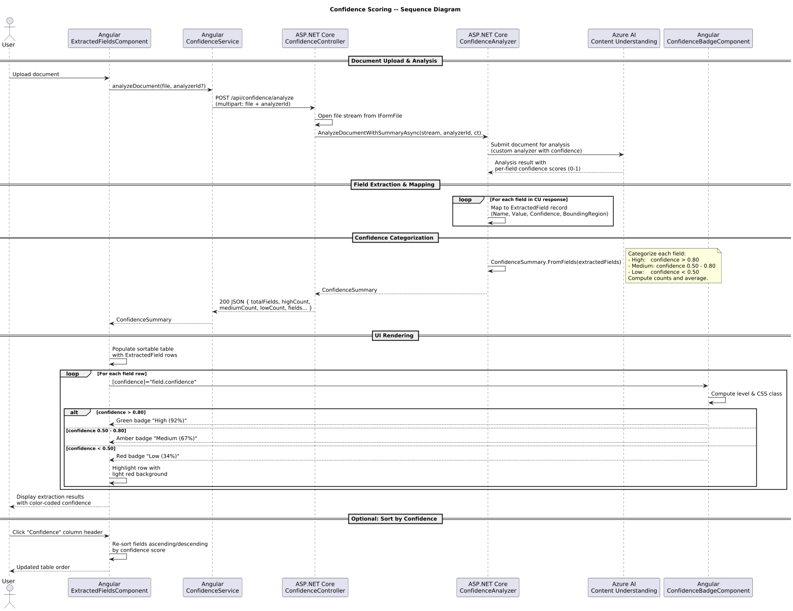

# Confidence Scoring

## Overview

This document describes the confidence scoring behavior for the WorkbenchIQ rewrite targeting **.NET 8 (ASP.NET Core)** on the backend and **Angular 17+** on the frontend. The design preserves the semantics of the existing Python/Next.js implementation -- where Azure AI Content Understanding returns per-field confidence scores and the UI highlights uncertain extractions -- while adopting idiomatic patterns for each new platform.

### Key behaviors carried forward

| Behavior | Current implementation | .NET / Angular design |
|---|---|---|
| Per-field confidence scores | Content Understanding returns 0-1 float per field | `ExtractedField.Confidence` property (double, 0-1) |
| Confidence levels | "high" (>80%), "medium" (50-80%), "low" (<50%) | `ConfidenceLevel` enum: `High`, `Medium`, `Low` with identical thresholds |
| Confidence summary | `ConfidenceSummary` categorizes fields and counts per level | `ConfidenceSummary` record with `HighCount`, `MediumCount`, `LowCount`, field groupings |
| Extracted field model | `ExtractedField`: name, value, confidence, bounding region | `ExtractedField` record: `Name`, `Value`, `Confidence`, `BoundingRegion` |
| Custom analyzer support | Custom analyzers enable confidence scoring | `IConfidenceAnalyzer` / `ConfidenceAnalyzer` wraps CU SDK with custom analyzer configuration |
| Document analysis | `analyze_document_with_confidence()` | `IConfidenceAnalyzer.AnalyzeDocumentAsync()` |
| Color-coded indicators | Frontend highlights uncertain extractions | `ConfidenceBadgeComponent` renders color-coded badges (green / amber / red) |
| Field list display | Table of extracted fields with confidence | `ExtractedFieldsComponent` renders sortable field table with inline badges |

---

## Architecture diagrams

### C4 Context



### C4 Container



### C4 Component



### Class diagram



### Sequence diagram



---

## Backend components (.NET 8 / ASP.NET Core)

### ConfidenceLevel enum

Categorizes a raw 0-1 confidence value into a discrete tier.

| Member | Threshold | Description |
|---|---|---|
| `High` | > 0.80 | Field value is highly reliable. |
| `Medium` | 0.50 -- 0.80 | Field value may need human review. |
| `Low` | < 0.50 | Field value is unreliable; flagged for manual correction. |

### ExtractedField record

Immutable record representing a single field extracted by Content Understanding.

| Property | Type | Description |
|---|---|---|
| `Name` | `string` | Field key as defined in the CU analyzer schema. |
| `Value` | `string?` | Extracted text value. `null` when the field was not found. |
| `Confidence` | `double` | Raw confidence score from CU (0.0 -- 1.0). |
| `BoundingRegion` | `BoundingRegion?` | Page number and polygon coordinates locating the field in the source document. |

Computed property `Level` returns the corresponding `ConfidenceLevel`.

### BoundingRegion record

| Property | Type | Description |
|---|---|---|
| `PageNumber` | `int` | 1-based page index. |
| `Polygon` | `IReadOnlyList<double>` | Flattened list of (x, y) coordinates defining the bounding polygon. |

### ConfidenceSummary record

Aggregates extraction results into a per-level breakdown.

| Property | Type | Description |
|---|---|---|
| `TotalFields` | `int` | Total number of extracted fields. |
| `HighCount` | `int` | Fields with confidence > 80%. |
| `MediumCount` | `int` | Fields with confidence 50-80%. |
| `LowCount` | `int` | Fields with confidence < 50%. |
| `HighFields` | `IReadOnlyList<ExtractedField>` | Fields in the high-confidence tier. |
| `MediumFields` | `IReadOnlyList<ExtractedField>` | Fields in the medium-confidence tier. |
| `LowFields` | `IReadOnlyList<ExtractedField>` | Fields in the low-confidence tier. |
| `AverageConfidence` | `double` | Mean confidence across all fields. |

Static factory method `FromFields(IEnumerable<ExtractedField>)` creates a summary from raw extraction results.

### IConfidenceAnalyzer / ConfidenceAnalyzer

Service that wraps the Azure AI Content Understanding SDK to perform document analysis with confidence extraction.

| Method | Returns | Description |
|---|---|---|
| `AnalyzeDocumentAsync(Stream document, string analyzerId, CancellationToken)` | `Task<IReadOnlyList<ExtractedField>>` | Sends the document to CU, maps the response to `ExtractedField` records. |
| `AnalyzeDocumentWithSummaryAsync(Stream document, string analyzerId, CancellationToken)` | `Task<ConfidenceSummary>` | Calls `AnalyzeDocumentAsync` and wraps the result in a `ConfidenceSummary`. |

Constructor dependencies:

- `ContentUnderstandingClient` -- Azure SDK client (injected via DI).
- `ILogger<ConfidenceAnalyzer>` -- structured logging.
- `ConfidenceAnalyzerOptions` -- configuration for default analyzer ID and threshold overrides.

### ConfidenceAnalyzerOptions

Configuration POCO bound from `appsettings.json` section `"ConfidenceAnalyzer"`.

| Property | Type | Description |
|---|---|---|
| `DefaultAnalyzerId` | `string` | Fallback analyzer identifier when none is specified per-request. |
| `HighThreshold` | `double` | Minimum score for `High` (default 0.80). |
| `MediumThreshold` | `double` | Minimum score for `Medium` (default 0.50). |

### ConfidenceController

`[ApiController]` at route `api/confidence`.

| Endpoint | Method | Description |
|---|---|---|
| `/api/confidence/analyze` | `POST` | Accepts multipart file upload + optional `analyzerId`. Returns `ConfidenceSummary` as JSON. |
| `/api/confidence/analyze/fields` | `POST` | Same input, returns flat `IReadOnlyList<ExtractedField>` without summary grouping. |

---

## Frontend components (Angular 17+)

### ConfidenceService

Injectable service in `core/services/confidence.service.ts`.

| Method | Returns | Description |
|---|---|---|
| `analyzeDocument(file: File, analyzerId?: string)` | `Observable<ConfidenceSummary>` | Calls `POST /api/confidence/analyze`. |
| `analyzeDocumentFields(file: File, analyzerId?: string)` | `Observable<ExtractedField[]>` | Calls `POST /api/confidence/analyze/fields`. |

### ConfidenceBadgeComponent

Standalone component that renders a color-coded badge for a single confidence value.

| Input | Type | Description |
|---|---|---|
| `confidence` | `number` | Raw 0-1 score. |
| `showPercentage` | `boolean` | Whether to display the numeric percentage (default `true`). |

Rendering logic:

| Level | CSS class | Color | Label |
|---|---|---|---|
| High (> 80%) | `badge--high` | Green (`#16a34a`) | "High" |
| Medium (50-80%) | `badge--medium` | Amber (`#d97706`) | "Medium" |
| Low (< 50%) | `badge--low` | Red (`#dc2626`) | "Low" |

### ExtractedFieldsComponent

Standalone component that displays all extracted fields in a sortable table.

| Input | Type | Description |
|---|---|---|
| `fields` | `ExtractedField[]` | Array of extraction results. |
| `sortBy` | `'name' \| 'confidence'` | Active sort column (default `'name'`). |

Each row shows the field name, extracted value, and an inline `ConfidenceBadgeComponent`. Rows with `Low` confidence are highlighted with a light red background to draw reviewer attention.

### ConfidenceSummaryComponent

Standalone component that renders the aggregate summary as a donut chart and count cards.

| Input | Type | Description |
|---|---|---|
| `summary` | `ConfidenceSummary` | Aggregated confidence breakdown. |

---

## Configuration

### appsettings.json (excerpt)

```json
{
  "ConfidenceAnalyzer": {
    "DefaultAnalyzerId": "prebuilt-invoice",
    "HighThreshold": 0.80,
    "MediumThreshold": 0.50
  }
}
```

### Environment variable mapping

| Env var | Maps to |
|---|---|
| `CONFIDENCEANALYZER__DefaultAnalyzerId` | `ConfidenceAnalyzerOptions.DefaultAnalyzerId` |
| `CONFIDENCEANALYZER__HighThreshold` | `ConfidenceAnalyzerOptions.HighThreshold` |
| `CONFIDENCEANALYZER__MediumThreshold` | `ConfidenceAnalyzerOptions.MediumThreshold` |

---

## Design decisions

1. **Immutable records** -- `ExtractedField`, `BoundingRegion`, and `ConfidenceSummary` are C# `record` types, making them naturally immutable, equatable, and serialization-friendly.
2. **Configurable thresholds** -- The 80/50 breakpoints are configurable via `ConfidenceAnalyzerOptions` so deployments can tighten or relax review requirements without code changes.
3. **Separation of analysis and presentation** -- The backend returns raw scores; confidence-level classification is duplicated in both backend (for API consumers) and frontend (for badge rendering) to keep each layer self-contained.
4. **Streaming support** -- `AnalyzeDocumentAsync` accepts a `Stream` rather than a byte array to support large documents without buffering the entire file in memory.
5. **Color-coding accessibility** -- Badge colors are supplemented with text labels ("High", "Medium", "Low") so the UI does not rely on color alone, meeting WCAG 2.1 AA requirements.
