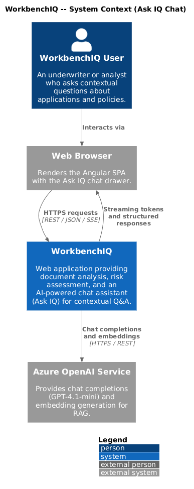
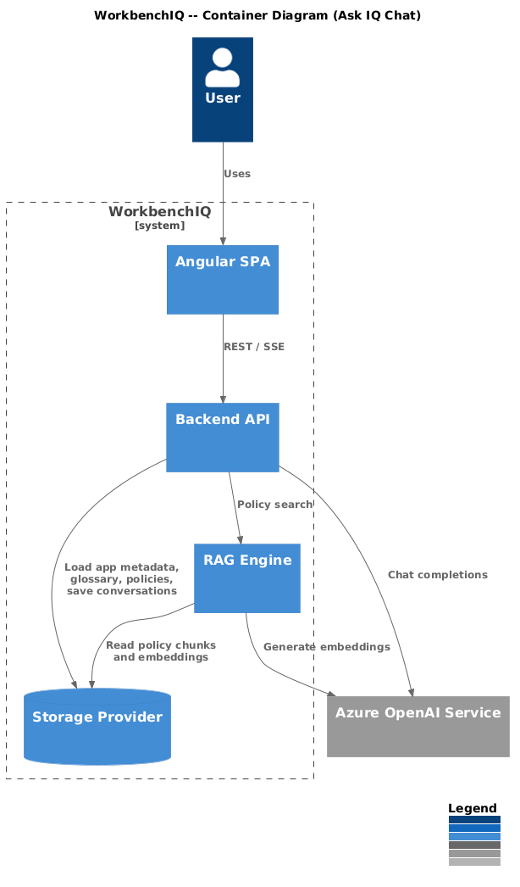
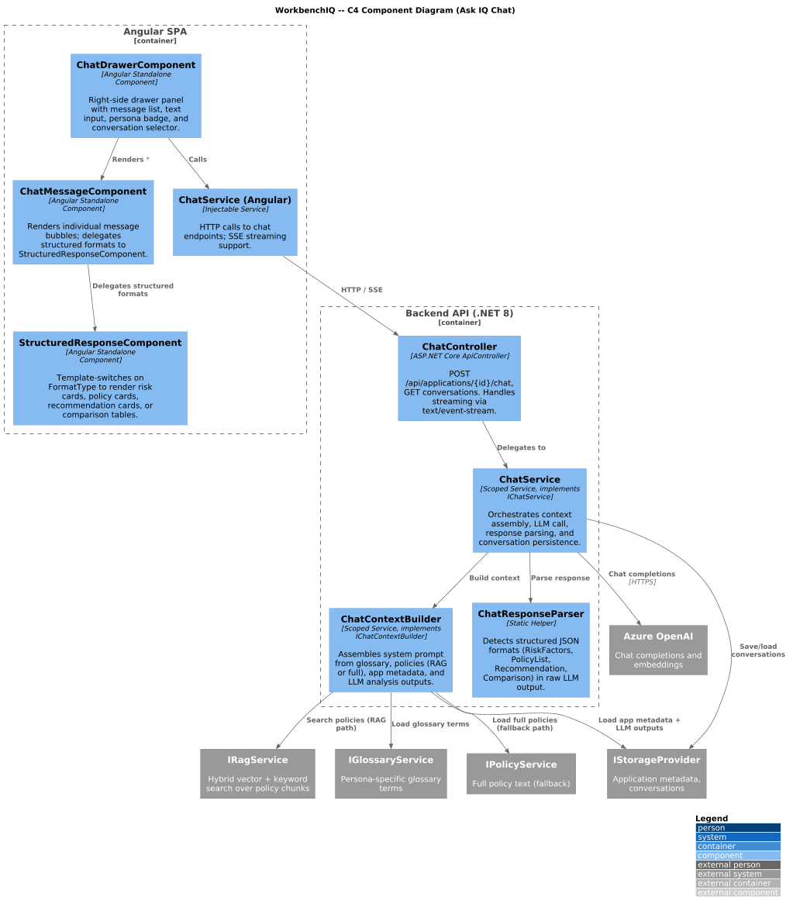
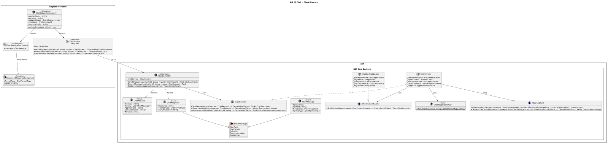
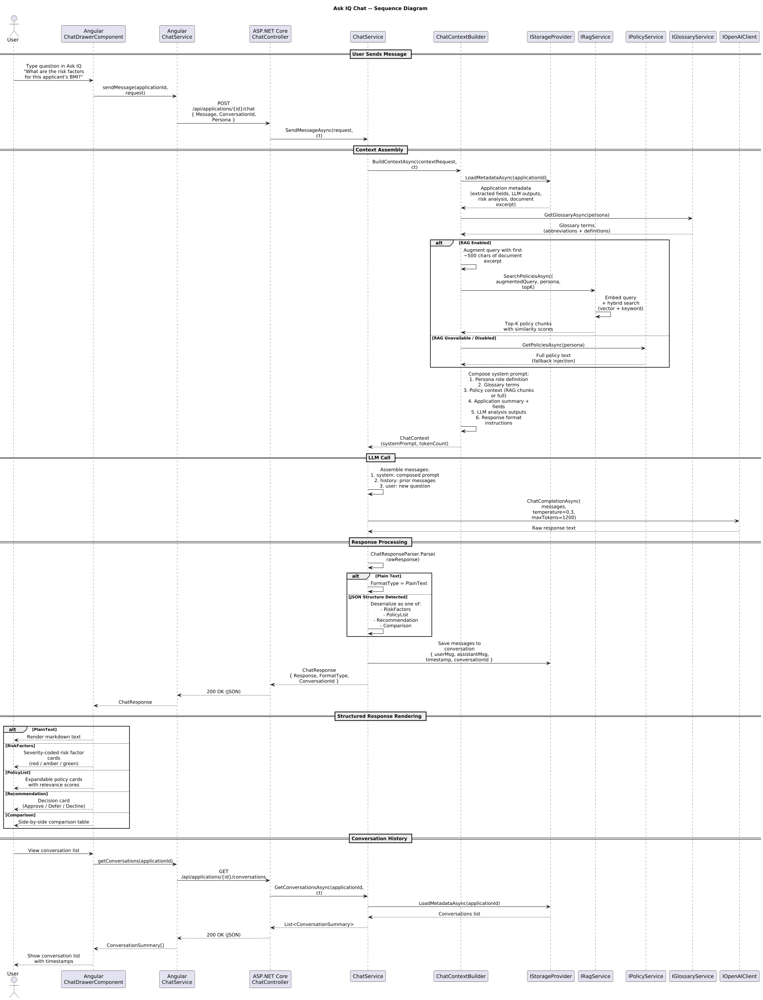

# Ask IQ Chat

## Overview

This document describes the "Ask IQ Chat" behavior for the WorkbenchIQ rewrite targeting **.NET 8 (ASP.NET Core)** on the backend and **Angular 17+** on the frontend. Ask IQ is a contextual chat assistant that lets users ask natural-language questions about an application's document, extracted fields, risk analysis, and applicable policies. The design preserves the semantics of the existing Python/Next.js implementation while adopting idiomatic patterns for each new platform.

### Key behaviors carried forward

| Behavior | Current implementation | .NET / Angular design |
|---|---|---|
| Chat endpoint | `POST /api/applications/{app_id}/chat` with `ChatRequest` | `ChatController.SendMessage()` with identical route |
| System prompt assembly | `get_chat_system_prompt()` composes glossary, policies, app context, LLM outputs | `IChatContextBuilder.BuildContextAsync()` assembles the same sections |
| RAG-augmented policy retrieval | Query augmented with first ~500 chars of document; top-k chunks returned | `IRagService.SearchPoliciesAsync()` with the same augmentation strategy |
| Full policy fallback | Falls back to full policy text when RAG is unavailable | `ChatContextBuilder` injects full policy text via `IPolicyService` when RAG is disabled |
| Streaming responses | `stream_completion()` via SSE | `IOpenAIClient.StreamChatCompletionAsync()` returning `IAsyncEnumerable<string>` |
| Structured JSON responses | `risk_factors`, `policy_list`, `recommendation`, `comparison`, plain text | `ChatResponseParser` detects format and deserializes into typed models |
| Conversation history | Messages stored per `conversation_id` in application metadata | Same structure persisted via `IStorageProvider` |
| Persona context | Persona determines glossary, policies, and role definition in system prompt | `IChatContextBuilder` resolves persona-specific context |
| Chat drawer UI | Right-side drawer panel with message history | Angular `ChatDrawerComponent` (Material sidenav) |
| Structured response rendering | Cards for risk factors, policy lists, recommendations, comparisons | `StructuredResponseComponent` with template switching |

---

## Architecture diagrams

### C4 Context



### C4 Container



### C4 Component



### Class diagram



### Sequence diagram



---

## Backend components (.NET 8 / ASP.NET Core)

### ChatController

`[ApiController]` at route `api/applications/{applicationId}/chat`.

| Endpoint | Method | Description |
|---|---|---|
| `/api/applications/{applicationId}/chat` | `POST` | Accepts a `ChatRequest`, assembles context, calls LLM, returns `ChatResponse`. Supports streaming via `text/event-stream` Accept header. |
| `/api/applications/{applicationId}/conversations` | `GET` | Returns the list of conversations for an application. |
| `/api/applications/{applicationId}/conversations/{conversationId}` | `GET` | Returns a single conversation with full message history. |

### ChatRequest

Record model received by `ChatController.SendMessage()`.

| Property | Type | Description |
|---|---|---|
| `Message` | `string` | The user's natural-language question. |
| `History` | `List<ChatMessage>?` | Optional prior messages for multi-turn context. |
| `ApplicationId` | `string` | The application this chat is scoped to. |
| `ConversationId` | `string?` | Existing conversation ID, or null to start a new one. |
| `Persona` | `string` | Active persona (e.g., `life-insurance`, `mortgage`). |

### ChatMessage

Record representing a single message in the conversation.

| Property | Type | Description |
|---|---|---|
| `Role` | `string` | `"user"`, `"assistant"`, or `"system"`. |
| `Content` | `string` | Message text (plain or JSON for structured responses). |
| `Timestamp` | `DateTimeOffset` | When the message was created. |
| `FormatType` | `ChatFormatType?` | Null for plain text; otherwise indicates structured format. |

### ChatResponse

Record returned to the frontend.

| Property | Type | Description |
|---|---|---|
| `Response` | `string` | The assistant's response text (plain or JSON). |
| `FormatType` | `ChatFormatType` | `PlainText`, `RiskFactors`, `PolicyList`, `Recommendation`, or `Comparison`. |
| `ConversationId` | `string` | The conversation this message belongs to. |

### ChatFormatType (enum)

`PlainText`, `RiskFactors`, `PolicyList`, `Recommendation`, `Comparison`.

### IChatService / ChatService

Domain service orchestrating the chat flow.

| Method | Returns | Description |
|---|---|---|
| `SendMessageAsync(ChatRequest request, CancellationToken ct)` | `Task<ChatResponse>` | Full non-streaming flow: build context, call LLM, parse response, persist messages. |
| `StreamMessageAsync(ChatRequest request, CancellationToken ct)` | `IAsyncEnumerable<string>` | Streaming variant that yields SSE chunks as they arrive from the LLM. |
| `GetConversationsAsync(string applicationId, CancellationToken ct)` | `Task<List<ConversationSummary>>` | Lists conversations for an application. |
| `GetConversationAsync(string applicationId, string conversationId, CancellationToken ct)` | `Task<Conversation>` | Returns a full conversation with messages. |

### IChatContextBuilder / ChatContextBuilder

Responsible for assembling the system prompt from multiple data sources.

| Method | Returns | Description |
|---|---|---|
| `BuildContextAsync(ChatContextRequest request, CancellationToken ct)` | `Task<ChatContext>` | Gathers glossary, policies (RAG or full), application data, and LLM analysis outputs into a single `ChatContext`. |

**Assembly steps:**

1. Load application metadata and extracted fields via `IStorageProvider`.
2. Load LLM analysis outputs (risk analysis, section summaries) from stored results.
3. Retrieve glossary terms for the active persona via `IGlossaryService`.
4. Query policies: if RAG is enabled, call `IRagService.SearchPoliciesAsync()` with the user question augmented by the first ~500 characters of the document excerpt; otherwise load full policy text via `IPolicyService`.
5. Compose the system prompt using the persona role definition template, injecting all gathered context.

### ChatResponseParser

Static helper that inspects the raw LLM response and detects the format.

| Method | Returns | Description |
|---|---|---|
| `Parse(string rawResponse)` | `(ChatFormatType FormatType, string Content)` | Attempts JSON deserialization into each known format. Returns `PlainText` if no structured format matches. |

### IOpenAIClient (reused)

Shared client from the AI integration layer. Chat-specific usage:

| Method | Returns | Description |
|---|---|---|
| `ChatCompletionAsync(List<ChatMessage> messages, ChatCompletionOptions options, CancellationToken ct)` | `Task<string>` | Non-streaming completion. Uses chat deployment (`AZURE_OPENAI_CHAT_DEPLOYMENT_NAME`) with temperature 0.3. |
| `StreamChatCompletionAsync(List<ChatMessage> messages, ChatCompletionOptions options, CancellationToken ct)` | `IAsyncEnumerable<string>` | Streaming completion yielding delta tokens. |

---

## Frontend components (Angular 17+)

### ChatService (Angular)

Injectable service in `core/services/chat.service.ts`.

| Method | Returns | Description |
|---|---|---|
| `sendMessage(applicationId, request)` | `Observable<ChatResponse>` | Posts to the chat endpoint, returns parsed response. |
| `streamMessage(applicationId, request)` | `Observable<string>` | Opens an SSE connection for streaming responses. |
| `getConversations(applicationId)` | `Observable<ConversationSummary[]>` | Fetches conversation list. |
| `getConversation(applicationId, conversationId)` | `Observable<Conversation>` | Fetches full conversation history. |

### ChatDrawerComponent

Standalone component rendering the right-side chat panel.

| Input / Output | Type | Description |
|---|---|---|
| `@Input() applicationId` | `string` | The application context for the chat. |
| `@Input() persona` | `string` | Active persona, shown as a context indicator badge. |
| `@Output() drawerClosed` | `EventEmitter<void>` | Emitted when the user closes the drawer. |

**Responsibilities:**

- Manages the message list and conversation selector.
- Renders each message via `ChatMessageComponent`.
- Displays a persona context indicator badge (e.g., "Life Insurance Underwriter").
- Auto-scrolls to the latest message.
- Provides a text input with send button and Enter-key submit.
- Shows a typing indicator while waiting for the LLM response.

### ChatMessageComponent

Standalone component rendering an individual chat message bubble.

| Input | Type | Description |
|---|---|---|
| `@Input() message` | `ChatMessage` | The message to render. |

- User messages render as right-aligned plain text bubbles.
- Assistant messages render left-aligned; delegates to `StructuredResponseComponent` when `FormatType` is not `PlainText`.
- Plain text assistant messages render with markdown support (`ngx-markdown`).

### StructuredResponseComponent

Standalone component that renders structured JSON responses with appropriate visual cards.

| Input | Type | Description |
|---|---|---|
| `@Input() formatType` | `ChatFormatType` | Determines which template to use. |
| `@Input() content` | `string` | The JSON content string to parse and display. |

**Template switching by format type:**

| FormatType | Rendering |
|---|---|
| `RiskFactors` | Severity-coded cards (red/amber/green) with factor name, description, and severity indicator. |
| `PolicyList` | Expandable policy cards with title, excerpt, and relevance score. |
| `Recommendation` | Decision card showing Approve / Defer / Decline with rationale text. |
| `Comparison` | Side-by-side table comparing fields or values. |

---

## Configuration

### appsettings.json (excerpt)

```json
{
  "AzureOpenAI": {
    "ChatDeploymentName": "gpt-4.1-mini",
    "ChatTemperature": 0.3,
    "ChatMaxTokens": 1200
  },
  "Rag": {
    "Enabled": true,
    "TopK": 5,
    "DocumentExcerptLength": 500
  }
}
```

### Environment variable mapping

| Env var | Maps to |
|---|---|
| `AZUREOPENAI__ChatDeploymentName` | `AzureOpenAIOptions.ChatDeploymentName` |
| `AZUREOPENAI__ChatTemperature` | `AzureOpenAIOptions.ChatTemperature` |
| `RAG__Enabled` | `RagOptions.Enabled` |
| `RAG__TopK` | `RagOptions.TopK` |

---

## Design considerations

1. **RAG fallback** -- When the RAG service is unavailable or disabled, the system falls back to injecting the full policy text into the system prompt. This guarantees the chat remains functional at the cost of higher token usage.
2. **Document excerpt augmentation** -- The user's query is augmented with the first ~500 characters of the application document when querying RAG. This provides document-specific context that improves policy chunk relevance.
3. **Token budget** -- The system prompt (glossary + policies + app context + LLM outputs) is assembled within a token budget to leave room for conversation history and the LLM response. Progressive summarization outputs are used for large documents.
4. **Streaming** -- The streaming path uses `IAsyncEnumerable<string>` on the backend and SSE on the wire, allowing the frontend to display tokens as they arrive for a responsive experience.
5. **Conversation persistence** -- Messages are saved to the application's metadata via `IStorageProvider`, ensuring conversation history survives page reloads and can be resumed later.
6. **Persona isolation** -- Each persona has its own glossary, policies, and role definition. The system prompt template is parameterized by persona, so switching personas changes the entire chat context.
