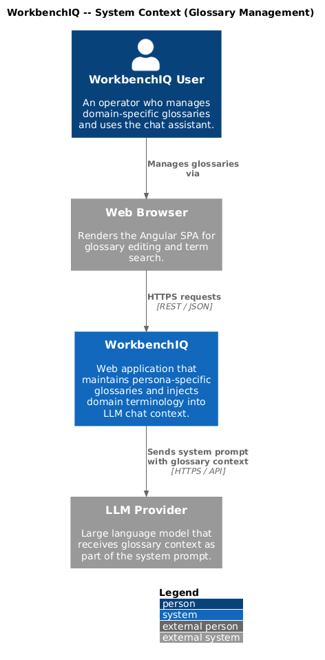
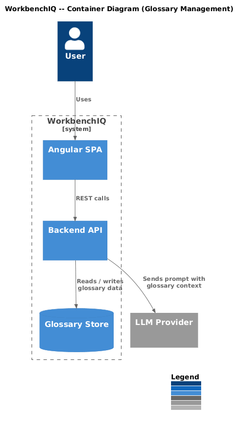
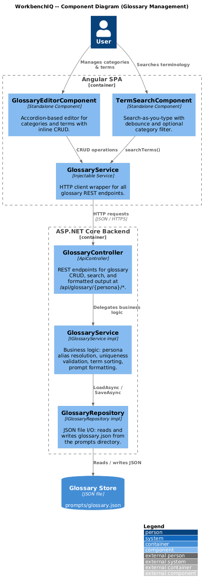
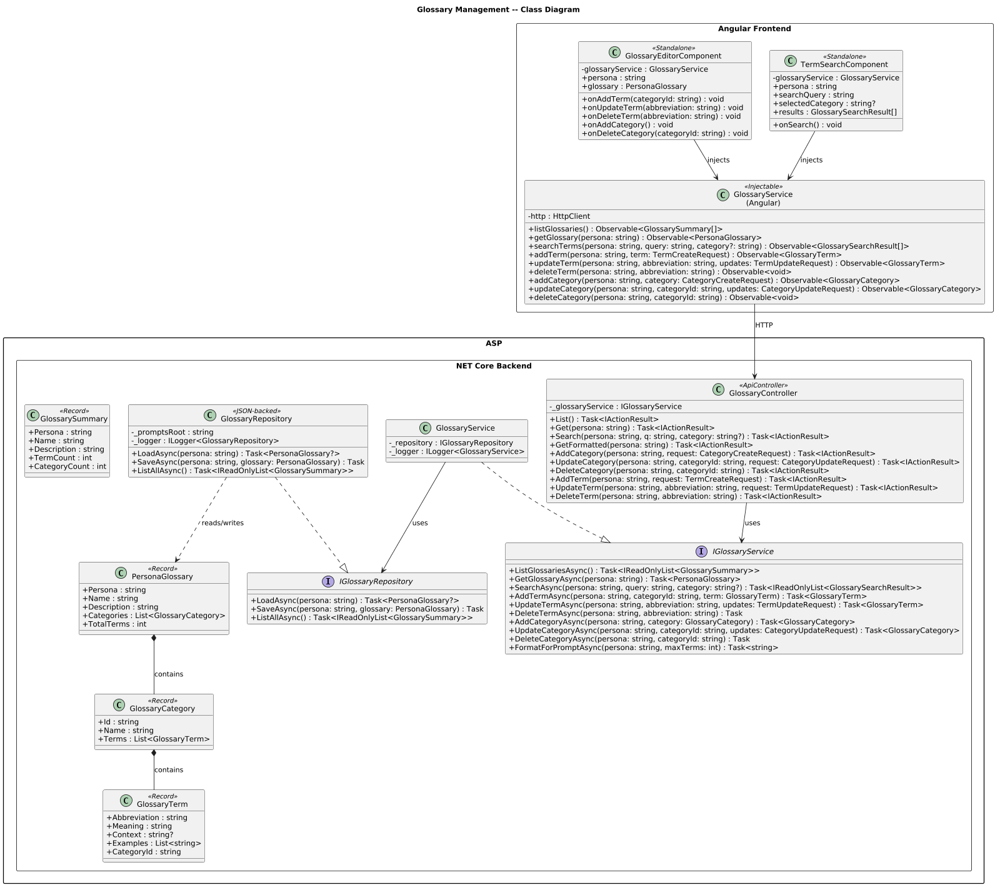
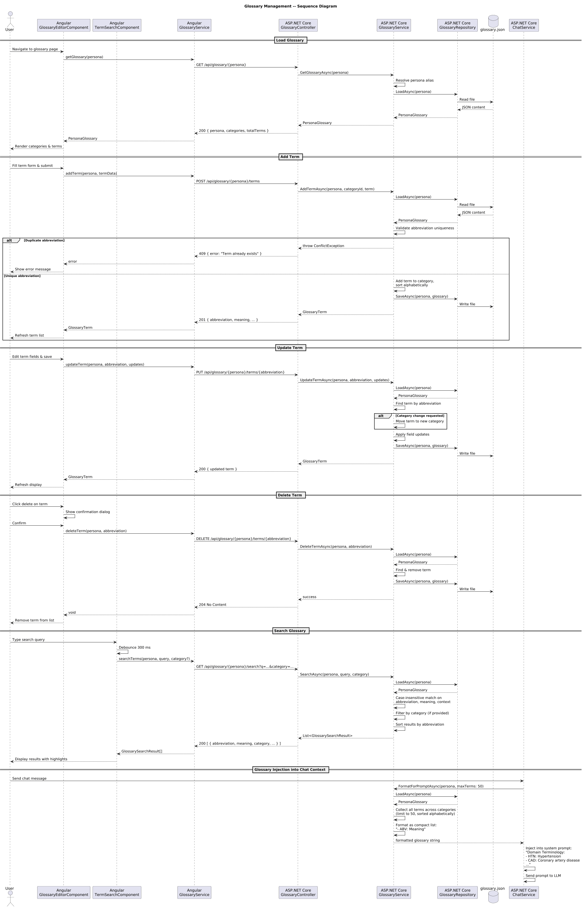

# Glossary Management

## Overview

This document describes the glossary management behavior for the WorkbenchIQ rewrite targeting **.NET 8 (ASP.NET Core)** on the backend and **Angular 17+** on the frontend. The design preserves the semantics of the existing Python implementation while adopting idiomatic patterns for each new platform.

Each persona maintains its own domain-specific glossary organized into categories and terms. The glossary is injected into the chat system prompt so the LLM understands industry-specific abbreviations and terminology.

### Key behaviors carried forward

| Behavior | Current implementation | .NET / Angular design |
|---|---|---|
| Persona-scoped glossaries | Single `glossary.json` with per-persona sections | `IGlossaryRepository` backed by per-persona JSON files under `prompts/{persona}/glossary.json` |
| Category CRUD | `add_category`, `update_category`, `delete_category` | `IGlossaryService` methods; `GlossaryController` REST endpoints |
| Term CRUD | `add_term`, `update_term`, `delete_term` | `IGlossaryService` methods; `GlossaryController` REST endpoints |
| Search with category filter | `search_glossary(query, category)` | `GET /api/glossary/{persona}/search?q=&category=` |
| Prompt injection | `format_glossary_for_prompt` -- max 100 terms, markdown or list | `IGlossaryService.FormatForPromptAsync` -- max 50 terms, compact list injected into system prompt |
| Persona alias resolution | `_resolve_persona_alias` mapping | `GlossaryService` resolves aliases before repository lookup |
| Delete-category guard | Category must be empty before deletion | Same validation in `GlossaryService.DeleteCategoryAsync` |
| Duplicate-term guard | Abbreviation must be unique across all categories within a persona | Same validation in `GlossaryService.AddTermAsync` |

---

## Architecture diagrams

### C4 Context



### C4 Container



### C4 Component



### Class diagram



### Sequence diagram



---

## Backend components (.NET 8 / ASP.NET Core)

### GlossaryCategory

Domain model representing a term grouping.

| Property | Type | Description |
|---|---|---|
| `Id` | `string` | Unique identifier within the persona (e.g., `"cardiac"`, `"vitals"`). |
| `Name` | `string` | Human-readable display name. |
| `Terms` | `List<GlossaryTerm>` | Terms belonging to this category, sorted alphabetically by abbreviation. |

### GlossaryTerm

Domain model representing a single glossary entry.

| Property | Type | Description |
|---|---|---|
| `Abbreviation` | `string` | Short form (e.g., `"HTN"`). Acts as the natural key. |
| `Meaning` | `string` | Full expansion (e.g., `"Hypertension"`). |
| `Context` | `string?` | Optional usage context (e.g., `"High blood pressure"`). |
| `Examples` | `List<string>` | Optional example usages. |
| `CategoryId` | `string` | Foreign key back to the owning category. |

### PersonaGlossary

Aggregate root wrapping a full persona's glossary data.

| Property | Type | Description |
|---|---|---|
| `Persona` | `string` | Canonical persona identifier. |
| `Name` | `string` | Display name for the persona. |
| `Description` | `string` | Brief description of the glossary's domain. |
| `Categories` | `List<GlossaryCategory>` | All categories with their terms. |
| `TotalTerms` | `int` | Computed count of all terms across categories. |

### IGlossaryRepository / GlossaryRepository

Data-access layer backed by JSON files on disk.

| Method | Returns | Description |
|---|---|---|
| `LoadAsync(persona)` | `Task<PersonaGlossary?>` | Reads and deserializes `prompts/{persona}/glossary.json`. |
| `SaveAsync(persona, glossary)` | `Task` | Serializes and writes the glossary back to disk. |
| `ListAllAsync()` | `Task<IReadOnlyList<GlossarySummary>>` | Scans persona directories for glossary files and returns summary info. |

### IGlossaryService / GlossaryService

Domain service encapsulating all glossary business logic.

| Method | Returns | Description |
|---|---|---|
| `ListGlossariesAsync()` | `Task<IReadOnlyList<GlossarySummary>>` | Returns summaries of all persona glossaries. |
| `GetGlossaryAsync(persona)` | `Task<PersonaGlossary>` | Loads the full glossary for a persona. Resolves aliases. |
| `SearchAsync(persona, query, category?)` | `Task<IReadOnlyList<GlossarySearchResult>>` | Case-insensitive search across abbreviation, meaning, and context. Optional category filter. |
| `AddTermAsync(persona, categoryId, term)` | `Task<GlossaryTerm>` | Validates uniqueness, adds term, sorts alphabetically, persists. |
| `UpdateTermAsync(persona, abbreviation, updates)` | `Task<GlossaryTerm>` | Supports field updates and cross-category moves. |
| `DeleteTermAsync(persona, abbreviation)` | `Task` | Removes term by abbreviation. |
| `AddCategoryAsync(persona, category)` | `Task<GlossaryCategory>` | Validates uniqueness, adds and sorts categories. |
| `UpdateCategoryAsync(persona, categoryId, updates)` | `Task<GlossaryCategory>` | Updates category name. |
| `DeleteCategoryAsync(persona, categoryId)` | `Task` | Rejects deletion if category has terms. |
| `FormatForPromptAsync(persona, maxTerms)` | `Task<string>` | Formats up to `maxTerms` (default 50) as a compact list for LLM context injection. |

### GlossaryController

`[ApiController]` at route `api/glossary`.

| Endpoint | Method | Description |
|---|---|---|
| `/api/glossary` | `GET` | Lists all persona glossaries with summary counts. |
| `/api/glossary/{persona}` | `GET` | Returns the full glossary for a persona. |
| `/api/glossary/{persona}/search` | `GET` | Searches terms. Query params: `q` (required), `category` (optional). |
| `/api/glossary/{persona}/formatted` | `GET` | Returns prompt-formatted glossary text. |
| `/api/glossary/{persona}/categories` | `POST` | Adds a new category. Body: `{ id, name }`. |
| `/api/glossary/{persona}/categories/{categoryId}` | `PUT` | Updates a category. Body: `{ name }`. |
| `/api/glossary/{persona}/categories/{categoryId}` | `DELETE` | Deletes an empty category. |
| `/api/glossary/{persona}/terms` | `POST` | Adds a new term. Body: `{ abbreviation, meaning, context?, examples?, categoryId }`. |
| `/api/glossary/{persona}/terms/{abbreviation}` | `PUT` | Updates a term. Body: `{ meaning?, context?, examples?, categoryId? }`. |
| `/api/glossary/{persona}/terms/{abbreviation}` | `DELETE` | Deletes a term. |

---

## Frontend components (Angular 17+)

### GlossaryService (Angular)

Injectable service in `core/services/glossary.service.ts`.

| Method | Returns | Description |
|---|---|---|
| `listGlossaries()` | `Observable<GlossarySummary[]>` | Calls `GET /api/glossary`. |
| `getGlossary(persona)` | `Observable<PersonaGlossary>` | Calls `GET /api/glossary/{persona}`. |
| `searchTerms(persona, query, category?)` | `Observable<GlossarySearchResult[]>` | Calls `GET /api/glossary/{persona}/search`. Debounced at the component level. |
| `addTerm(persona, term)` | `Observable<GlossaryTerm>` | Calls `POST /api/glossary/{persona}/terms`. |
| `updateTerm(persona, abbreviation, updates)` | `Observable<GlossaryTerm>` | Calls `PUT /api/glossary/{persona}/terms/{abbreviation}`. |
| `deleteTerm(persona, abbreviation)` | `Observable<void>` | Calls `DELETE /api/glossary/{persona}/terms/{abbreviation}`. |
| `addCategory(persona, category)` | `Observable<GlossaryCategory>` | Calls `POST /api/glossary/{persona}/categories`. |
| `updateCategory(persona, categoryId, updates)` | `Observable<GlossaryCategory>` | Calls `PUT /api/glossary/{persona}/categories/{categoryId}`. |
| `deleteCategory(persona, categoryId)` | `Observable<void>` | Calls `DELETE /api/glossary/{persona}/categories/{categoryId}`. |

### GlossaryEditorComponent

Standalone component for managing a persona's glossary.

- Displays categories in an expandable accordion layout.
- Each category lists its terms in a sortable table.
- Inline editing for term fields (abbreviation, meaning, context, examples).
- Add/delete buttons for both categories and terms.
- Confirmation dialog before deleting terms or categories.
- Calls `GlossaryService` for all CRUD operations.

### TermSearchComponent

Standalone component providing search-as-you-type functionality.

- Text input with 300 ms debounce.
- Optional category dropdown filter.
- Displays matching terms in a result list with highlighted matches.
- Calls `GlossaryService.searchTerms()`.

---

## Glossary prompt injection

When the chat system prompt is assembled, the backend calls `IGlossaryService.FormatForPromptAsync` to produce a compact terminology reference. This block is injected into the system prompt so the LLM can correctly interpret domain abbreviations.

### Format

```
Domain Terminology:

- HTN: Hypertension
- CAD: Coronary artery disease
- MI: Myocardial infarction
...
```

### Constraints

- Maximum of **50 terms** are included (configurable).
- Terms are sorted alphabetically by abbreviation.
- Only abbreviation and meaning are included (context and examples are omitted for token efficiency).
- If no glossary exists for the persona, the section is silently omitted.

---

## Data storage

### File layout

```
prompts/
  glossary.json          <-- single file with all persona glossaries
```

### JSON schema (excerpt)

```json
{
  "version": "1.0",
  "personas": {
    "underwriting": {
      "name": "Life & Health Underwriting",
      "description": "Medical and insurance terminology",
      "categories": [
        {
          "id": "cardiac",
          "name": "Cardiac",
          "terms": [
            {
              "abbreviation": "HTN",
              "meaning": "Hypertension",
              "context": "High blood pressure"
            }
          ]
        }
      ]
    }
  }
}
```

---

## Error handling

| Scenario | HTTP status | Error message |
|---|---|---|
| Persona not found | `404` | `Persona '{persona}' not found in glossary` |
| Category not found | `404` | `Category '{categoryId}' not found` |
| Term not found | `404` | `Term '{abbreviation}' not found` |
| Duplicate abbreviation | `409` | `Term '{abbreviation}' already exists` |
| Category not empty on delete | `409` | `Category '{categoryId}' is not empty. Delete all terms first.` |
| Duplicate category ID | `409` | `Category '{categoryId}' already exists` |
