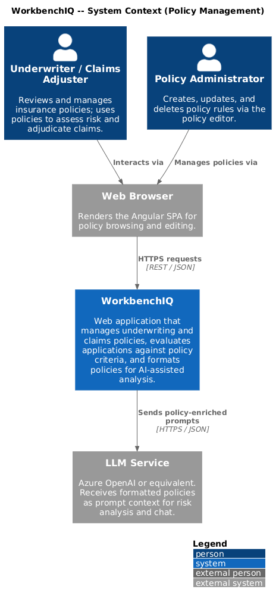
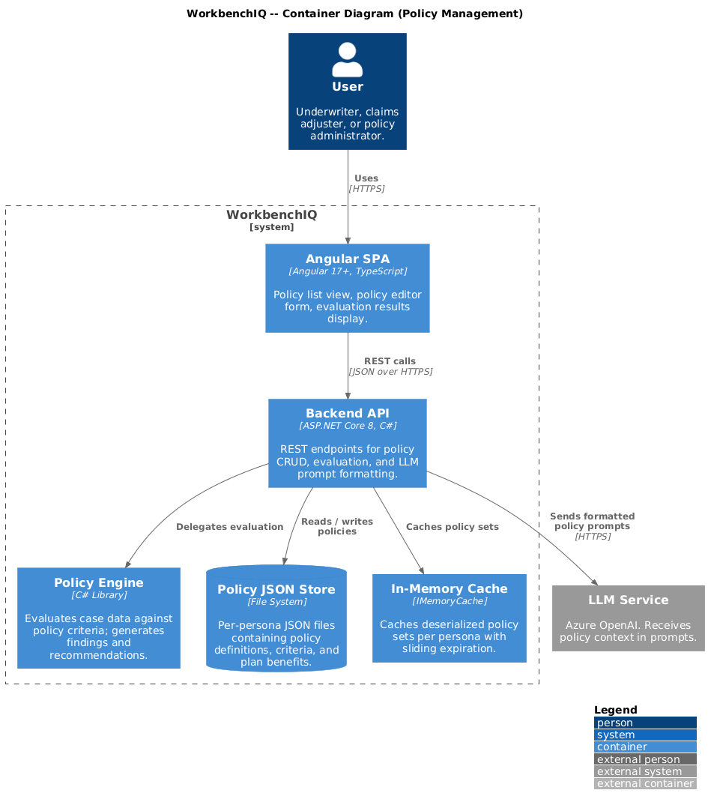
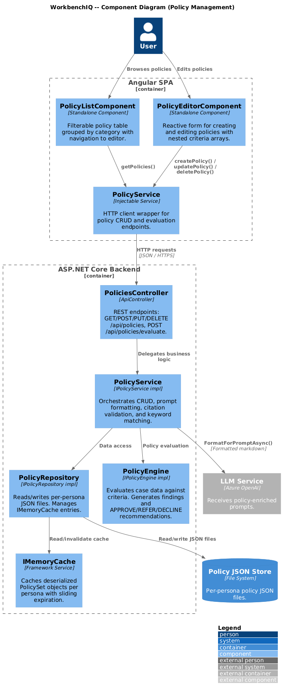
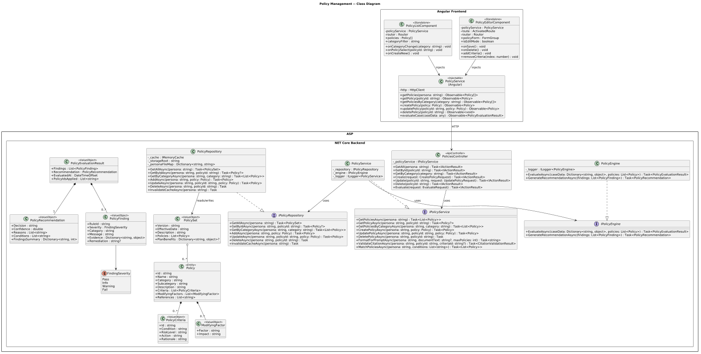
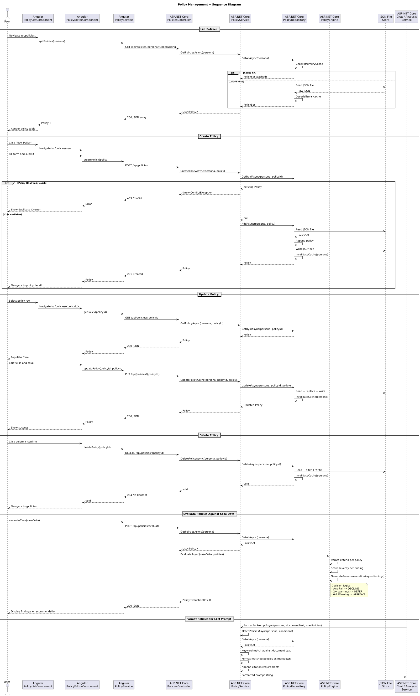

# Policy Management

## Overview

This document describes the Policy Management behavior for the WorkbenchIQ rewrite targeting **.NET 8 (ASP.NET Core)** on the backend and **Angular 17+** on the frontend. The design preserves the semantics of the existing Python implementation while adopting idiomatic patterns for each new platform.

Policies are structured rule sets that govern underwriting decisions, claims adjudication, and risk assessment across multiple insurance personas (life-health underwriting, automotive claims, property-casualty claims, mortgage underwriting, etc.). Each policy carries typed criteria with severity levels, actions, modifying factors, and audit-ready references.

### Key behaviors carried forward

| Behavior | Current implementation | .NET / Angular design |
|---|---|---|
| CRUD operations for policies | `add_policy`, `update_policy`, `delete_policy` in `underwriting_policies.py` | `PoliciesController` with `IPolicyService` / `PolicyService` |
| Per-persona policy files | JSON files keyed by persona (e.g. `life-health-underwriting-policies.json`) | `IPolicyRepository` loads from persona-scoped JSON stores |
| Policy lookup by ID | `get_policy_by_id()` | `IPolicyRepository.GetByIdAsync()` |
| Category filtering | `get_policies_by_category()` | `GET /api/policies/category/{category}` |
| Keyword-to-policy matching | `get_policies_for_conditions()` with keyword map | `IPolicyEngine.MatchPoliciesAsync()` |
| Policy evaluation against case data | `MortgagePolicyEvaluator.evaluate_all()` with severity scoring | `IPolicyEngine.EvaluateAsync()` returns `PolicyEvaluationResult` |
| Recommendation generation | `RecommendationEngine.generate_recommendation()` from findings | `IPolicyEngine.GenerateRecommendationAsync()` |
| LLM prompt formatting | `format_policies_for_prompt()` with citation requirements | `IPolicyService.FormatForPromptAsync()` |
| Policy citation validation | `validate_policy_citation()` | `IPolicyService.ValidateCitationAsync()` |
| In-memory caching | `_policy_cache` dict with `clear_policy_cache()` | `IMemoryCache` with persona-scoped keys and explicit invalidation |

---

## Architecture diagrams

### C4 Context



### C4 Container



### C4 Component



### Class diagram



### Sequence diagram



---

## Backend components (.NET 8 / ASP.NET Core)

### Policy (domain model)

The core entity representing a single underwriting or claims policy.

| Property | Type | Description |
|---|---|---|
| `Id` | `string` | Unique policy identifier (e.g. `"CVD-BP-001"`, `"OSFI-B20-GDS-001"`). |
| `Name` | `string` | Human-readable policy name. |
| `Category` | `string` | Top-level category (e.g. `"cardiovascular"`, `"ratio"`, `"compliance"`). |
| `Subcategory` | `string` | Refinement within category (e.g. `"hypertension"`, `"gds"`). |
| `Description` | `string` | Full description of the policy purpose. |
| `Criteria` | `List<PolicyCriteria>` | Ordered list of evaluation criteria. |
| `ModifyingFactors` | `List<ModifyingFactor>` | Factors that adjust the base risk assessment. |
| `References` | `List<string>` | External guideline references for audit trail. |

### PolicyCriteria

| Property | Type | Description |
|---|---|---|
| `Id` | `string` | Criteria identifier (e.g. `"CVD-BP-001-C"`). |
| `Condition` | `string` | Condition expression to evaluate. |
| `RiskLevel` | `string` | Risk severity (e.g. `"Low"`, `"Moderate"`, `"High"`). |
| `Action` | `string` | Recommended action when criteria is matched. |
| `Rationale` | `string` | Explanation for the action. |

### ModifyingFactor

| Property | Type | Description |
|---|---|---|
| `Factor` | `string` | Factor name (e.g. `"Medication compliance"`). |
| `Impact` | `string` | Description of how the factor adjusts the assessment. |

### PolicyCategory (enum)

Enumerates the top-level policy categories: `Cardiovascular`, `Metabolic`, `Endocrine`, `FamilyHistory`, `Lifestyle`, `Ratio`, `Credit`, `Income`, `Property`, `Compliance`.

### PolicyEvaluationResult

| Property | Type | Description |
|---|---|---|
| `Findings` | `List<PolicyFinding>` | Individual rule evaluation outcomes. |
| `Recommendation` | `PolicyRecommendation` | Aggregated decision with confidence score. |
| `EvaluatedAt` | `DateTimeOffset` | Timestamp of evaluation. |
| `PolicyIdsApplied` | `List<string>` | Which policies contributed to the result. |

### PolicyFinding

| Property | Type | Description |
|---|---|---|
| `RuleId` | `string` | The rule that produced this finding (e.g. `"OSFI-B20-GDS-001"`). |
| `Severity` | `FindingSeverity` | Enum: `Pass`, `Info`, `Warning`, `Fail`. |
| `Category` | `string` | Finding category. |
| `Message` | `string` | Human-readable finding description. |
| `Evidence` | `Dictionary<string, object>` | Supporting data points. |
| `Remediation` | `string?` | Suggested corrective action. |

### PolicyRecommendation

| Property | Type | Description |
|---|---|---|
| `Decision` | `string` | `"APPROVE"`, `"REFER"`, or `"DECLINE"`. |
| `Confidence` | `double` | 0.0 to 1.0 confidence score. |
| `Reasons` | `List<string>` | Justification for the decision. |
| `Conditions` | `List<string>` | Conditions attached to an approval. |
| `FindingsSummary` | `Dictionary<string, int>` | Count of findings by severity. |

### IPolicyRepository / PolicyRepository

Data access layer for policy JSON files.

| Method | Returns | Description |
|---|---|---|
| `GetAllAsync(string persona)` | `Task<PolicySet>` | Load all policies for a persona. Uses `IMemoryCache`. |
| `GetByIdAsync(string persona, string policyId)` | `Task<Policy?>` | Retrieve a single policy by ID. |
| `GetByCategoryAsync(string persona, string category)` | `Task<List<Policy>>` | Filter policies by category. |
| `AddAsync(string persona, Policy policy)` | `Task<Policy>` | Append a policy; throws if ID exists. |
| `UpdateAsync(string persona, string policyId, Policy policy)` | `Task<Policy>` | Replace a policy by ID; throws if not found. |
| `DeleteAsync(string persona, string policyId)` | `Task` | Remove a policy by ID; throws if not found. |
| `InvalidateCacheAsync(string persona)` | `Task` | Clear cached policies for the given persona. |

The repository maps persona names to JSON file paths using a dictionary equivalent to the Python `PERSONA_POLICY_FILES` constant. After every write operation, the cache for the affected persona is invalidated.

### IPolicyService / PolicyService

Orchestration layer between the controller and the repository/engine.

| Method | Returns | Description |
|---|---|---|
| `GetPoliciesAsync(string persona)` | `Task<List<Policy>>` | Delegate to repository. |
| `GetPolicyAsync(string persona, string policyId)` | `Task<Policy?>` | Single policy lookup. |
| `GetPoliciesByCategoryAsync(string persona, string category)` | `Task<List<Policy>>` | Category filter. |
| `CreatePolicyAsync(string persona, Policy policy)` | `Task<Policy>` | Validation + add. |
| `UpdatePolicyAsync(string persona, string policyId, Policy policy)` | `Task<Policy>` | Validation + update. |
| `DeletePolicyAsync(string persona, string policyId)` | `Task` | Delete with cache invalidation. |
| `FormatForPromptAsync(string persona, string? documentText, int maxPolicies)` | `Task<string>` | Format policies for LLM injection with citation requirements. |
| `ValidateCitationAsync(string persona, string policyId, string? criteriaId)` | `Task<CitationValidationResult>` | Verify a policy/criteria citation is valid. |
| `MatchPoliciesAsync(string persona, List<string> conditions)` | `Task<List<Policy>>` | Keyword-based policy matching. |

### IPolicyEngine / PolicyEngine

Evaluates application/claim data against loaded policies and generates recommendations.

| Method | Returns | Description |
|---|---|---|
| `EvaluateAsync(Dictionary<string, object> caseData, List<Policy> policies)` | `Task<PolicyEvaluationResult>` | Run all policy criteria against case data. |
| `GenerateRecommendationAsync(List<PolicyFinding> findings)` | `Task<PolicyRecommendation>` | Aggregate findings into APPROVE/REFER/DECLINE. |

Decision logic (carried forward from `RecommendationEngine`):
- **APPROVE** -- All findings pass, or pass with at most one warning (conditions attached).
- **REFER** -- Two or more warnings; requires human review.
- **DECLINE** -- Any finding has `Fail` severity.

### PoliciesController

`[ApiController]` at route `api/policies`.

| Endpoint | Method | Description |
|---|---|---|
| `GET /api/policies` | `GetAll` | Returns all policies for the current persona (from query param or session). |
| `GET /api/policies/{policyId}` | `GetById` | Returns a single policy. |
| `GET /api/policies/category/{category}` | `GetByCategory` | Returns policies filtered by category. |
| `POST /api/policies` | `Create` | Creates a new policy. Returns 409 if ID already exists. |
| `PUT /api/policies/{policyId}` | `Update` | Updates an existing policy. Returns 404 if not found. |
| `DELETE /api/policies/{policyId}` | `Delete` | Deletes a policy. Returns 404 if not found. |
| `POST /api/policies/evaluate` | `Evaluate` | Evaluates case data against persona policies. Returns `PolicyEvaluationResult`. |

---

## Frontend components (Angular 17+)

### PolicyService (Angular)

Injectable service in `core/services/policy.service.ts`.

| Method | Returns | Description |
|---|---|---|
| `getPolicies(persona: string)` | `Observable<Policy[]>` | Calls `GET /api/policies?persona=...`. |
| `getPolicy(policyId: string)` | `Observable<Policy>` | Calls `GET /api/policies/{policyId}`. |
| `getPoliciesByCategory(category: string)` | `Observable<Policy[]>` | Calls `GET /api/policies/category/{category}`. |
| `createPolicy(policy: Policy)` | `Observable<Policy>` | Calls `POST /api/policies`. |
| `updatePolicy(policyId: string, policy: Policy)` | `Observable<Policy>` | Calls `PUT /api/policies/{policyId}`. |
| `deletePolicy(policyId: string)` | `Observable<void>` | Calls `DELETE /api/policies/{policyId}`. |
| `evaluateCase(caseData: any)` | `Observable<PolicyEvaluationResult>` | Calls `POST /api/policies/evaluate`. |

### PolicyListComponent

Standalone component at route `/policies`.

- Displays a filterable, sortable table of policies grouped by category.
- Category filter chips allow narrowing to a single category.
- Each row shows policy ID, name, category, subcategory, and criteria count.
- Row selection navigates to the policy editor.
- "New Policy" button opens the editor in create mode.

### PolicyEditorComponent

Standalone component at route `/policies/:policyId` (edit) and `/policies/new` (create).

- Reactive form with nested `FormArray` for criteria and modifying factors.
- Policy ID field is read-only in edit mode, required in create mode.
- Validates that criteria IDs follow the parent policy ID prefix convention.
- Save button calls `PolicyService.createPolicy()` or `PolicyService.updatePolicy()`.
- Delete button (edit mode only) calls `PolicyService.deletePolicy()` with confirmation dialog.

---

## Policy file structure

Each persona has a dedicated JSON file containing a `PolicySet`:

```json
{
  "version": "1.0",
  "effective_date": "2025-01-01",
  "description": "Life and Health Insurance Underwriting Manual",
  "last_updated": "2025-01-01",
  "policies": [
    {
      "id": "CVD-BP-001",
      "category": "cardiovascular",
      "subcategory": "hypertension",
      "name": "Blood Pressure Risk Assessment",
      "description": "Guidelines for evaluating blood pressure readings",
      "criteria": [
        {
          "id": "CVD-BP-001-A",
          "condition": "Systolic < 120 AND Diastolic < 80",
          "risk_level": "Low",
          "action": "Standard rates",
          "rationale": "Normal blood pressure per AHA guidelines."
        }
      ],
      "modifying_factors": [
        {
          "factor": "Duration of condition",
          "impact": "Longer duration with good control is favorable"
        }
      ],
      "references": [
        "AHA/ACC Hypertension Guidelines 2024"
      ]
    }
  ],
  "plan_benefits": {}
}
```

### Persona-to-file mapping

| Persona key | JSON file |
|---|---|
| `underwriting` | `life-health-underwriting-policies.json` |
| `life_health_claims` | `life-health-claims-policies.json` |
| `automotive_claims` | `automotive-claims-policies.json` |
| `property_casualty_claims` | `property-casualty-claims-policies.json` |
| `mortgage_underwriting` / `mortgage` | `mortgage-underwriting-policies.json` |

---

## LLM prompt formatting

When policies are formatted for injection into an LLM prompt, the output follows a structured markdown format:

1. **Header** with instructions requiring the LLM to cite specific policy and criteria IDs.
2. **Per-policy blocks** with category, description, criteria table (condition, risk level, action, rationale), and modifying factors.
3. **Citation requirements section** specifying the expected fields: `policy_id`, `criteria_id`, `policy_name`, `matched_condition`, `applied_action`, `rationale`.

The `FormatForPromptAsync` method supports two modes:
- **All policies** -- formats every policy for the persona (capped at `maxPolicies`).
- **Relevant policies** -- analyzes document text to extract conditions, matches them to policies via keyword mapping, and formats only the matched subset.

---

## Caching strategy

- Policies are cached per-persona using `IMemoryCache` with a sliding expiration of 30 minutes.
- Any write operation (`Create`, `Update`, `Delete`) invalidates the cache entry for the affected persona.
- Cache keys follow the pattern `policies:{persona}`.

---

## Error handling

| Scenario | HTTP status | Response |
|---|---|---|
| Policy not found | `404 Not Found` | `{ "error": "Policy '{policyId}' not found" }` |
| Duplicate policy ID on create | `409 Conflict` | `{ "error": "Policy with ID '{id}' already exists" }` |
| Invalid policy data | `400 Bad Request` | `{ "error": "Validation failed", "details": [...] }` |
| Policy file I/O failure | `500 Internal Server Error` | `{ "error": "Failed to persist policy changes" }` |
