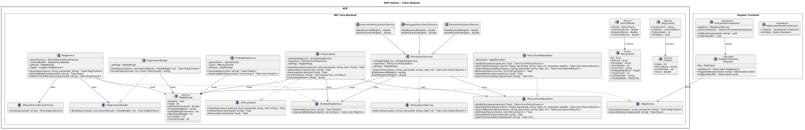
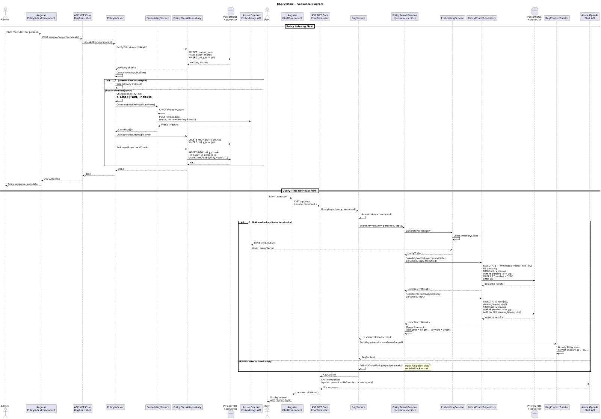

# 12 - RAG System

## Overview

The RAG (Retrieval-Augmented Generation) System enriches LLM prompts with relevant policy document context so that the AI produces grounded, citation-backed answers. In the current Python implementation, the system lazy-initialises persona-specific vector indexes, performs hybrid (semantic + keyword) search over chunked policy documents stored in PostgreSQL, and assembles the top-k results into a token-budgeted prompt context block with inline citations. When the RAG index is unavailable or empty the service falls back to full policy injection.

In the .NET 8 + Angular 17+ rewrite the RAG subsystem is modelled as a set of loosely-coupled services registered via dependency injection, backed by Entity Framework Core for chunk persistence and Azure OpenAI for embedding generation.

---

## Architecture Diagrams

| Diagram | File | Description |
|---------|------|-------------|
| C4 Context | [c4-context.puml](c4-context.puml) | System-level context showing WorkbenchIQ, users, and external services |
| C4 Container | [c4-container.puml](c4-container.puml) | Container-level view: API, SPA, PostgreSQL, Azure OpenAI |
| C4 Component | [c4-component.puml](c4-component.puml) | Component-level breakdown of RAG-related .NET and Angular components |
| Class Diagram | [class-diagram.puml](class-diagram.puml) | Domain model: services, repositories, and value objects |
| Sequence Diagram | [sequence-diagram.puml](sequence-diagram.puml) | Runtime flows: policy indexing and query-time retrieval |





---

## Component Descriptions

### Backend (.NET 8)

#### RagSettings (Options)

Typed configuration loaded from `appsettings.json` via `IOptions<RagSettings>`:

| Property | Type | Purpose |
|----------|------|---------|
| `Enabled` | `bool` | Global feature flag for the RAG subsystem |
| `TopK` | `int` | Maximum number of chunks returned per query (default 5) |
| `SimilarityThreshold` | `double` | Minimum cosine similarity score to include a chunk (default 0.7) |
| `EmbeddingModel` | `string` | Azure OpenAI deployment name (e.g., `text-embedding-3-small`) |
| `EmbeddingDimensions` | `int` | Vector dimensionality (default 1536) |
| `MaxTokenBudget` | `int` | Token ceiling for the assembled RAG context block |
| `ChunkSize` | `int` | Target token count per chunk during indexing |
| `ChunkOverlap` | `int` | Overlap tokens between adjacent chunks |

#### IRagService / RagService

Top-level orchestrator that coordinates the full RAG pipeline:

- **Lazy initialisation** -- persona-specific indexes are built on first access, not at startup.
- **Query** -- accepts a user query and persona ID, delegates to `IPolicySearchService`, then passes results to `IRagContextBuilder`.
- **Fallback** -- when RAG is disabled or the index for a persona is empty, injects the full policy text directly into the prompt (matching current Python behaviour).
- Registered as a scoped service.

#### IPolicySearchService / PolicySearchService

Performs hybrid retrieval combining semantic vector search with keyword matching:

- Generates an embedding for the query via `IEmbeddingService`.
- Executes a cosine-similarity search against `PolicyChunk` embeddings in PostgreSQL (pgvector).
- Applies keyword boosting using full-text search (`ts_vector` / `ts_query`).
- Merges and re-ranks results by a weighted score, returning the top-k `SearchResult` items.

Persona-specific variants (`AutomotivePolicySearchService`, `MortgagePolicySearchService`, `DefaultPolicySearchService`) inherit from a common base and override persona-specific ranking weights or filter predicates. A factory (`IPolicySearchServiceFactory`) resolves the correct variant at runtime based on the active persona.

#### IPolicyIndexer / PolicyIndexer

Responsible for ingesting and chunking policy documents:

1. Receives a policy document (text + metadata).
2. Splits the document into overlapping chunks of `ChunkSize` tokens.
3. Generates embeddings for each chunk via `IEmbeddingService` (batch API).
4. Persists `PolicyChunk` records through `IPolicyChunkRepository`.
5. Supports **incremental indexing** -- only new or modified policies are re-indexed, identified by a content hash.

#### IRagContextBuilder / RagContextBuilder

Assembles search results into a prompt-ready context block:

- Accepts a list of `SearchResult` items and a `MaxTokenBudget`.
- Greedily fills the budget starting from the highest-scored result.
- Formats each included chunk with citation markers (`[1]`, `[2]`, ...).
- Returns a `RagContext` containing the assembled text, the citation list, and the total token count consumed.

#### IEmbeddingService / EmbeddingService

Generates vector embeddings via the Azure OpenAI Embeddings API:

- Wraps the `Azure.AI.OpenAI` SDK client.
- Supports single-text and batch embedding generation.
- Implements an in-memory `IMemoryCache` layer keyed by content hash to avoid redundant API calls.
- Reads model deployment name and dimensions from `RagSettings`.

#### IPolicyChunkRepository / PolicyChunkRepository

Data-access layer for the `PolicyChunk` entity, built on Entity Framework Core:

- CRUD operations on `policy_chunks` table.
- Vector similarity query using pgvector's `<=>` (cosine distance) operator.
- Full-text search query using PostgreSQL `tsvector` column.
- Bulk insert for batch indexing.
- Filtering by `PolicyId` and `PersonaId`.

### Domain Models

#### PolicyChunk

| Property | Type | Description |
|----------|------|-------------|
| `Id` | `Guid` | Primary key |
| `PolicyId` | `Guid` | FK to the source policy document |
| `PersonaId` | `string` | Persona that owns this policy |
| `ChunkIndex` | `int` | Ordinal position within the source document |
| `ChunkText` | `string` | The raw text of the chunk |
| `EmbeddingVector` | `float[]` | Dense vector (pgvector `vector` type) |
| `TokenCount` | `int` | Token count for budget calculations |
| `ContentHash` | `string` | SHA-256 hash for incremental indexing |
| `CreatedAtUtc` | `DateTime` | Timestamp |

#### SearchResult

| Property | Type | Description |
|----------|------|-------------|
| `Chunk` | `PolicyChunk` | The matched chunk |
| `SimilarityScore` | `double` | Cosine similarity (0..1) |
| `KeywordScore` | `double` | Full-text search rank |
| `CombinedScore` | `double` | Weighted hybrid score |

#### RagContext

| Property | Type | Description |
|----------|------|-------------|
| `ContextText` | `string` | Assembled prompt text with citation markers |
| `Citations` | `List<Citation>` | Ordered citation metadata (policy name, chunk index, score) |
| `TokensUsed` | `int` | Total tokens consumed from the budget |
| `IsFallback` | `bool` | True when full policy injection was used instead of RAG |

### Frontend (Angular 17+)

#### RagAdminService (Angular)

Injectable service that calls policy indexing and RAG status endpoints. Used only by admin views.

#### PolicyIndexComponent

Admin-only component for triggering and monitoring policy indexing jobs:

- Displays per-persona index status (chunk count, last indexed timestamp).
- Provides a "Re-index" button per persona and a "Re-index All" bulk action.
- Shows progress via a polling mechanism against a background job status endpoint.

#### RagContextPanelComponent

Side-panel component rendered alongside chat and analysis views. Displays the RAG citations returned with an LLM response so the user can inspect which policy chunks influenced the answer.

---

## Indexing Pipeline

1. Admin uploads or updates a policy document via the Policy Management module.
2. `PolicyIndexer` computes a SHA-256 content hash and compares it against existing chunks.
3. If new or changed, the document is split into overlapping chunks (`ChunkSize` / `ChunkOverlap`).
4. `EmbeddingService` generates embeddings in batch (up to 16 texts per API call).
5. `PolicyChunkRepository` bulk-inserts the new `PolicyChunk` records and deletes stale ones.
6. The persona-specific search index is invalidated so the next query picks up new data.

## Query-Time Flow

1. User submits a question via Ask IQ Chat or the analysis pipeline.
2. `RagService` checks whether RAG is enabled and the persona has indexed chunks.
3. `PolicySearchService` generates a query embedding, runs hybrid search, and returns ranked `SearchResult` items.
4. `RagContextBuilder` assembles the top results into a token-budgeted context block with citations.
5. The context block is prepended to the LLM prompt.
6. The LLM response and citation metadata are returned to the frontend.
7. If no chunks meet the similarity threshold, `RagService` falls back to injecting the full policy text.

---

## Configuration (appsettings.json)

```jsonc
{
  "RagSettings": {
    "Enabled": true,
    "TopK": 5,
    "SimilarityThreshold": 0.7,
    "EmbeddingModel": "text-embedding-3-small",
    "EmbeddingDimensions": 1536,
    "MaxTokenBudget": 4000,
    "ChunkSize": 512,
    "ChunkOverlap": 64
  }
}
```

Settings are bound via `IOptions<RagSettings>` and validated at startup with `IValidateOptions<RagSettings>`.

---

## API Endpoints

| Endpoint | Verb | Description |
|----------|------|-------------|
| `GET /api/rag/status` | GET | RAG subsystem health: enabled flag, per-persona chunk counts |
| `POST /api/rag/index/{personaId}` | POST | Trigger incremental indexing for a persona |
| `POST /api/rag/index` | POST | Trigger full re-index across all personas |
| `GET /api/rag/index/{personaId}/status` | GET | Indexing job progress for a persona |
| `POST /api/rag/search` | POST | Debug endpoint: run a RAG query and return raw search results |

---

## Database Schema (PostgreSQL + pgvector)

```sql
CREATE EXTENSION IF NOT EXISTS vector;

CREATE TABLE policy_chunks (
    id              UUID PRIMARY KEY DEFAULT gen_random_uuid(),
    policy_id       UUID NOT NULL REFERENCES policies(id) ON DELETE CASCADE,
    persona_id      VARCHAR(64) NOT NULL,
    chunk_index     INT NOT NULL,
    chunk_text      TEXT NOT NULL,
    embedding_vector VECTOR(1536) NOT NULL,
    token_count     INT NOT NULL,
    content_hash    VARCHAR(64) NOT NULL,
    created_at_utc  TIMESTAMPTZ NOT NULL DEFAULT now(),
    tsv             TSVECTOR GENERATED ALWAYS AS (to_tsvector('english', chunk_text)) STORED
);

CREATE INDEX ix_policy_chunks_persona   ON policy_chunks (persona_id);
CREATE INDEX ix_policy_chunks_policy    ON policy_chunks (policy_id);
CREATE INDEX ix_policy_chunks_hash      ON policy_chunks (content_hash);
CREATE INDEX ix_policy_chunks_embedding ON policy_chunks USING ivfflat (embedding_vector vector_cosine_ops) WITH (lists = 100);
CREATE INDEX ix_policy_chunks_tsv       ON policy_chunks USING gin (tsv);
```
