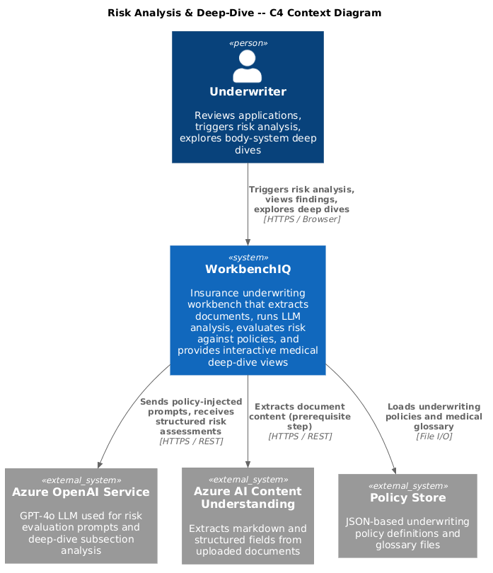
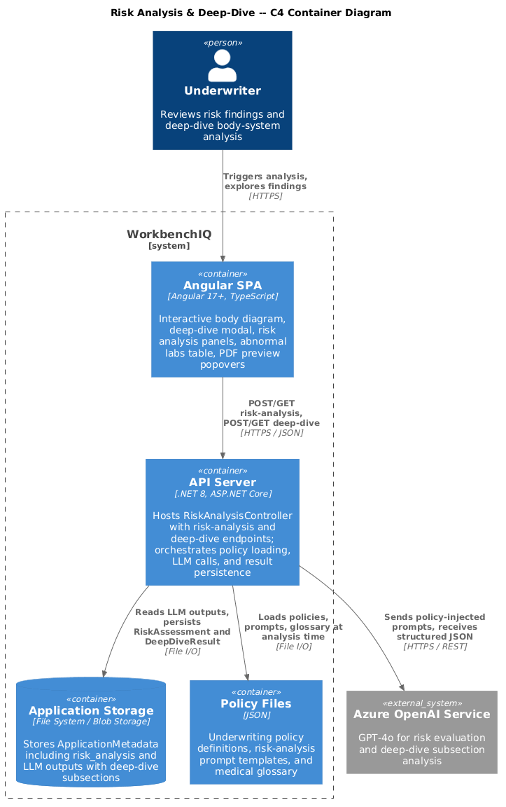
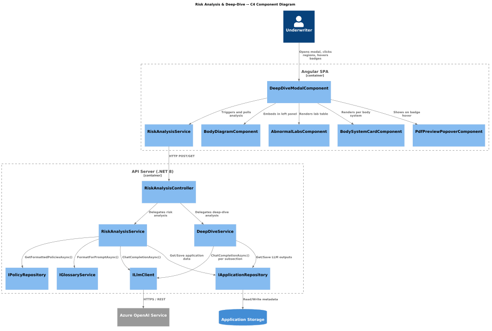
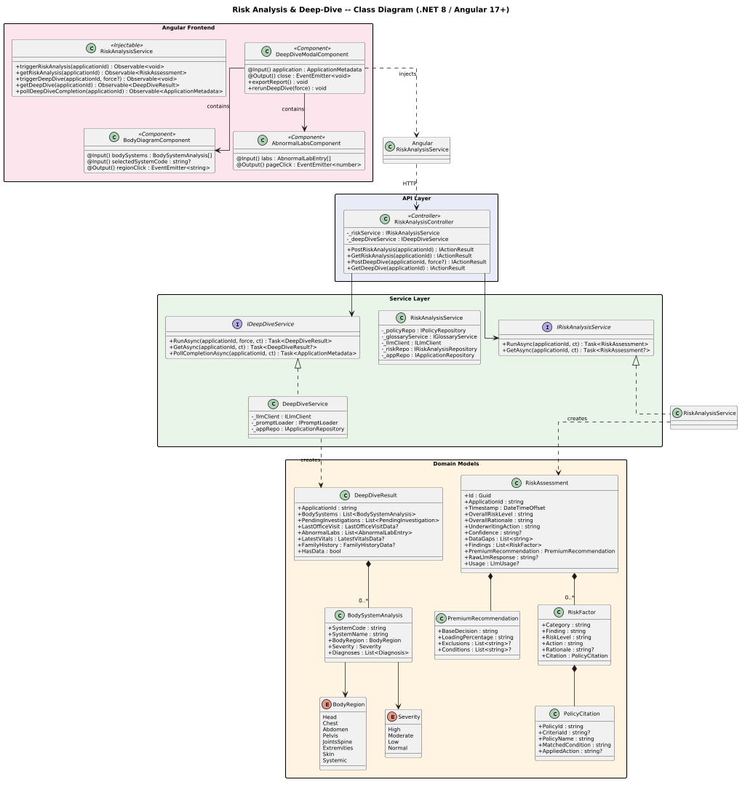
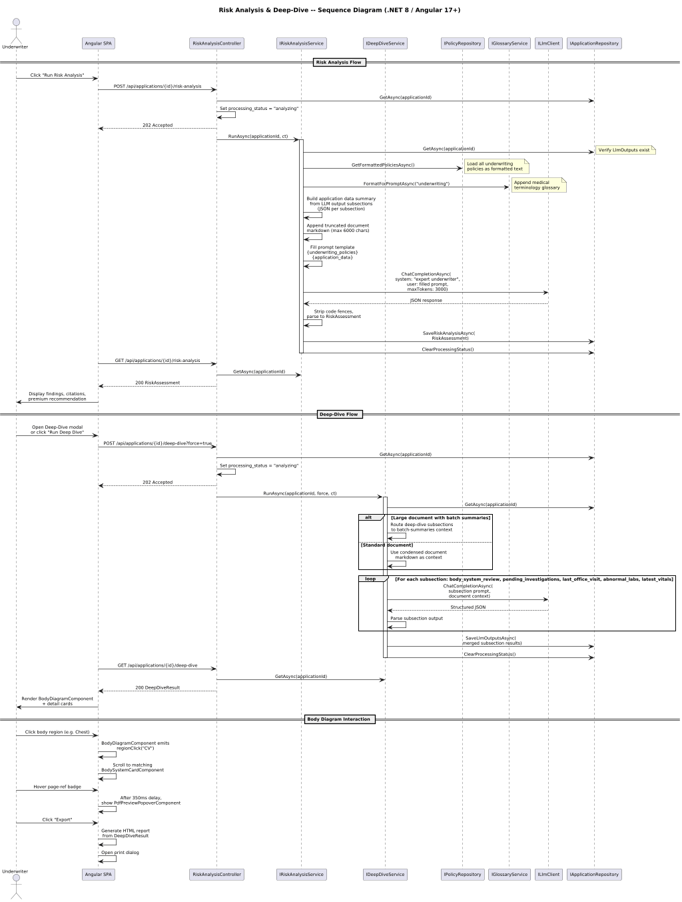

# Risk Analysis & Deep-Dive

## Overview

This document describes the **Risk Analysis & Deep-Dive** behavior for the WorkbenchIQ rewrite targeting **.NET 8 (ASP.NET Core)** on the backend and **Angular 17+** on the frontend. The design preserves the semantics of the existing Python implementation while adopting idiomatic patterns for each new platform.

Risk analysis is a **separate, policy-driven evaluation** that runs after document extraction and LLM summarisation are complete. It loads underwriting policies, evaluates extracted medical and financial data against policy criteria, and produces a structured risk assessment with severity-scored findings, policy citations, premium recommendations, and data-gap warnings. A companion **deep-dive** subsystem provides focused, body-system-level medical analysis with an interactive SVG body diagram, abnormal-lab review, and floating PDF page previews.

### Key behaviors carried forward

| Behavior | Current implementation | .NET / Angular design |
|---|---|---|
| Policy-based risk evaluation | `run_risk_analysis()` in `processing.py` loads policies, builds application data summary from LLM outputs, calls LLM with policy-injected prompt | `IRiskAnalysisService.RunAsync()` orchestrates policy loading, data assembly, and LLM call |
| Underwriting policy injection | `load_underwriting_policies()` formats all policies for prompt; glossary appended | `IPolicyRepository.GetFormattedPoliciesAsync()` + `IGlossaryService.FormatForPromptAsync()` |
| Risk analysis storage | Stored in `ApplicationMetadata.risk_analysis` as `{ timestamp, raw, parsed, usage }` | `RiskAnalysis` entity persisted via `IRiskAnalysisRepository` |
| Structured risk output | `RiskAnalysisResult` with `overall_risk_level`, `findings[]`, `premium_recommendation`, `underwriting_action`, `confidence`, `data_gaps[]` | Same shape via `RiskAssessment`, `RiskFactor`, `PremiumRecommendation` DTOs |
| Policy citations per finding | Each `RiskFinding` carries `policy_id`, `criteria_id`, `policy_name`, `matched_condition`, `action`, `rationale` | `PolicyCitation` value object embedded in each `RiskFactor` |
| Deep-dive subsections | `medical_summary` subsections (`body_system_review`, `pending_investigations`, `last_office_visit`, `abnormal_labs`, `latest_vitals`) routed to batch-summaries context for large docs | `IDeepDiveService.RunSubsectionsAsync()` with context-routing strategy |
| Deep-dive trigger | `POST /api/applications/{app_id}/analyze/deep-dive` starts background analysis; polls for completion | `POST /api/applications/{applicationId}/deep-dive` with `202 Accepted` + polling |
| Interactive body diagram | `BodyDiagram.tsx` renders SVG with clickable region paths, severity-coloured overlays, diagnosis count badges | `BodyDiagramComponent` (Angular) with same SVG viewBox, region click events |
| Body system cards | `BodySystemCard.tsx` with expandable diagnoses, treatments, consults, imaging, page-reference badges | `BodySystemCardComponent` with collapsible accordion sections |
| Abnormal labs table | `AbnormalLabsCard.tsx` colour-coded interpretation column | `AbnormalLabsComponent` with severity pipe and sortable table |
| Deep-dive modal | `BodySystemDeepDiveModal.tsx` full-screen modal with left body-diagram panel + scrollable detail cards + export-to-HTML/print | `DeepDiveModalComponent` with split-pane layout |
| Floating PDF preview on page-ref hover | `FloatingPdfPreview` shown after 350 ms hover delay on page badges | `PdfPreviewPopoverComponent` with configurable hover delay |
| Export full report | Builds complete HTML document from deep-dive data and opens print dialog | `DeepDiveModalComponent.exportReport()` generates HTML or calls backend PDF endpoint |
| Risk analysis API | `POST /api/applications/{app_id}/risk-analysis` to trigger; `GET` to retrieve | `RiskAnalysisController` with `POST` / `GET` endpoints |

---

## Architecture diagrams

### C4 Context

### C4 Container

### C4 Component

### Class diagram

### Sequence diagram

---

## Backend components (.NET 8 / ASP.NET Core)

### RiskAssessment (domain model)

The top-level entity representing a completed risk evaluation for an application.

| Property | Type | Description |
|---|---|---|
| `Id` | `Guid` | Primary key. |
| `ApplicationId` | `string` | Foreign key to the parent application. |
| `Timestamp` | `DateTimeOffset` | When the analysis was performed. |
| `OverallRiskLevel` | `string` | Aggregate risk level (`"standard"`, `"substandard"`, `"decline"`, etc.). |
| `OverallRationale` | `string` | Free-text explanation of the overall assessment. |
| `UnderwritingAction` | `string` | Recommended action (`"approve"`, `"rate-up"`, `"postpone"`, `"decline"`). |
| `Confidence` | `string?` | LLM self-assessed confidence level. |
| `DataGaps` | `List<string>` | Missing data that could change the assessment. |
| `Findings` | `List<RiskFactor>` | Individual risk findings with policy citations. |
| `PremiumRecommendation` | `PremiumRecommendation` | Loading, exclusions, and conditions. |
| `RawLlmResponse` | `string?` | Verbatim LLM output for audit trail. |
| `Usage` | `LlmUsage?` | Token counts (prompt, completion, total). |

### RiskFactor (value object)

A single risk finding tied to a specific policy criterion.

| Property | Type | Description |
|---|---|---|
| `Category` | `string` | Medical or financial category (e.g. `"cardiovascular"`, `"build"`). |
| `Finding` | `string` | Description of what was found. |
| `RiskLevel` | `string` | Severity (`"high"`, `"moderate"`, `"low"`). |
| `Action` | `string` | Recommended underwriting action. |
| `Rationale` | `string?` | Explanation for the finding. |
| `Citation` | `PolicyCitation` | Policy reference that triggered this finding. |

### PolicyCitation (value object)

Audit-ready reference back to the exact policy and criterion that was matched.

| Property | Type | Description |
|---|---|---|
| `PolicyId` | `string` | Unique policy identifier (e.g. `"CVD-BP-001"`). |
| `CriteriaId` | `string?` | Specific criterion within the policy. |
| `PolicyName` | `string` | Human-readable policy name. |
| `MatchedCondition` | `string` | The condition text that matched the applicant data. |
| `AppliedAction` | `string?` | Action dictated by the policy criterion. |

### PremiumRecommendation (value object)

| Property | Type | Description |
|---|---|---|
| `BaseDecision` | `string` | Base underwriting decision. |
| `LoadingPercentage` | `string` | Premium loading (e.g. `"+50%"`, `"table 4"`). |
| `Exclusions` | `List<string>?` | Conditions excluded from coverage. |
| `Conditions` | `List<string>?` | Special conditions attached to the policy. |

### BodySystemAnalysis (domain model)

Represents the structured deep-dive output for a single body system.

| Property | Type | Description |
|---|---|---|
| `SystemCode` | `string` | Short code (e.g. `"CV"`, `"NEURO"`, `"ENDO"`). |
| `SystemName` | `string` | Display name (e.g. `"Cardiovascular"`). |
| `BodyRegion` | `BodyRegion` | Enum: `Head`, `Chest`, `Abdomen`, `Pelvis`, `JointsSpine`, `Extremities`, `Skin`, `Systemic`. |
| `Severity` | `Severity` | Enum: `High`, `Moderate`, `Low`, `Normal`. |
| `Diagnoses` | `List<Diagnosis>` | Diagnoses with treatments, consults, imaging, page references. |

### DeepDiveResult (domain model)

Aggregation of all deep-dive subsections for an application.

| Property | Type | Description |
|---|---|---|
| `ApplicationId` | `string` | Parent application. |
| `BodySystems` | `List<BodySystemAnalysis>` | Per-system review. |
| `PendingInvestigations` | `List<PendingInvestigation>` | Outstanding tests, referrals, imaging. |
| `LastOfficeVisit` | `LastOfficeVisitData?` | Most recent visit summary. |
| `AbnormalLabs` | `List<AbnormalLabEntry>` | Labs outside reference range. |
| `LatestVitals` | `LatestVitalsData?` | Most recent vital signs. |
| `FamilyHistory` | `FamilyHistoryData?` | Relatives, conditions, age-at-onset. |
| `HasData` | `bool` | `true` when at least one subsection is populated. |

### IRiskAnalysisService / RiskAnalysisService

Orchestrates the full risk-analysis pipeline.

| Method | Signature | Description |
|---|---|---|
| `RunAsync` | `Task<RiskAssessment> RunAsync(string applicationId, CancellationToken ct)` | Loads policies, assembles application data from LLM outputs, calls LLM, parses structured response, persists result. |
| `GetAsync` | `Task<RiskAssessment?> GetAsync(string applicationId, CancellationToken ct)` | Retrieves stored risk assessment. |

Implementation details:
1. Loads formatted policies via `IPolicyRepository.GetFormattedPoliciesAsync()`.
2. Appends glossary via `IGlossaryService.FormatForPromptAsync("underwriting")`.
3. Builds application data summary by serialising each LLM output subsection as JSON.
4. Appends a truncated document-markdown excerpt (first 6 000 characters) for additional context.
5. Fills the `overall_risk_assessment` prompt template with `{underwriting_policies}` and `{application_data}` placeholders.
6. Calls `ILlmClient.ChatCompletionAsync()` with system message and filled prompt.
7. Strips markdown code fences, parses JSON, maps to `RiskAssessment`.
8. Persists via `IRiskAnalysisRepository.SaveAsync()`.

### IDeepDiveService / DeepDiveService

Runs the body-system deep-dive subsections.

| Method | Signature | Description |
|---|---|---|
| `RunAsync` | `Task<DeepDiveResult> RunAsync(string applicationId, bool force, CancellationToken ct)` | Runs all deep-dive subsections (`body_system_review`, `pending_investigations`, `last_office_visit`, `abnormal_labs`, `latest_vitals`). Routes to batch-summaries context for large documents. |
| `GetAsync` | `Task<DeepDiveResult?> GetAsync(string applicationId, CancellationToken ct)` | Retrieves stored deep-dive data from LLM outputs. |
| `PollCompletionAsync` | `Task<ApplicationMetadata> PollCompletionAsync(string applicationId, CancellationToken ct)` | Waits for background deep-dive processing to finish. |

Context-routing strategy (preserved from Python):
- For large documents with batch summaries, deep-dive subsections are run against the richer batch-summaries context rather than the condensed summary.
- Standard medical-summary subsections (family history, hypertension, etc.) continue to use the condensed context.

### RiskAnalysisController

| Endpoint | Method | Description |
|---|---|---|
| `/api/applications/{applicationId}/risk-analysis` | `POST` | Triggers risk analysis. Sets `processing_status = "analyzing"`. Returns `202 Accepted`. |
| `/api/applications/{applicationId}/risk-analysis` | `GET` | Returns the stored `RiskAssessment` or `404`. |
| `/api/applications/{applicationId}/deep-dive` | `POST` | Triggers deep-dive analysis. Accepts optional `force` query parameter. Returns `202 Accepted`. |
| `/api/applications/{applicationId}/deep-dive` | `GET` | Returns the stored `DeepDiveResult` or `404`. |

---

## Frontend components (Angular 17+)

### RiskAnalysisService (Angular)

Injectable service that communicates with the risk-analysis and deep-dive API endpoints.

| Method | Return type | Description |
|---|---|---|
| `triggerRiskAnalysis(applicationId)` | `Observable<void>` | `POST` to risk-analysis endpoint. |
| `getRiskAnalysis(applicationId)` | `Observable<RiskAssessment>` | `GET` risk assessment. |
| `triggerDeepDive(applicationId, force?)` | `Observable<void>` | `POST` to deep-dive endpoint. |
| `getDeepDive(applicationId)` | `Observable<DeepDiveResult>` | `GET` deep-dive data. |
| `pollDeepDiveCompletion(applicationId)` | `Observable<ApplicationMetadata>` | Polls until `processing_status !== "analyzing"`. |

### BodyDiagramComponent

Standalone Angular component that renders an interactive SVG body map.

- **Inputs**: `bodySystems: BodySystemAnalysis[]`, `selectedSystemCode?: string`.
- **Outputs**: `regionClick: EventEmitter<string>` (emits `systemCode`).
- **Behaviour**: Maps each `BodySystemAnalysis` to a region path, fills with severity colour, shows diagnosis-count badges. Non-spatial regions (skin, systemic) render as labelled circles outside the silhouette.
- SVG viewBox `0 0 100 100` with region paths matching the current React implementation.
- Severity colours: high = red, moderate = amber, low = emerald, normal = slate.

### DeepDiveModalComponent

Full-screen overlay with two-panel layout.

- **Left panel** (fixed 288 px): `BodyDiagramComponent` + quick-stat cards (pending investigations count, abnormal labs count).
- **Right panel** (scrollable): stacked cards for pending investigations, last office visit, body system cards, abnormal labs, latest vitals, family history.
- **Toolbar**: re-run button (calls `triggerDeepDive` with `force = true`), export button, close button.
- **Export**: Generates a complete HTML document from deep-dive data and opens it in a new window with `window.print()`.
- **Page-reference hover**: Shows `PdfPreviewPopoverComponent` after 350 ms delay.

### BodySystemCardComponent

Expandable card for a single body system.

- Displays system icon, name, code, severity badge.
- Accordion of diagnoses, each with status, date diagnosed, page references.
- Nested sections for treatments, consults, and imaging with page-ref badges.

### AbnormalLabsComponent

Sortable table of lab results outside reference range.

- Columns: Date, Test, Value, Ref Range, Interpretation, Source (page refs).
- Interpretation column colour-coded: critical/very-high/very-low = red bold, elevated/high/low = amber, default = slate.

### PdfPreviewPopoverComponent

Floating popover that renders a single PDF page thumbnail.

- Anchored to the hovered page-reference badge `DOMRect`.
- Shown after 350 ms hover delay; dismissed on mouse-leave.
- Loads PDF page via the existing media proxy endpoint.

---

## Data flow summary

1. **Extraction & summarisation** (prerequisite) -- document is uploaded, Content Understanding extracts markdown, LLM produces section/subsection outputs stored in `LlmOutputs`.
2. **Deep-dive trigger** -- user opens the deep-dive modal or clicks "Run Deep Dive". `POST /api/applications/{id}/deep-dive` queues subsection prompts against the extracted data (or batch summaries for large documents). Results are stored under `LlmOutputs.MedicalSummary` subsections.
3. **Risk analysis trigger** -- user clicks "Run Risk Analysis". `POST /api/applications/{id}/risk-analysis` loads all underwriting policies, serialises LLM outputs as structured context, calls the `overall_risk_assessment` prompt, parses the structured JSON response, and stores the result as `RiskAnalysis` on the application.
4. **Display** -- the Angular app retrieves both the deep-dive result and risk assessment and renders them in the body-diagram modal and risk-analysis panels respectively.

---

## Configuration

| Setting | Type | Default | Description |
|---|---|---|---|
| `RiskAnalysis:PromptsPath` | `string` | `"prompts/risk-analysis-prompts.json"` | Path to risk-analysis prompt templates. |
| `RiskAnalysis:MaxDocumentExcerptChars` | `int` | `6000` | Maximum characters of document markdown to include in the risk-analysis prompt. |
| `RiskAnalysis:MaxTokens` | `int` | `3000` | Max tokens for the risk-analysis LLM call. |
| `DeepDive:Subsections` | `string[]` | `["body_system_review", "pending_investigations", "last_office_visit", "abnormal_labs", "latest_vitals"]` | Subsections to run during deep-dive analysis. |
| `DeepDive:HoverDelayMs` | `int` | `350` | Milliseconds before showing the floating PDF preview on page-badge hover. |
