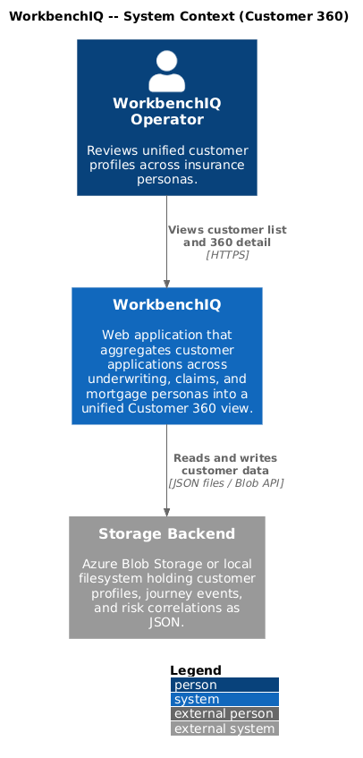
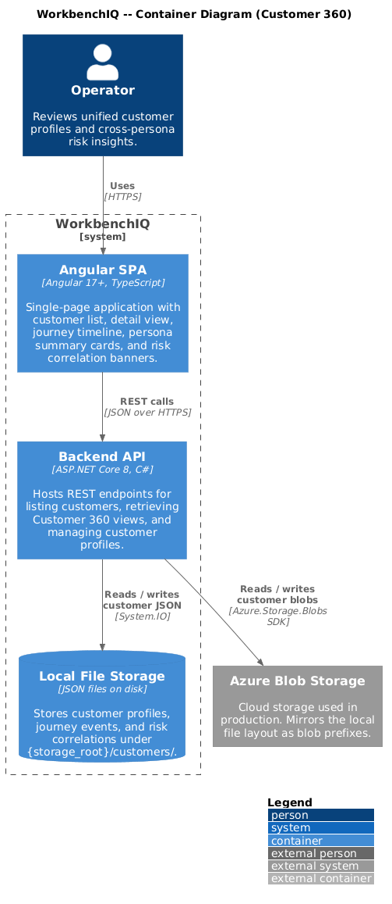
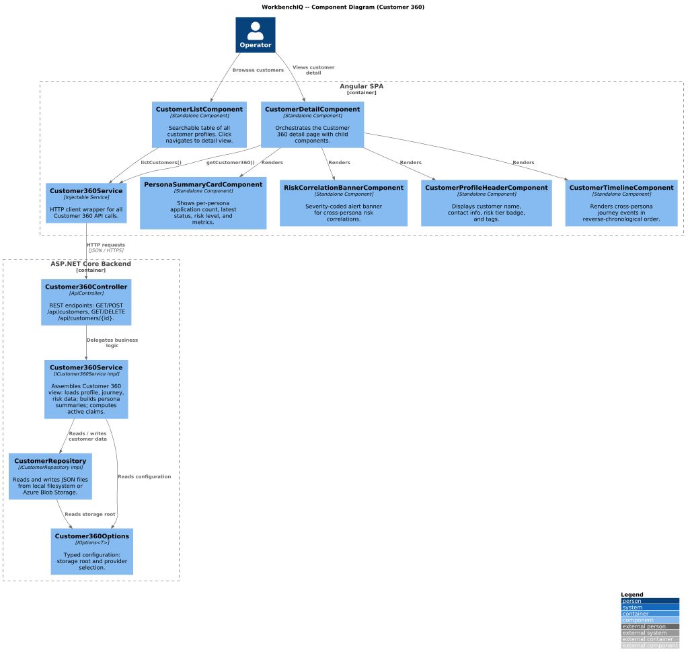
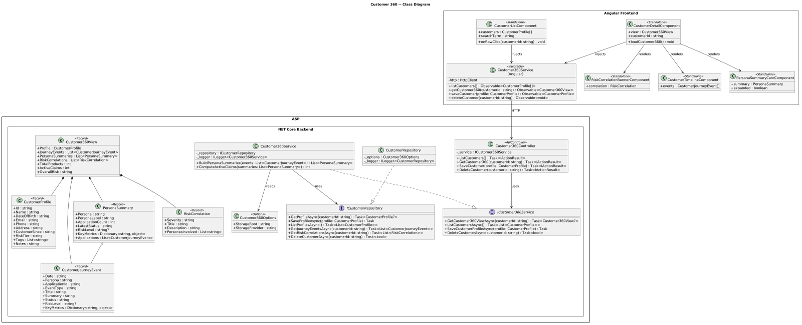
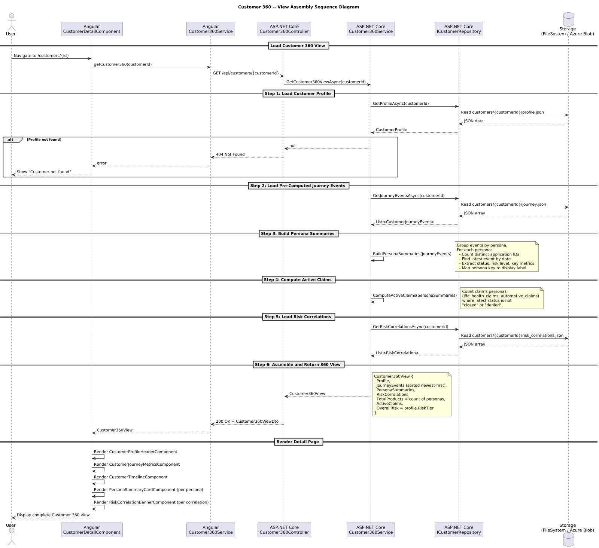

# Customer 360

## Overview

This document describes the Customer 360 behavior for the WorkbenchIQ rewrite targeting **.NET 8 (ASP.NET Core)** on the backend and **Angular 17+** on the frontend. The design preserves the semantics of the existing Python implementation while adopting idiomatic patterns for each new platform.

Customer 360 aggregates applications across multiple personas (underwriting, claims, mortgage) into a unified customer profile. It provides a cross-persona timeline, per-persona summaries, and automated risk correlation analysis.

### Key behaviors carried forward

| Behavior | Current implementation | .NET / Angular design |
|---|---|---|
| Unified customer profile | `CustomerProfile` dataclass stored as JSON | `CustomerProfile` entity persisted via `ICustomerRepository` |
| Cross-persona journey timeline | `CustomerJourneyEvent` list computed from linked apps | `ICustomer360Service.GetJourneyEventsAsync()` assembles timeline |
| Per-persona summaries | `PersonaSummary` built by grouping events by persona | `ICustomer360Service.BuildPersonaSummariesAsync()` |
| Risk correlation analysis | `RiskCorrelation` generated from cross-persona patterns | `ICustomer360Service.AnalyzeRiskCorrelationsAsync()` |
| Full 360 view assembly | `get_customer_360()` returns `Customer360View` | `Customer360Controller.GetCustomer360()` returns `Customer360ViewDto` |
| Customer list | `list_customers()` enumerates profile directories | `Customer360Controller.ListCustomers()` with repository |
| Storage: local + Azure Blob | Blob-first with local filesystem fallback | `ICustomerRepository` with `FileSystemCustomerRepository` / `AzureBlobCustomerRepository` |
| Customer list page | `/customers` route with search and filter | `CustomerListComponent` at `/customers` |
| Customer detail page | `/customers/{id}` with profile card, timeline, summaries | `CustomerDetailComponent` at `/customers/:id` |

---

## Architecture diagrams

### C4 Context



### C4 Container



### C4 Component



### Class diagram



### Sequence diagram



---

## Backend components (.NET 8 / ASP.NET Core)

### Customer360Options

Configuration POCO bound from `appsettings.json` section `"Customer360"`.

| Property | Type | Description |
|---|---|---|
| `StorageRoot` | `string` | Root path for local filesystem storage. |
| `StorageProvider` | `string` | `"FileSystem"` or `"AzureBlob"`. |

### Models

#### CustomerProfile

Core customer identity record linking applications across personas.

| Property | Type | Description |
|---|---|---|
| `Id` | `string` | Unique customer identifier. |
| `Name` | `string` | Full name. |
| `DateOfBirth` | `string` | Date of birth (ISO 8601). |
| `Email` | `string` | Primary email address. |
| `Phone` | `string` | Primary phone number. |
| `Address` | `string` | Mailing address. |
| `CustomerSince` | `string` | Date the customer relationship began. |
| `RiskTier` | `string` | Overall risk classification: `"low"`, `"medium"`, `"high"`. |
| `Tags` | `List<string>` | Arbitrary classification tags. |
| `Notes` | `string` | Free-text notes. |

#### CustomerJourneyEvent

A single event in the cross-persona customer timeline.

| Property | Type | Description |
|---|---|---|
| `Date` | `string` | Event timestamp (ISO 8601). |
| `Persona` | `string` | Persona key (e.g. `"underwriting"`, `"automotive_claims"`). |
| `ApplicationId` | `string` | ID of the associated application. |
| `EventType` | `string` | Event kind: `application_submitted`, `claim_filed`, `underwriting_complete`, etc. |
| `Title` | `string` | Human-readable event title. |
| `Summary` | `string` | Brief description. |
| `Status` | `string` | Current status of the associated application. |
| `RiskLevel` | `string?` | Risk level at the time of the event. |
| `KeyMetrics` | `Dictionary<string, object>` | Persona-specific metrics snapshot. |

#### PersonaSummary

Aggregated view of a single persona's applications for one customer.

| Property | Type | Description |
|---|---|---|
| `Persona` | `string` | Persona key. |
| `PersonaLabel` | `string` | Display name (e.g. "Life & Health Underwriting"). |
| `ApplicationCount` | `int` | Number of distinct applications. |
| `LatestStatus` | `string` | Status of the most recent application. |
| `RiskLevel` | `string?` | Risk level from the most recent event. |
| `KeyMetrics` | `Dictionary<string, object>` | Latest metrics snapshot. |
| `Applications` | `List<CustomerJourneyEvent>` | All events for this persona. |

#### RiskCorrelation

A cross-persona risk insight detected by analyzing patterns across the customer's applications.

| Property | Type | Description |
|---|---|---|
| `Severity` | `string` | `"info"`, `"warning"`, or `"critical"`. |
| `Title` | `string` | Short headline. |
| `Description` | `string` | Detailed explanation. |
| `PersonasInvolved` | `List<string>` | Persona keys contributing to this correlation. |

#### Customer360View

Complete aggregated view returned by the API.

| Property | Type | Description |
|---|---|---|
| `Profile` | `CustomerProfile` | Core customer record. |
| `JourneyEvents` | `List<CustomerJourneyEvent>` | Timeline events sorted newest-first. |
| `PersonaSummaries` | `List<PersonaSummary>` | One entry per persona with active applications. |
| `RiskCorrelations` | `List<RiskCorrelation>` | Cross-persona risk insights. |
| `TotalProducts` | `int` | Count of distinct personas with applications. |
| `ActiveClaims` | `int` | Count of open claims (claims personas with status not `closed`/`denied`). |
| `OverallRisk` | `string` | Mirrors `CustomerProfile.RiskTier`. |

### ICustomerRepository / CustomerRepository

Abstraction for customer data persistence. Two implementations:

- **FileSystemCustomerRepository** -- reads/writes JSON files under `{StorageRoot}/customers/{customerId}/`.
- **AzureBlobCustomerRepository** -- reads/writes blobs under `customers/{customerId}/` prefix.

| Method | Returns | Description |
|---|---|---|
| `GetProfileAsync(customerId)` | `Task<CustomerProfile?>` | Load a single customer profile. |
| `SaveProfileAsync(profile)` | `Task` | Persist a customer profile. |
| `ListProfilesAsync()` | `Task<List<CustomerProfile>>` | Enumerate all customer profiles. |
| `GetJourneyEventsAsync(customerId)` | `Task<List<CustomerJourneyEvent>>` | Load pre-computed journey events. |
| `SaveJourneyEventsAsync(customerId, events)` | `Task` | Persist journey events. |
| `GetRiskCorrelationsAsync(customerId)` | `Task<List<RiskCorrelation>>` | Load risk correlations. |
| `SaveRiskCorrelationsAsync(customerId, correlations)` | `Task` | Persist risk correlations. |
| `DeleteCustomerAsync(customerId)` | `Task<bool>` | Remove customer and all associated data. |

### ICustomer360Service / Customer360Service

Domain service that orchestrates the 360 view assembly.

| Method | Returns | Description |
|---|---|---|
| `GetCustomer360ViewAsync(customerId)` | `Task<Customer360View?>` | Loads profile, journey, and risk data; builds persona summaries; returns the full view. |
| `ListCustomersAsync()` | `Task<List<CustomerProfile>>` | Delegates to repository. |
| `BuildPersonaSummariesAsync(events)` | `Task<List<PersonaSummary>>` | Groups journey events by persona, computes latest status and metrics. |
| `ComputeActiveClaimsAsync(summaries)` | `Task<int>` | Counts open claims from claims-type persona summaries. |
| `SaveCustomerProfileAsync(profile)` | `Task` | Creates or updates a customer profile. |
| `DeleteCustomerAsync(customerId)` | `Task<bool>` | Removes a customer and all data. |

### Customer360Controller

`[ApiController]` at route `api/customers`.

| Endpoint | Method | Description |
|---|---|---|
| `/api/customers` | `GET` | Returns list of all customer profiles. |
| `/api/customers/{customerId}` | `GET` | Returns the full `Customer360View` for one customer. |
| `/api/customers` | `POST` | Creates or updates a customer profile. |
| `/api/customers/{customerId}` | `DELETE` | Deletes a customer and all associated data. |

### PersonaLabels

Static mapping from persona keys to display labels, matching the current implementation:

| Key | Label |
|---|---|
| `underwriting` | Life & Health Underwriting |
| `life_health_claims` | Life & Health Claims |
| `automotive_claims` | Automotive Claims |
| `mortgage_underwriting` | Mortgage Underwriting |
| `mortgage` | Mortgage Underwriting |

---

## Frontend components (Angular 17+)

### Customer360Service (Angular)

Injectable service in `features/customer360/services/customer360.service.ts`.

| Method | Returns | Description |
|---|---|---|
| `listCustomers()` | `Observable<CustomerProfile[]>` | Calls `GET /api/customers`. |
| `getCustomer360(customerId)` | `Observable<Customer360View>` | Calls `GET /api/customers/{customerId}`. |
| `saveCustomer(profile)` | `Observable<CustomerProfile>` | Calls `POST /api/customers`. |
| `deleteCustomer(customerId)` | `Observable<void>` | Calls `DELETE /api/customers/{customerId}`. |

### CustomerListComponent

Standalone component at route `/customers`.

- Displays a searchable, sortable table of all customer profiles.
- Columns: Name, Email, Risk Tier, Customer Since, Tags.
- Click a row to navigate to `/customers/:id`.
- Search filters on name and email.

### CustomerDetailComponent

Standalone component at route `/customers/:id`.

- Orchestrates the detail view by loading `Customer360View` on init.
- Renders four child components: `CustomerProfileHeaderComponent`, `CustomerTimelineComponent`, `PersonaSummaryCardComponent` (one per persona), and `RiskCorrelationBannerComponent` (one per correlation).
- Displays aggregate metrics: Total Products, Active Claims, Overall Risk.

### CustomerProfileHeaderComponent

Displays the customer profile card.

- Inputs: `CustomerProfile`.
- Shows name, DOB, email, phone, address, risk tier badge, customer-since date, and tags.

### CustomerTimelineComponent

Renders the cross-persona journey timeline.

- Inputs: `CustomerJourneyEvent[]`.
- Displays events in reverse-chronological order.
- Each event shows date, persona badge, event type, title, summary, status, and risk level indicator.

### PersonaSummaryCardComponent

Renders a per-persona summary card.

- Inputs: `PersonaSummary`.
- Shows persona label, application count, latest status, risk level, and key metrics.
- Expandable section lists individual applications.

### RiskCorrelationBannerComponent

Renders a cross-persona risk correlation alert.

- Inputs: `RiskCorrelation`.
- Color-coded by severity: blue (info), amber (warning), red (critical).
- Shows title, description, and list of involved personas.

### CustomerJourneyMetricsComponent

Summary metrics bar displayed at the top of the detail page.

- Inputs: `Customer360View`.
- Shows Total Products, Active Claims, and Overall Risk as stat cards.

---

## Storage layout

Customer data is stored as JSON files under the storage root:

```
{storage_root}/
  customers/
    {customer_id}/
      profile.json          # CustomerProfile
      journey.json           # List<CustomerJourneyEvent>
      risk_correlations.json # List<RiskCorrelation>
```

The Azure Blob implementation mirrors this path structure as blob prefixes.

---

## Configuration

### appsettings.json (excerpt)

```json
{
  "Customer360": {
    "StorageRoot": "./data",
    "StorageProvider": "FileSystem"
  }
}
```

### Environment variable mapping

| Env var | Maps to |
|---|---|
| `CUSTOMER360__StorageRoot` | `Customer360Options.StorageRoot` |
| `CUSTOMER360__StorageProvider` | `Customer360Options.StorageProvider` |

---

## Key design decisions

1. **Repository pattern** -- `ICustomerRepository` abstracts storage so the service layer is unaware of whether data lives on disk or in Azure Blob Storage. New providers can be added without changing business logic.
2. **Pre-computed journey and risk data** -- Journey events and risk correlations are persisted separately from the profile, allowing them to be computed asynchronously and cached. The 360 view assembly simply loads and combines them.
3. **Active claims calculation** -- Claims personas (`life_health_claims`, `automotive_claims`) with a latest status that is not `closed` or `denied` are counted as active. This matches the current Python logic.
4. **Persona label mapping** -- A static dictionary maps persona keys to human-readable labels, consistent with the existing `PERSONA_LABELS` dictionary.
5. **Async all the way** -- All repository and service methods are `async Task<T>` to support non-blocking I/O for both filesystem and blob storage.
