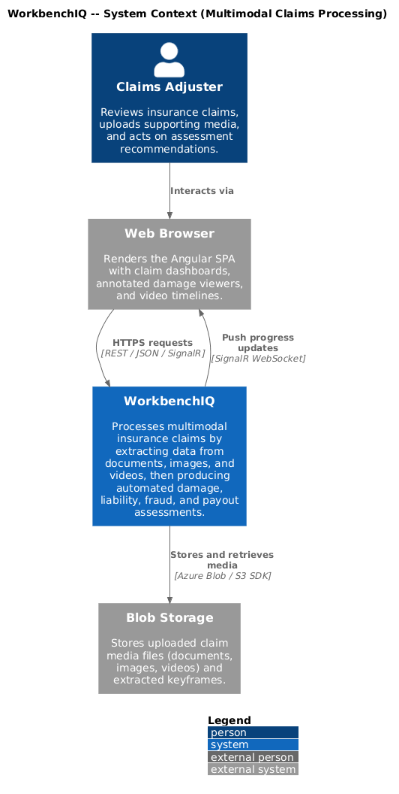
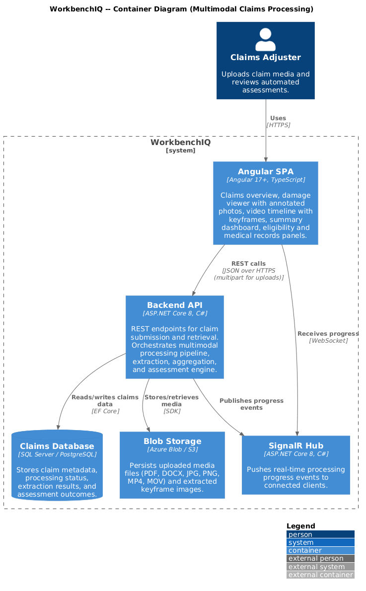
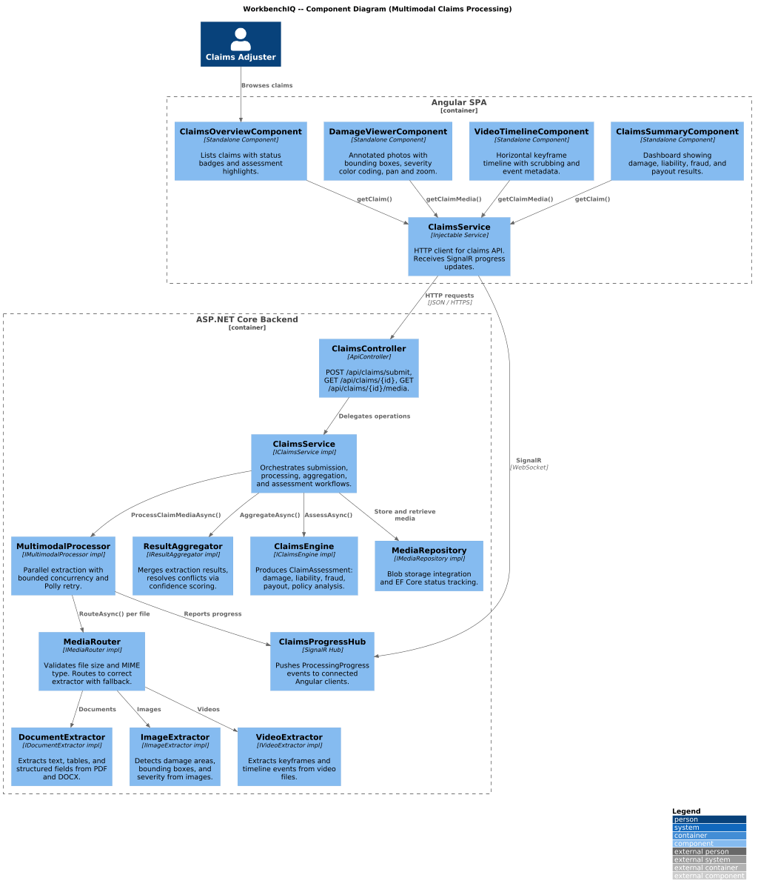
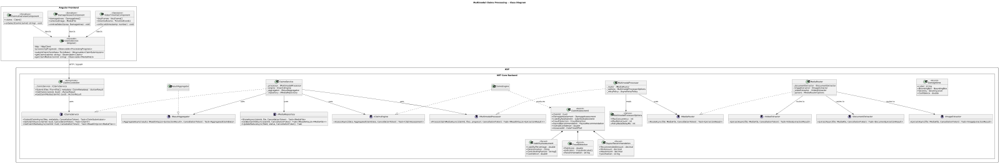
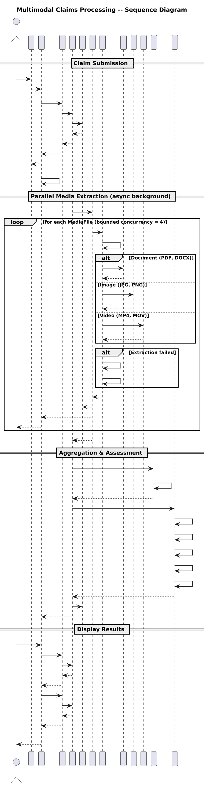

# Multimodal Claims Processing

## Overview

This document describes the multimodal claims processing behavior for the WorkbenchIQ rewrite targeting **.NET 8 (ASP.NET Core)** on the backend and **Angular 17+** on the frontend. The design preserves the semantics of the existing Python implementation while adopting idiomatic patterns for each new platform.

Multimodal claims processing ingests documents, images, and videos related to an insurance claim, extracts structured data from each media type in parallel, aggregates the results, and runs a claims assessment engine that produces damage, liability, fraud, and payout recommendations.

### Key behaviors carried forward

| Behavior | Current implementation | .NET / Angular design |
|---|---|---|
| Parallel media processing | `MultimodalProcessor` with configurable concurrency (4 workers) | `IMultimodalProcessor` using `SemaphoreSlim`-bounded `Task.WhenAll` with configurable `MaxConcurrency` |
| Media routing & validation | `router.py` validates file size/type, selects analyzer, provides fallbacks | `IMediaRouter` / `MediaRouter` with `MediaRouterOptions` for size limits and allowed types |
| Document extraction | `DocumentExtractor` for PDF, DOCX | `IDocumentExtractor` returning `DocumentExtractionResult` |
| Image extraction | `ImageExtractor` producing damage areas, bounding boxes, severity | `IImageExtractor` returning `ImageExtractionResult` with `DamageArea[]` |
| Video extraction | `VideoExtractor` producing keyframes, timeline events | `IVideoExtractor` returning `VideoExtractionResult` with `KeyFrame[]` and `TimelineEvent[]` |
| Result aggregation | `aggregator.py` combines sources, resolves conflicts | `IResultAggregator` / `ResultAggregator` producing `AggregatedClaimData` |
| Claims assessment engine | `ClaimAssessment` with damage, liability, fraud, payout, policy analysis | `IClaimsEngine` / `ClaimsEngine` returning `ClaimAssessment` |
| Retry with backoff | Exponential backoff in processor | Polly `AsyncRetryPolicy` with exponential backoff |
| Progress callbacks | Processor emits progress events | `IProgress<ProcessingProgress>` callbacks + SignalR hub for real-time UI updates |
| Media storage & status | `repository.py` stores files, tracks status, manages keyframes | `IMediaRepository` backed by blob storage with EF Core status tracking |
| Claims API | `POST /api/claims/submit`, `GET /api/claims/{id}`, `GET /api/claims/{id}/media` | `ClaimsController` with identical routes |
| Frontend overview | `AutomotiveClaimsOverview`, `DamageViewer`, `VideoTimeline`, `ClaimsSummary`, `EligibilityPanel`, `MedicalRecordsPanel` | Angular standalone components with the same responsibilities |

---

## Architecture diagrams

### C4 Context



### C4 Container



### C4 Component



### Class diagram



### Sequence diagram



---

## Backend components (.NET 8 / ASP.NET Core)

### ClaimsController

`[ApiController]` at route `api/claims`.

| Endpoint | Method | Description |
|---|---|---|
| `/api/claims/submit` | `POST` | Accepts multipart form data (claim metadata + media files). Validates, stores media, starts async processing, returns `202 Accepted` with claim ID. |
| `/api/claims/{claimId}` | `GET` | Returns claim details including current processing status and assessment results. |
| `/api/claims/{claimId}/media` | `GET` | Returns metadata and URLs for all media files associated with a claim. |

### MultimodalProcessorOptions

Configuration POCO bound from `appsettings.json` section `"MultimodalProcessor"`.

| Property | Type | Description |
|---|---|---|
| `MaxConcurrency` | `int` | Maximum parallel extraction tasks (default 4). |
| `MaxRetryCount` | `int` | Number of retry attempts per extraction (default 3). |
| `RetryBaseDelayMs` | `int` | Base delay for exponential backoff in milliseconds (default 500). |

### IMultimodalProcessor / MultimodalProcessor

Orchestrates parallel extraction of all media files attached to a claim.

| Method | Returns | Description |
|---|---|---|
| `ProcessClaimMediaAsync(ClaimId, IReadOnlyList<MediaFile>, IProgress<ProcessingProgress>?, CancellationToken)` | `Task<IReadOnlyList<ExtractionResult>>` | Routes each file via `IMediaRouter`, extracts in parallel (bounded by `MaxConcurrency`), retries failures with exponential backoff, reports progress. |

### IMediaRouter / MediaRouter

Routes incoming media to the correct extractor and validates constraints.

| Method | Returns | Description |
|---|---|---|
| `RouteAsync(MediaFile, CancellationToken)` | `Task<ExtractionResult>` | Validates file size and MIME type, selects primary extractor, falls back to alternate extractor on failure. |

### MediaRouterOptions

| Property | Type | Description |
|---|---|---|
| `MaxFileSizeBytes` | `long` | Maximum allowed file size (default 100 MB). |
| `AllowedDocumentTypes` | `string[]` | `["application/pdf", "application/vnd.openxmlformats-officedocument.wordprocessingml.document"]` |
| `AllowedImageTypes` | `string[]` | `["image/jpeg", "image/png", "image/webp"]` |
| `AllowedVideoTypes` | `string[]` | `["video/mp4", "video/quicktime"]` |

### Extractors

#### IDocumentExtractor

| Method | Returns | Description |
|---|---|---|
| `ExtractAsync(MediaFile, CancellationToken)` | `Task<DocumentExtractionResult>` | Extracts text, tables, and structured fields from PDF and DOCX files. |

#### IImageExtractor

| Method | Returns | Description |
|---|---|---|
| `ExtractAsync(MediaFile, CancellationToken)` | `Task<ImageExtractionResult>` | Identifies damage areas with bounding boxes, severity scores, and descriptive labels. |

#### IVideoExtractor

| Method | Returns | Description |
|---|---|---|
| `ExtractAsync(MediaFile, CancellationToken)` | `Task<VideoExtractionResult>` | Extracts keyframes at significant moments and produces a timeline of events. |

### IResultAggregator / ResultAggregator

Combines extraction results from multiple media sources into a unified dataset.

| Method | Returns | Description |
|---|---|---|
| `AggregateAsync(IReadOnlyList<ExtractionResult>, CancellationToken)` | `Task<AggregatedClaimData>` | Merges document, image, and video results. Resolves conflicting information using confidence scores and source priority rules. |

### IClaimsEngine / ClaimsEngine

Runs the full assessment pipeline on aggregated data.

| Method | Returns | Description |
|---|---|---|
| `AssessAsync(AggregatedClaimData, CancellationToken)` | `Task<ClaimAssessment>` | Produces damage assessment, liability assessment, fraud detection, payout recommendation, and policy analysis. |

### IMediaRepository

Persists media files and tracks processing status.

| Method | Returns | Description |
|---|---|---|
| `StoreAsync(ClaimId, IFormFile, CancellationToken)` | `Task<MediaFile>` | Stores the uploaded file in blob storage and creates a tracking record. |
| `GetByClaimIdAsync(ClaimId, CancellationToken)` | `Task<IReadOnlyList<MediaFile>>` | Returns all media files for a claim. |
| `UpdateStatusAsync(MediaFileId, ProcessingStatus, CancellationToken)` | `Task` | Updates the processing status of a media file. |
| `StoreKeyFrameAsync(MediaFileId, KeyFrame, CancellationToken)` | `Task` | Persists an extracted keyframe image. |

### Domain models

#### ClaimAssessment

| Property | Type |
|---|---|
| `ClaimId` | `Guid` |
| `DamageAssessment` | `DamageAssessment` |
| `LiabilityAssessment` | `LiabilityAssessment` |
| `FraudDetection` | `FraudDetection` |
| `PayoutRecommendation` | `PayoutRecommendation` |
| `PolicyAnalysis` | `PolicyAnalysis` |
| `OverallConfidence` | `double` |
| `AssessedAt` | `DateTimeOffset` |

#### DamageArea

| Property | Type |
|---|---|
| `Label` | `string` |
| `BoundingBox` | `BoundingBox` |
| `Severity` | `SeverityLevel` (enum: Minor, Moderate, Severe, Total) |
| `Confidence` | `double` |
| `SourceMediaFileId` | `Guid` |

#### LiabilityAssessment

| Property | Type |
|---|---|
| `LiabilityPercentage` | `double` |
| `Determination` | `string` |
| `ContributingFactors` | `string[]` |
| `Confidence` | `double` |

#### FraudDetection

| Property | Type |
|---|---|
| `RiskScore` | `double` |
| `Indicators` | `FraudIndicator[]` |
| `Recommendation` | `string` |

#### PayoutRecommendation

| Property | Type |
|---|---|
| `RecommendedAmount` | `decimal` |
| `MinAmount` | `decimal` |
| `MaxAmount` | `decimal` |
| `Justification` | `string` |

---

## Frontend components (Angular 17+)

### ClaimsService (Angular)

Injectable service in `features/claims/services/claims.service.ts`.

| Method | Returns | Description |
|---|---|---|
| `submitClaim(formData: FormData)` | `Observable<ClaimSubmission>` | Calls `POST /api/claims/submit` with multipart payload. |
| `getClaim(claimId: string)` | `Observable<Claim>` | Calls `GET /api/claims/{claimId}`. |
| `getClaimMedia(claimId: string)` | `Observable<MediaFile[]>` | Calls `GET /api/claims/{claimId}/media`. |
| `processingProgress$` | `Observable<ProcessingProgress>` | Receives real-time progress updates via SignalR. |

### ClaimsOverviewComponent

Standalone component at route `/claims`. Displays a summary list of all claims with status badges, filing dates, and assessment highlights. Entry point for navigating to individual claim details.

### DamageViewerComponent

Standalone component rendered within the claim detail page. Displays annotated photographs with SVG overlays for bounding boxes, severity color coding, and damage labels. Supports pan and zoom.

### VideoTimelineComponent

Standalone component rendered within the claim detail page. Presents extracted keyframes on a horizontal timeline, allows scrubbing to specific events, and displays event metadata on selection.

### ClaimsSummaryComponent

Standalone component showing the overall assessment result including damage, liability, fraud risk, and payout recommendation in a dashboard layout.

### EligibilityPanelComponent

Standalone component that displays policy eligibility information, coverage limits, deductibles, and whether the claim falls within policy terms.

### MedicalRecordsPanelComponent

Standalone component for viewing extracted medical record data, injury summaries, and treatment timelines when applicable to the claim.

---

## Configuration

### appsettings.json (excerpt)

```json
{
  "MultimodalProcessor": {
    "MaxConcurrency": 4,
    "MaxRetryCount": 3,
    "RetryBaseDelayMs": 500
  },
  "MediaRouter": {
    "MaxFileSizeBytes": 104857600,
    "AllowedDocumentTypes": ["application/pdf", "application/vnd.openxmlformats-officedocument.wordprocessingml.document"],
    "AllowedImageTypes": ["image/jpeg", "image/png", "image/webp"],
    "AllowedVideoTypes": ["video/mp4", "video/quicktime"]
  },
  "BlobStorage": {
    "ConnectionString": "UseDevelopmentStorage=true",
    "ContainerName": "claim-media"
  }
}
```

---

## Resilience

1. **Bounded concurrency** -- `SemaphoreSlim` limits parallel extraction tasks to `MaxConcurrency` to prevent resource exhaustion.
2. **Exponential backoff** -- Polly retry policy with jitter handles transient extraction failures.
3. **Fallback extractors** -- `MediaRouter` attempts an alternate extractor when the primary fails (e.g., OCR fallback for corrupted PDFs).
4. **Cancellation support** -- All async methods accept `CancellationToken` for graceful shutdown.
5. **Progress reporting** -- `IProgress<ProcessingProgress>` provides percentage updates; SignalR hub pushes to the Angular SPA in real time.

## Security considerations

1. **File validation** -- MIME type and file size are validated before storage. File content is scanned separately from the extension.
2. **Blob storage isolation** -- Each claim's media is stored under a unique prefix. Signed URIs are used for time-limited access.
3. **Input sanitization** -- Extracted text and metadata are sanitized before storage to prevent injection attacks.
4. **Authorization** -- All claims endpoints require authentication. Claim data is scoped to the authorized user's organization.
