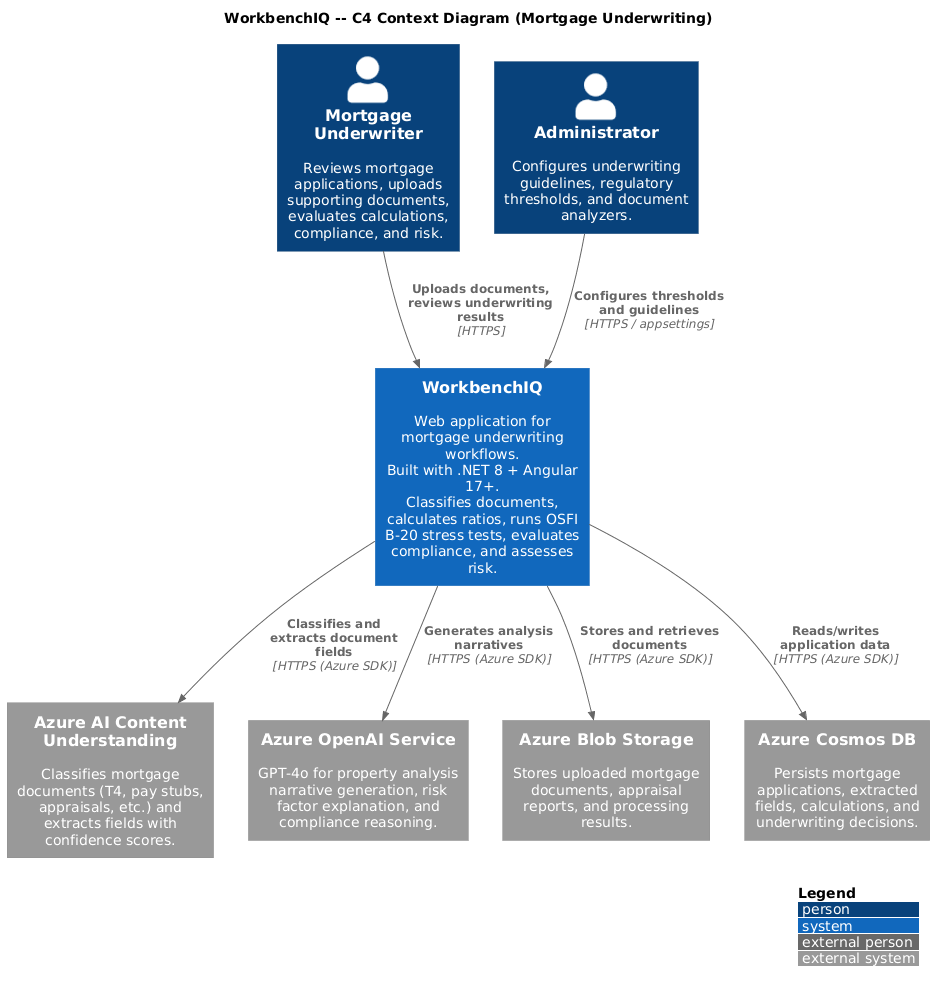
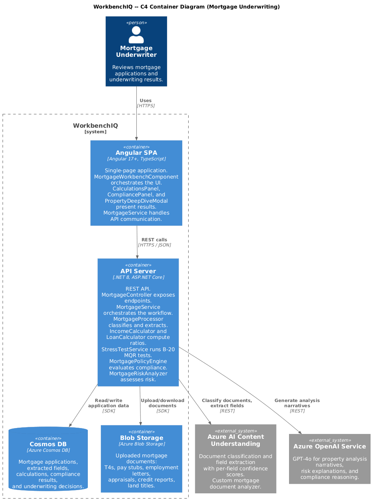
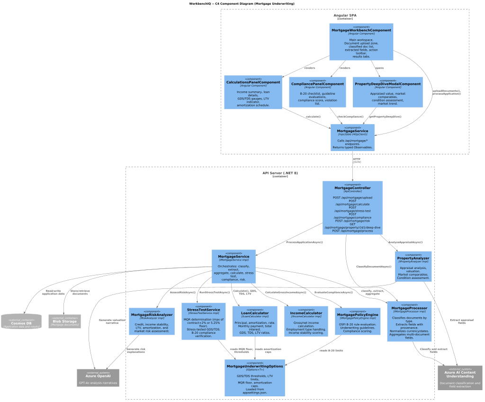
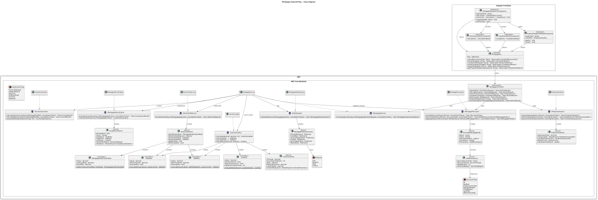
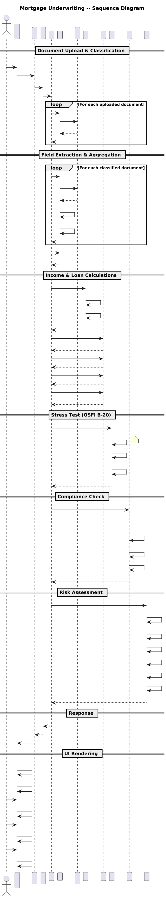

# Mortgage Underwriting

## Overview

This document describes the mortgage underwriting behavior for the WorkbenchIQ rewrite targeting **.NET 8 (ASP.NET Core)** on the backend and **Angular 17+** on the frontend. The design preserves the semantics of the existing Python implementation -- document classification, field extraction with provenance, income and loan calculations, OSFI B-20 compliance checks, stress testing, risk analysis, and property deep-dive -- while adopting idiomatic .NET and Angular patterns.

### Key behaviors carried forward

| Behavior | Current implementation | .NET / Angular design |
|---|---|---|
| Document classification | `MortgageProcessor` classifies T4, pay stub, employment letter, appraisal, credit docs | `IMortgageProcessor` / `MortgageProcessor` with `DocumentType` enum |
| Field extraction with provenance | `MortgageProcessor` extracts fields with source tracking | `ExtractedMortgageField` record with `Provenance` (page, bounding region, source document) |
| Currency / date normalization | `MortgageProcessor` normalizes CAD amounts and date formats | `CurrencyNormalizer` and `DateNormalizer` static helpers; consistent `decimal` for currency |
| Multi-document aggregation | `MortgageProcessor` aggregates fields across uploaded documents | `IMortgageProcessor.AggregateAsync()` merges fields from multiple classified documents |
| Income calculation | `IncomeCalculator` computes gross/net, handles employment types, stability scoring | `IIncomeCalculator` / `IncomeCalculator` with `EmploymentType` enum and `IncomeStabilityScore` |
| Loan calculation | `LoanCalculator` computes principal, amortization, rate, payment, interest projections | `ILoanCalculator` / `LoanCalculator` returns `LoanCalculation` record |
| Property analysis | `property_deep_dive.py` (1123 lines): appraisal, valuation, comparables, condition | `IPropertyAnalyzer` / `PropertyAnalyzer` with `PropertyValuation`, `MarketComparable`, `ConditionAssessment` |
| Policy compliance | `policy_engine.py`: OSFI B-20 compliance, underwriting guidelines, scoring | `IMortgagePolicyEngine` / `MortgagePolicyEngine` evaluates rules, returns `ComplianceResult` |
| Risk analysis | `risk_analysis.py`: credit, income stability, LTV, amortization, market risk | `IRiskAnalyzer` / `MortgageRiskAnalyzer` returns `MortgageRiskAssessment` |
| Stress testing | `stress_test.py`: MQR 5.25% floor, stress-tested affordability, B-20 verification | `IStressTestService` / `StressTestService` returns `StressTestResult` |
| GDS / TDS ratios | GDS max 39%, TDS max 44% | `GdsRatio` and `TdsRatio` value objects with built-in threshold validation |
| LTV ratio | 80% conventional / 95% insured | `LtvRatio` value object with `IsConventional` and `RequiresInsurance` properties |
| MQR floor | Minimum qualifying rate 5.25% or contract + 2%, whichever is higher | `MortgageQualificationRate` value object enforcing B-20 floor |
| Amortization limits | 25 yr insured / 30 yr uninsured | Enforced by `ILoanCalculator` based on `LtvRatio.RequiresInsurance` |
| Frontend workbench | `MortgageWorkbench`, `CalculationsPanel`, `CompliancePanel`, `PropertyDeepDiveModal` | `MortgageWorkbenchComponent`, `CalculationsPanelComponent`, `CompliancePanelComponent`, `PropertyDeepDiveModalComponent` |

---

## Architecture diagrams

### C4 Context



### C4 Container



### C4 Component



### Class diagram



### Sequence diagram



---

## Backend components (.NET 8 / ASP.NET Core)

### DocumentType enum

Classifies uploaded mortgage documents.

| Member | Description |
|---|---|
| `T4` | Canada Revenue Agency T4 slip (employment income). |
| `PayStub` | Employer pay stub showing gross/net pay and deductions. |
| `EmploymentLetter` | Employer-issued letter confirming position, salary, and tenure. |
| `AppraisalReport` | Licensed appraiser's property valuation report. |
| `CreditReport` | Bureau credit report with score, trade lines, and liabilities. |
| `LandTitle` | Land title / title search document. |
| `OfferToPurchase` | Signed offer to purchase (Agreement of Purchase and Sale). |

### EmploymentType enum

| Member | Description |
|---|---|
| `FullTimeSalaried` | Permanent full-time salaried employment. |
| `FullTimeHourly` | Permanent full-time hourly employment. |
| `PartTime` | Part-time employment. |
| `SelfEmployed` | Self-employed or incorporated contractor. |
| `Contract` | Fixed-term contract employment. |
| `Seasonal` | Seasonal employment. |

### ExtractedMortgageField record

Immutable record representing a single field extracted from a mortgage document.

| Property | Type | Description |
|---|---|---|
| `Name` | `string` | Field key (e.g., "GrossIncome", "PropertyAddress"). |
| `Value` | `string?` | Extracted text value. `null` when not found. |
| `NormalizedValue` | `object?` | Typed value after currency/date normalization (e.g., `decimal`, `DateOnly`). |
| `Confidence` | `double` | Raw confidence score from Content Understanding (0.0 -- 1.0). |
| `Provenance` | `FieldProvenance` | Source document, page number, and bounding region. |

### FieldProvenance record

| Property | Type | Description |
|---|---|---|
| `SourceDocumentId` | `string` | Identifier of the originating uploaded document. |
| `DocumentType` | `DocumentType` | Classified type of the source document. |
| `PageNumber` | `int` | 1-based page index within the source document. |
| `BoundingRegion` | `BoundingRegion?` | Polygon coordinates locating the field on the page. |

### GdsRatio value object

Gross Debt Service ratio. Encapsulates housing costs as a proportion of gross income.

| Property | Type | Description |
|---|---|---|
| `Value` | `decimal` | Ratio as a decimal (e.g., 0.35 for 35%). |
| `MaxThreshold` | `decimal` | Regulatory maximum (default 0.39). |
| `IsCompliant` | `bool` | `true` when `Value <= MaxThreshold`. |

Static factory: `GdsRatio.Calculate(decimal monthlyHousingCost, decimal monthlyGrossIncome)`.

Formula: `(Mortgage Payment + Property Tax + Heating + 50% Condo Fees) / Gross Monthly Income`.

### TdsRatio value object

Total Debt Service ratio. Extends GDS to include all debt obligations.

| Property | Type | Description |
|---|---|---|
| `Value` | `decimal` | Ratio as a decimal (e.g., 0.42 for 42%). |
| `MaxThreshold` | `decimal` | Regulatory maximum (default 0.44). |
| `IsCompliant` | `bool` | `true` when `Value <= MaxThreshold`. |

Static factory: `TdsRatio.Calculate(decimal monthlyHousingCost, decimal monthlyDebtObligations, decimal monthlyGrossIncome)`.

Formula: `(Housing Costs + All Other Debt Payments) / Gross Monthly Income`.

### LtvRatio value object

Loan-to-Value ratio.

| Property | Type | Description |
|---|---|---|
| `Value` | `decimal` | Ratio as a decimal (e.g., 0.80 for 80%). |
| `IsConventional` | `bool` | `true` when `Value <= 0.80`. |
| `RequiresInsurance` | `bool` | `true` when `Value > 0.80` (up to 0.95 max for insured). |
| `MaxAmortizationYears` | `int` | 25 when insured, 30 when conventional. |

Static factory: `LtvRatio.Calculate(decimal loanAmount, decimal propertyValue)`.

### MortgageQualificationRate value object

OSFI B-20 minimum qualifying rate.

| Property | Type | Description |
|---|---|---|
| `Value` | `decimal` | The qualifying rate used for stress testing. |
| `ContractRate` | `decimal` | The borrower's actual contract rate. |
| `FloorRate` | `decimal` | Regulatory floor (default 5.25%). |

Static factory: `MortgageQualificationRate.Determine(decimal contractRate, decimal floorRate = 0.0525m)`.

Logic: `max(contractRate + 0.02, floorRate)`.

### LoanCalculation record

| Property | Type | Description |
|---|---|---|
| `Principal` | `decimal` | Loan principal amount. |
| `AmortizationMonths` | `int` | Amortization period in months. |
| `Rate` | `decimal` | Annual interest rate as a decimal. |
| `MonthlyPayment` | `decimal` | Calculated monthly payment (P&I). |
| `TotalInterest` | `decimal` | Total interest over the amortization period. |
| `InterestProjections` | `IReadOnlyList<InterestProjection>` | Year-by-year principal/interest breakdown. |

### PropertyValuation record

| Property | Type | Description |
|---|---|---|
| `AppraisedValue` | `decimal` | Appraiser's estimated market value. |
| `Comparables` | `IReadOnlyList<MarketComparable>` | Comparable property sales used in the appraisal. |
| `ConditionAssessment` | `ConditionAssessment` | Property condition evaluation. |
| `MarketTrend` | `MarketTrend` | Local market trend indicator (Rising, Stable, Declining). |
| `ValuationConfidence` | `double` | Confidence in the appraised value (0.0 -- 1.0). |

### MarketComparable record

| Property | Type | Description |
|---|---|---|
| `Address` | `string` | Comparable property address. |
| `SalePrice` | `decimal` | Recorded sale price. |
| `SaleDate` | `DateOnly` | Date of sale. |
| `AdjustedValue` | `decimal` | Value after adjustments for differences. |
| `Adjustments` | `IReadOnlyDictionary<string, decimal>` | Named adjustments applied (e.g., "Lot Size", "Condition"). |

### ConditionAssessment record

| Property | Type | Description |
|---|---|---|
| `OverallRating` | `PropertyConditionRating` | Overall condition (Excellent, Good, Fair, Poor). |
| `StructuralNotes` | `string?` | Structural observations from the appraisal. |
| `EnvironmentalFlags` | `IReadOnlyList<string>` | Environmental concerns (e.g., flood zone, contamination). |
| `RequiredRepairs` | `IReadOnlyList<string>` | Repairs required before or after closing. |

### ComplianceResult record

| Property | Type | Description |
|---|---|---|
| `IsCompliant` | `bool` | Overall compliance determination. |
| `Score` | `double` | Compliance score (0.0 -- 1.0). |
| `GdsResult` | `GdsRatio` | GDS ratio evaluation. |
| `TdsResult` | `TdsRatio` | TDS ratio evaluation. |
| `LtvResult` | `LtvRatio` | LTV ratio evaluation. |
| `StressTestResult` | `StressTestResult` | MQR stress test outcome. |
| `Violations` | `IReadOnlyList<ComplianceViolation>` | List of guideline violations. |
| `Guidelines` | `IReadOnlyList<GuidelineEvaluation>` | All evaluated underwriting guidelines with pass/fail. |

### StressTestResult record

| Property | Type | Description |
|---|---|---|
| `QualificationRate` | `MortgageQualificationRate` | The MQR used for the test. |
| `StressTestedPayment` | `decimal` | Monthly payment at the qualifying rate. |
| `StressTestedGds` | `GdsRatio` | GDS ratio calculated at the qualifying rate. |
| `StressTestedTds` | `TdsRatio` | TDS ratio calculated at the qualifying rate. |
| `IsAffordable` | `bool` | `true` when stress-tested ratios remain compliant. |
| `B20Compliant` | `bool` | `true` when all B-20 requirements are met. |

### MortgageRiskAssessment record

| Property | Type | Description |
|---|---|---|
| `OverallRiskLevel` | `RiskLevel` | Aggregate risk (Low, Medium, High, Critical). |
| `CreditRisk` | `RiskFactor` | Credit score and history assessment. |
| `IncomeStabilityRisk` | `RiskFactor` | Employment type and income consistency assessment. |
| `LtvRisk` | `RiskFactor` | Loan-to-value risk assessment. |
| `AmortizationRisk` | `RiskFactor` | Risk from amortization period length. |
| `MarketRisk` | `RiskFactor` | Local real estate market risk. |
| `Flags` | `IReadOnlyList<string>` | Human-readable risk flags for underwriter review. |

### RiskFactor record

| Property | Type | Description |
|---|---|---|
| `Category` | `string` | Risk category name. |
| `Level` | `RiskLevel` | Assessed risk level. |
| `Score` | `double` | Numeric risk score (0.0 = no risk, 1.0 = maximum risk). |
| `Details` | `string` | Explanation of the risk assessment. |

### IMortgageProcessor / MortgageProcessor

Classifies uploaded documents, extracts fields with provenance, normalizes values, and aggregates across multiple documents.

| Method | Returns | Description |
|---|---|---|
| `ClassifyDocumentAsync(Stream, CancellationToken)` | `Task<DocumentType>` | Classifies a single document into a `DocumentType`. |
| `ExtractFieldsAsync(Stream, DocumentType, CancellationToken)` | `Task<IReadOnlyList<ExtractedMortgageField>>` | Extracts fields from a classified document with provenance. |
| `AggregateAsync(IEnumerable<IReadOnlyList<ExtractedMortgageField>>, CancellationToken)` | `Task<MortgageFieldSet>` | Merges fields from multiple documents into a unified field set. |

### IIncomeCalculator / IncomeCalculator

| Method | Returns | Description |
|---|---|---|
| `CalculateGrossIncomeAsync(MortgageFieldSet, CancellationToken)` | `Task<IncomeResult>` | Computes gross annual/monthly income from T4s, pay stubs, and employment letters. |
| `CalculateNetIncomeAsync(MortgageFieldSet, CancellationToken)` | `Task<IncomeResult>` | Computes net income after deductions. |
| `AssessStability(EmploymentType, int yearsEmployed)` | `IncomeStabilityScore` | Scores income stability based on employment type and tenure. |

### ILoanCalculator / LoanCalculator

| Method | Returns | Description |
|---|---|---|
| `Calculate(decimal principal, decimal annualRate, int amortizationMonths)` | `LoanCalculation` | Computes monthly payment, total interest, and year-by-year projections. |
| `CalculateGds(LoanCalculation, decimal propertyTax, decimal heating, decimal condoFees, decimal grossMonthlyIncome)` | `GdsRatio` | Computes Gross Debt Service ratio. |
| `CalculateTds(GdsRatio, decimal otherDebtPayments, decimal grossMonthlyIncome)` | `TdsRatio` | Computes Total Debt Service ratio. |
| `CalculateLtv(decimal loanAmount, decimal propertyValue)` | `LtvRatio` | Computes Loan-to-Value ratio. |

### IPropertyAnalyzer / PropertyAnalyzer

| Method | Returns | Description |
|---|---|---|
| `AnalyzeAppraisalAsync(Stream, CancellationToken)` | `Task<PropertyValuation>` | Extracts and evaluates appraisal report data. |
| `GetComparablesAsync(string address, CancellationToken)` | `Task<IReadOnlyList<MarketComparable>>` | Retrieves market comparable sales for the subject property. |
| `AssessConditionAsync(Stream, CancellationToken)` | `Task<ConditionAssessment>` | Evaluates property condition from appraisal report. |

### IMortgagePolicyEngine / MortgagePolicyEngine

| Method | Returns | Description |
|---|---|---|
| `EvaluateComplianceAsync(MortgageApplication, CancellationToken)` | `Task<ComplianceResult>` | Evaluates the full application against OSFI B-20 and underwriting guidelines. |
| `CheckGuideline(string guidelineId, MortgageApplication)` | `GuidelineEvaluation` | Evaluates a single underwriting guideline. |

### IRiskAnalyzer / MortgageRiskAnalyzer

| Method | Returns | Description |
|---|---|---|
| `AssessRiskAsync(MortgageApplication, CancellationToken)` | `Task<MortgageRiskAssessment>` | Performs comprehensive risk analysis across all dimensions. |

### IStressTestService / StressTestService

| Method | Returns | Description |
|---|---|---|
| `RunStressTestAsync(MortgageApplication, CancellationToken)` | `Task<StressTestResult>` | Runs MQR stress test at the higher of contract + 2% or 5.25% floor. |

### IMortgageService / MortgageService

Orchestration service that coordinates the full underwriting workflow.

| Method | Returns | Description |
|---|---|---|
| `ProcessApplicationAsync(MortgageApplicationRequest, CancellationToken)` | `Task<MortgageUnderwritingResult>` | End-to-end: classify, extract, calculate, stress test, compliance, risk. |

### MortgageController

`[ApiController]` at route `api/mortgage`.

| Endpoint | Method | Description |
|---|---|---|
| `/api/mortgage/upload` | `POST` | Accepts multipart file upload of one or more mortgage documents. Classifies and extracts fields. |
| `/api/mortgage/calculate` | `POST` | Runs income, loan, GDS, TDS, LTV calculations on extracted data. |
| `/api/mortgage/stress-test` | `POST` | Executes MQR stress test and returns affordability result. |
| `/api/mortgage/compliance` | `POST` | Evaluates OSFI B-20 and underwriting guideline compliance. |
| `/api/mortgage/risk` | `POST` | Performs multi-dimensional risk analysis. |
| `/api/mortgage/property/{id}/deep-dive` | `GET` | Returns full property valuation with comparables and condition. |
| `/api/mortgage/process` | `POST` | Full end-to-end underwriting pipeline. |

---

## Frontend components (Angular 17+)

### MortgageService

Injectable service in `features/mortgage/services/mortgage.service.ts`.

| Method | Returns | Description |
|---|---|---|
| `uploadDocuments(files: File[])` | `Observable<ClassifiedDocument[]>` | Uploads and classifies mortgage documents. |
| `calculate(applicationId: string)` | `Observable<CalculationResult>` | Fetches income, loan, and ratio calculations. |
| `runStressTest(applicationId: string)` | `Observable<StressTestResult>` | Runs MQR stress test. |
| `checkCompliance(applicationId: string)` | `Observable<ComplianceResult>` | Evaluates OSFI B-20 compliance. |
| `assessRisk(applicationId: string)` | `Observable<RiskAssessment>` | Retrieves risk analysis. |
| `getPropertyDeepDive(propertyId: string)` | `Observable<PropertyValuation>` | Fetches full property valuation. |
| `processApplication(request: MortgageApplicationRequest)` | `Observable<UnderwritingResult>` | Runs the full underwriting pipeline. |

### MortgageWorkbenchComponent

Standalone component at route `/mortgage`. Main workspace for mortgage underwriting.

| Feature | Description |
|---|---|
| Document upload zone | Drag-and-drop area accepting T4s, pay stubs, employment letters, appraisals, credit docs. |
| Document list | Classified documents with type badges and extraction status. |
| Extracted fields panel | Aggregated fields across all uploaded documents with provenance indicators. |
| Action toolbar | Buttons to trigger calculations, stress test, compliance check, and risk analysis. |
| Results tabs | Tabbed view switching between Calculations, Compliance, and Risk panels. |

### CalculationsPanelComponent

Standalone component rendering income, loan, and ratio calculations.

| Section | Description |
|---|---|
| Income summary | Gross and net income with employment type and stability score. |
| Loan details | Principal, rate, amortization, monthly payment, total interest. |
| GDS gauge | Visual gauge showing GDS ratio against 39% threshold; green/amber/red. |
| TDS gauge | Visual gauge showing TDS ratio against 44% threshold; green/amber/red. |
| LTV indicator | LTV ratio with conventional vs. insured classification. |
| Amortization schedule | Expandable year-by-year principal/interest breakdown table. |

### CompliancePanelComponent

Standalone component rendering OSFI B-20 compliance and guideline results.

| Section | Description |
|---|---|
| Overall status | Large pass/fail badge with compliance score. |
| B-20 checklist | MQR stress test, GDS/TDS limits, LTV limits, amortization limits -- each with pass/fail. |
| Guideline list | All evaluated underwriting guidelines with status, description, and details. |
| Violations | Highlighted list of any compliance violations requiring underwriter attention. |

### PropertyDeepDiveModalComponent

Standalone modal component for detailed property analysis.

| Section | Description |
|---|---|
| Appraised value | Headline valuation with confidence indicator. |
| Market comparables | Table of comparable sales with addresses, prices, dates, and adjustments. |
| Condition assessment | Overall rating, structural notes, environmental flags, required repairs. |
| Market trend | Trend indicator (Rising / Stable / Declining) for the local market. |

---

## Regulatory constants

| Constant | Value | Source |
|---|---|---|
| GDS maximum | 39% | OSFI B-20 |
| TDS maximum | 44% | OSFI B-20 |
| LTV conventional ceiling | 80% | OSFI B-20 |
| LTV insured maximum | 95% | National Housing Act |
| MQR floor rate | 5.25% | OSFI B-20 |
| MQR buffer above contract | +2.00% | OSFI B-20 |
| Max amortization (insured) | 25 years | CMHC / NHA |
| Max amortization (uninsured) | 30 years | OSFI B-20 |

---

## Configuration

### appsettings.json (excerpt)

```json
{
  "MortgageUnderwriting": {
    "GdsMaxThreshold": 0.39,
    "TdsMaxThreshold": 0.44,
    "LtvConventionalCeiling": 0.80,
    "LtvInsuredMaximum": 0.95,
    "MqrFloorRate": 0.0525,
    "MqrContractBuffer": 0.02,
    "MaxAmortizationInsuredYears": 25,
    "MaxAmortizationUninsuredYears": 30,
    "DocumentAnalyzerId": "mortgageDocAnalyzer"
  }
}
```

### Environment variable mapping

| Env var | Maps to |
|---|---|
| `MORTGAGEUNDERWRITING__GdsMaxThreshold` | `MortgageUnderwritingOptions.GdsMaxThreshold` |
| `MORTGAGEUNDERWRITING__TdsMaxThreshold` | `MortgageUnderwritingOptions.TdsMaxThreshold` |
| `MORTGAGEUNDERWRITING__MqrFloorRate` | `MortgageUnderwritingOptions.MqrFloorRate` |
| `MORTGAGEUNDERWRITING__DocumentAnalyzerId` | `MortgageUnderwritingOptions.DocumentAnalyzerId` |

---

## Design decisions

1. **Value objects for ratios** -- `GdsRatio`, `TdsRatio`, `LtvRatio`, and `MortgageQualificationRate` are immutable value objects that encapsulate both the computed value and the regulatory threshold. This ensures compliance checks are always co-located with the calculation and cannot be skipped.
2. **Provenance tracking** -- Every extracted field carries a `FieldProvenance` record linking it back to the source document, page, and bounding region. This supports audit trails and allows the UI to highlight the exact source of each data point.
3. **Configurable regulatory thresholds** -- All OSFI B-20 constants are externalized to `MortgageUnderwritingOptions` so deployments can adapt to regulatory changes without code modifications.
4. **Separation of calculation and policy** -- The `ILoanCalculator` performs pure arithmetic while `IMortgagePolicyEngine` evaluates compliance rules. This keeps financial calculations testable in isolation and allows policy rules to evolve independently.
5. **Orchestration via IMortgageService** -- The `MortgageService` coordinates the multi-step underwriting workflow (classify, extract, aggregate, calculate, stress test, compliance, risk) so that individual services remain single-responsibility and independently testable.
6. **Stress test isolation** -- The `IStressTestService` is a dedicated service rather than a method on the calculator, because B-20 stress testing involves policy decisions (MQR floor, buffer calculation) beyond pure loan mathematics.
7. **Property deep-dive as modal** -- The property analysis is presented in a modal rather than inline, mirroring the existing UX pattern where the underwriter opens a detailed view on demand without losing their place in the main workbench.
