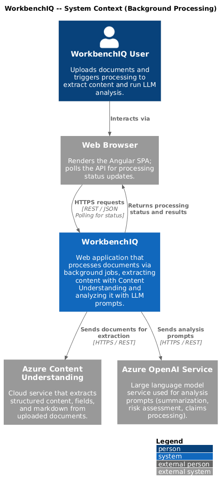
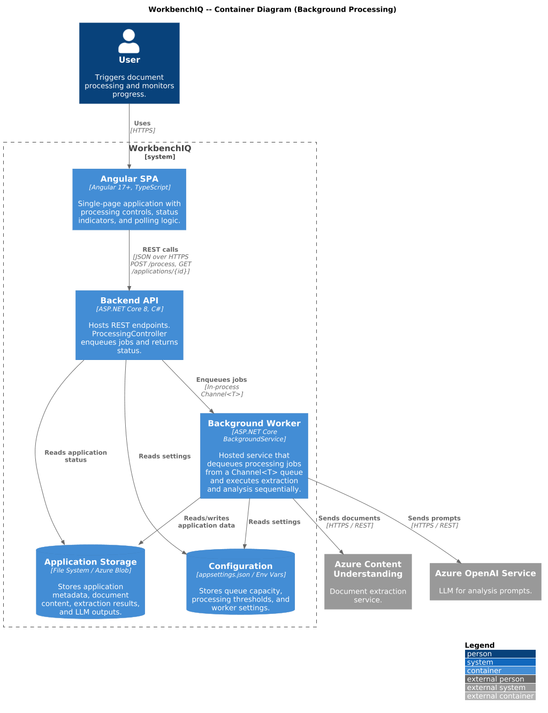
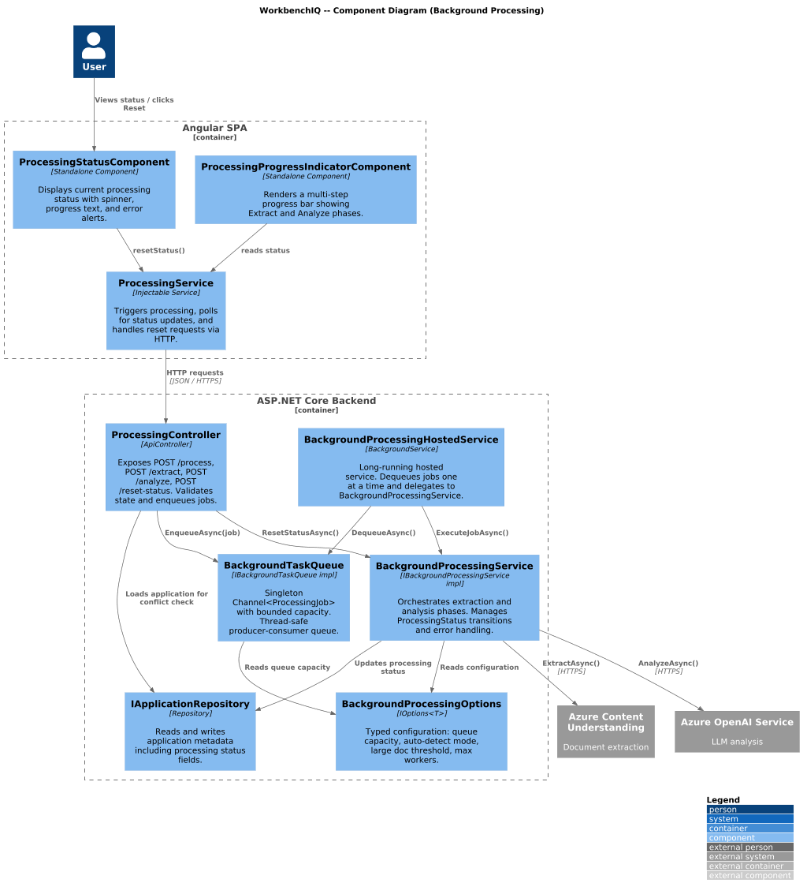
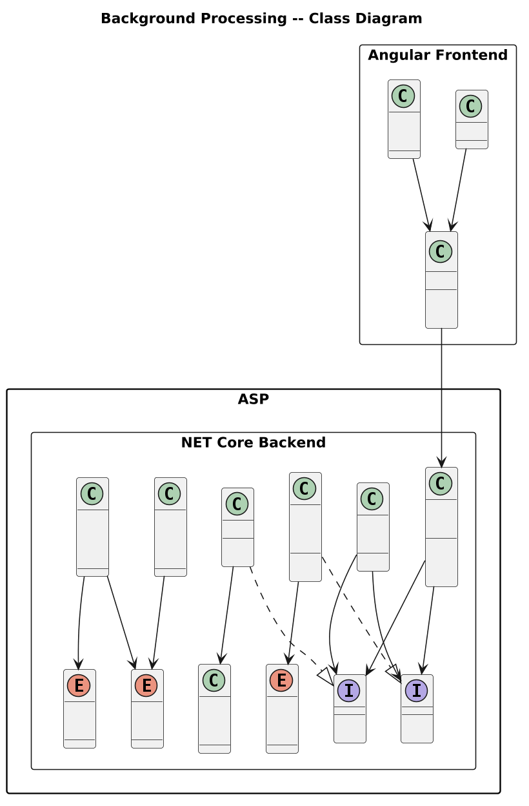
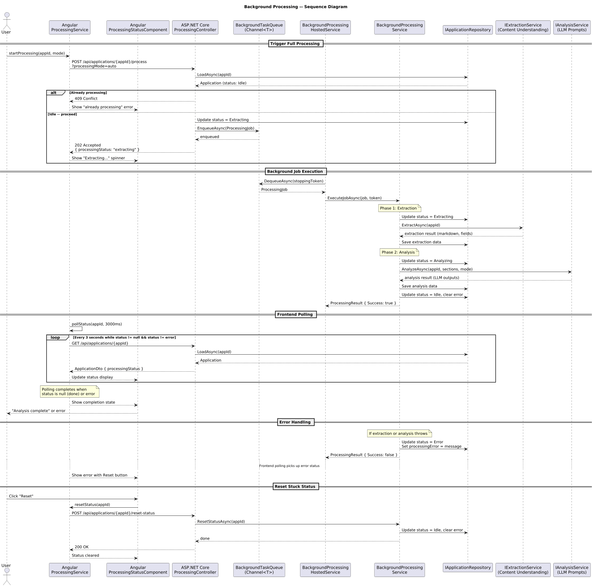

# Background Processing

## Overview

This document describes the background processing behavior for the WorkbenchIQ rewrite targeting **.NET 8 (ASP.NET Core)** on the backend and **Angular 17+** on the frontend. The design replaces the Python asyncio task model with idiomatic .NET patterns using `IHostedService`, `BackgroundService`, and `Channel<T>` for a reliable producer-consumer queue.

### Key behaviors carried forward

| Behavior | Current implementation | .NET / Angular design |
|---|---|---|
| Fire-and-forget processing | `asyncio.create_task()` with semaphore | `BackgroundService` consuming from `Channel<T>` queue |
| Concurrency control | `asyncio.Semaphore(1)` limits to 1 concurrent job | `Channel<T>` with bounded capacity; single consumer loop |
| Status transitions | `processing_status`: `null` -> `"extracting"` -> `"analyzing"` -> `null` or `"error"` | `ProcessingStatus` enum: `Idle` -> `Extracting` -> `Analyzing` -> `Idle` or `Error` |
| Error capture | `processing_error` string field on metadata | `ProcessingError` field on `Application` entity |
| Trigger endpoint | `POST /api/applications/{app_id}/process` returns immediately | `ProcessingController.Process()` enqueues job, returns `202 Accepted` |
| Reset endpoint | `POST /api/applications/{app_id}/reset-status` | `ProcessingController.ResetStatus()` sets status to `Idle` |
| Frontend polling | `GET /api/applications/{app_id}` checked on interval | Angular `ProcessingService` with `interval`-based polling via RxJS |
| Processing modes | `processing_mode` query param: `auto`, `standard`, `large_document` | `ProcessingMode` enum on `ProcessingJob` |

---

## Architecture diagrams

### C4 Context



### C4 Container



### C4 Component



### Class diagram



### Sequence diagram



---

## Backend components (.NET 8 / ASP.NET Core)

### ProcessingStatus enum

Represents the current state of an application's background processing pipeline.

| Value | Description |
|---|---|
| `Idle` | No processing in progress. Default state. |
| `Extracting` | Content Understanding extraction is running. |
| `Analyzing` | LLM analysis prompts are running. |
| `Error` | Processing failed. See `ProcessingError` for details. |

### ProcessingMode enum

Controls how documents are processed, particularly for large files.

| Value | Description |
|---|---|
| `Auto` | Automatically detect based on document size threshold. |
| `Standard` | Direct processing with full document context. |
| `LargeDocument` | Batch summarization with condensed context for large files. |

### ProcessingJob

Record representing a unit of work enqueued for background processing.

| Property | Type | Description |
|---|---|---|
| `ApplicationId` | `string` | The application to process. |
| `JobType` | `ProcessingJobType` | `ExtractOnly`, `AnalyzeOnly`, or `ExtractAndAnalyze`. |
| `ProcessingMode` | `ProcessingMode?` | Optional override for processing mode. |
| `Sections` | `IReadOnlyList<string>?` | Optional filter for specific analysis sections. |
| `EnqueuedAt` | `DateTimeOffset` | Timestamp when the job was enqueued. |

### ProcessingResult

Record returned by the processing pipeline after a job completes.

| Property | Type | Description |
|---|---|---|
| `ApplicationId` | `string` | The application that was processed. |
| `Success` | `bool` | Whether processing completed without errors. |
| `ErrorMessage` | `string?` | Error details if `Success` is false. |
| `Duration` | `TimeSpan` | Wall-clock duration of the job. |
| `ProcessingMode` | `ProcessingMode` | The mode that was actually used. |

### IBackgroundTaskQueue / BackgroundTaskQueue

Producer-consumer queue backed by `System.Threading.Channels.Channel<ProcessingJob>`.

| Method | Returns | Description |
|---|---|---|
| `EnqueueAsync(ProcessingJob job)` | `ValueTask` | Adds a job to the queue. Throws if queue is full (bounded capacity). |
| `DequeueAsync(CancellationToken token)` | `ValueTask<ProcessingJob>` | Blocks until a job is available or cancellation is requested. |

Implementation details:
- Registered as a **singleton** in DI.
- Uses `Channel.CreateBounded<ProcessingJob>(new BoundedChannelOptions(capacity) { FullMode = BoundedChannelFullMode.Wait })`.
- Default capacity: 10 (configurable via `BackgroundProcessingOptions.QueueCapacity`).

### IBackgroundProcessingService / BackgroundProcessingService

Orchestrates the actual extraction and analysis work. Injected into the hosted service.

| Method | Returns | Description |
|---|---|---|
| `ExecuteJobAsync(ProcessingJob job, CancellationToken token)` | `Task<ProcessingResult>` | Runs extraction, analysis, or both. Updates `ProcessingStatus` at each phase transition. |
| `ResetStatusAsync(string applicationId)` | `Task` | Resets a stuck application to `Idle` and clears `ProcessingError`. |

Status transition logic inside `ExecuteJobAsync`:

1. Set status to `Extracting`, persist.
2. Run `IExtractionService.ExtractAsync()` (Content Understanding).
3. If job includes analysis: set status to `Analyzing`, persist.
4. Run `IAnalysisService.AnalyzeAsync()` (LLM prompts).
5. Set status to `Idle`, clear error, persist.
6. On exception at any step: set status to `Error`, store message, persist.

### BackgroundProcessingHostedService

Inherits from `BackgroundService` (which implements `IHostedService`). Runs for the lifetime of the application.

```
protected override async Task ExecuteAsync(CancellationToken stoppingToken)
{
    while (!stoppingToken.IsCancellationRequested)
    {
        var job = await _taskQueue.DequeueAsync(stoppingToken);
        var result = await _processingService.ExecuteJobAsync(job, stoppingToken);
        _logger.LogInformation("Job {AppId} completed: {Success}", result.ApplicationId, result.Success);
    }
}
```

Key characteristics:
- Single consumer ensures only one job runs at a time (mirrors Python's `Semaphore(1)`).
- Graceful shutdown via `CancellationToken` from the host.
- Exceptions are caught and logged; the loop continues to process the next job.

### ProcessingController

`[ApiController]` at route `api/applications/{applicationId}`.

| Endpoint | Method | Description |
|---|---|---|
| `/api/applications/{applicationId}/process` | `POST` | Enqueues `ExtractAndAnalyze` job. Returns `202 Accepted` with current application state. Rejects with `409 Conflict` if already processing. |
| `/api/applications/{applicationId}/extract` | `POST` | Enqueues `ExtractOnly` job. Supports `?background=true` query param. |
| `/api/applications/{applicationId}/analyze` | `POST` | Enqueues `AnalyzeOnly` job. Accepts optional `sections` and `processingMode` in body. |
| `/api/applications/{applicationId}/reset-status` | `POST` | Calls `ResetStatusAsync`. Returns `200 OK`. |

Conflict detection: before enqueuing, the controller loads the application and checks `ProcessingStatus`. If it is `Extracting` or `Analyzing`, returns `409 Conflict`.

### BackgroundProcessingOptions

Configuration POCO bound from `appsettings.json` section `"BackgroundProcessing"`.

| Property | Type | Default | Description |
|---|---|---|---|
| `QueueCapacity` | `int` | `10` | Maximum number of jobs in the queue. |
| `AutoDetectMode` | `bool` | `true` | Whether to auto-detect large document mode. |
| `LargeDocThresholdKb` | `int` | `100` | Document size threshold for large document mode. |
| `MaxWorkersPerSection` | `int` | `4` | Max parallel LLM calls within a single analysis section. |

---

## Frontend components (Angular 17+)

### ProcessingService

Injectable service in `core/services/processing.service.ts`.

| Method | Returns | Description |
|---|---|---|
| `startProcessing(applicationId: string, mode?: ProcessingMode)` | `Observable<ApplicationDto>` | Calls `POST /api/applications/{id}/process`. |
| `resetStatus(applicationId: string)` | `Observable<void>` | Calls `POST /api/applications/{id}/reset-status`. |
| `pollStatus(applicationId: string, intervalMs?: number)` | `Observable<ApplicationDto>` | Polls `GET /api/applications/{id}` at the given interval (default 3000ms). Completes when `processingStatus` is `null` or `error`. |

Polling implementation:
```typescript
pollStatus(applicationId: string, intervalMs = 3000): Observable<ApplicationDto> {
  return interval(intervalMs).pipe(
    switchMap(() => this.http.get<ApplicationDto>(`/api/applications/${applicationId}`)),
    takeWhile(app => app.processingStatus !== null && app.processingStatus !== 'error', true),
    distinctUntilKeyChanged('processingStatus'),
    shareReplay(1)
  );
}
```

### ProcessingStatusComponent

Standalone component that displays the current processing status with contextual messaging.

| Input | Type | Description |
|---|---|---|
| `processingStatus` | `ProcessingStatus \| null` | Current status from the application DTO. |
| `processingError` | `string \| null` | Error message when status is `Error`. |

Behavior:
- `Idle` / `null`: hidden or shows "Ready" badge.
- `Extracting`: shows spinner with "Extracting document content...".
- `Analyzing`: shows spinner with "Running analysis...".
- `Error`: shows error alert with message and a "Reset" button.

### ProcessingProgressIndicatorComponent

Standalone component rendering a multi-step progress bar for the extraction-then-analysis pipeline.

| Input | Type | Description |
|---|---|---|
| `status` | `ProcessingStatus \| null` | Current processing status. |

Renders two steps:
1. **Extract** -- active/complete/pending based on status.
2. **Analyze** -- active/complete/pending based on status.

Uses Angular Material `mat-stepper` or a custom CSS progress bar.

---

## Configuration

### appsettings.json (excerpt)

```json
{
  "BackgroundProcessing": {
    "QueueCapacity": 10,
    "AutoDetectMode": true,
    "LargeDocThresholdKb": 100,
    "MaxWorkersPerSection": 4
  }
}
```

### DI registration (Program.cs excerpt)

```csharp
builder.Services.Configure<BackgroundProcessingOptions>(
    builder.Configuration.GetSection("BackgroundProcessing"));

builder.Services.AddSingleton<IBackgroundTaskQueue, BackgroundTaskQueue>();
builder.Services.AddScoped<IBackgroundProcessingService, BackgroundProcessingService>();
builder.Services.AddHostedService<BackgroundProcessingHostedService>();
```

---

## Error handling and recovery

| Scenario | Behavior |
|---|---|
| Extraction fails (e.g., Content Understanding service down) | Status set to `Error`, `ProcessingError` populated. Analysis is skipped. |
| Analysis fails (e.g., LLM rate limit) | Status set to `Error`, `ProcessingError` populated. Extraction results are preserved. |
| Application stuck in `Extracting`/`Analyzing` (e.g., server restart) | User or admin calls `POST /reset-status` to return to `Idle`. |
| Duplicate processing request | Controller returns `409 Conflict` -- prevents enqueuing a second job for the same application. |
| Queue full | `EnqueueAsync` waits (bounded channel with `Wait` mode) until a slot opens. Controller can optionally time out and return `503 Service Unavailable`. |

---

## Security considerations

- Background processing runs under the same authentication context as the API. The controller endpoints require valid API key / session.
- The hosted service runs in-process and does not expose any external surface.
- Processing errors are sanitized before being stored in `ProcessingError` to avoid leaking internal details to the frontend.
