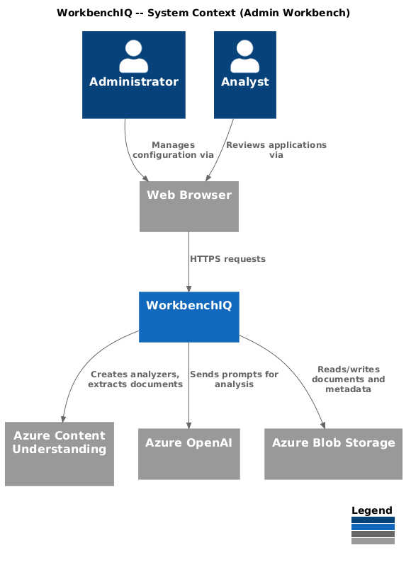
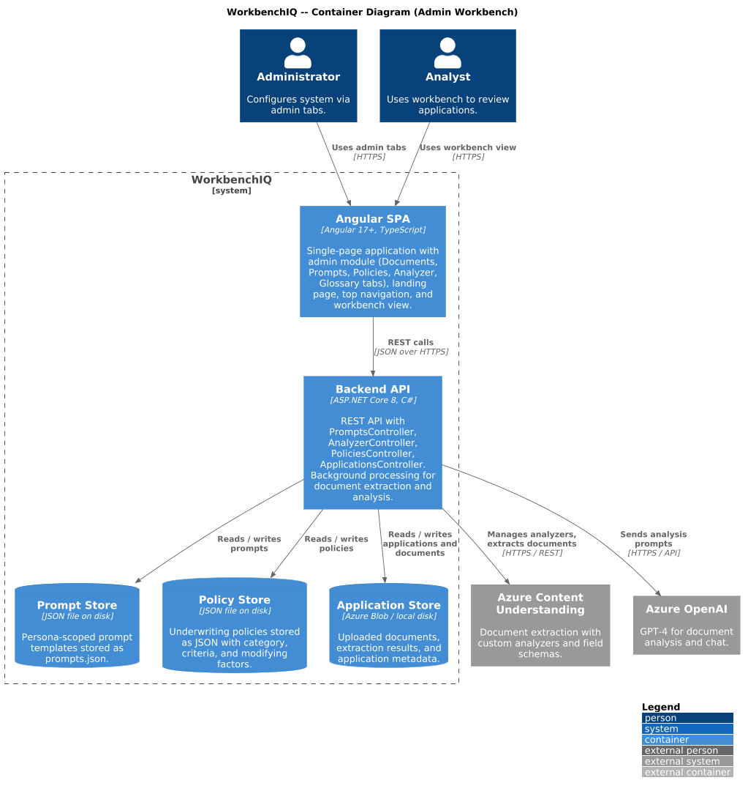
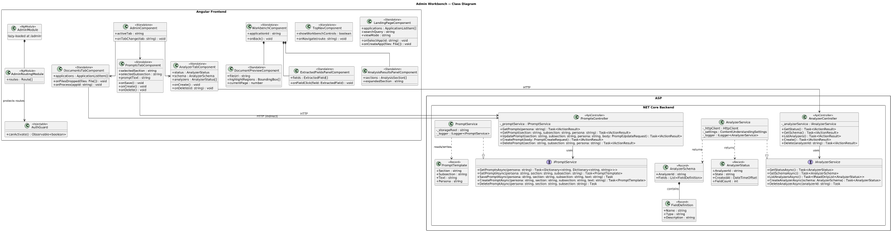
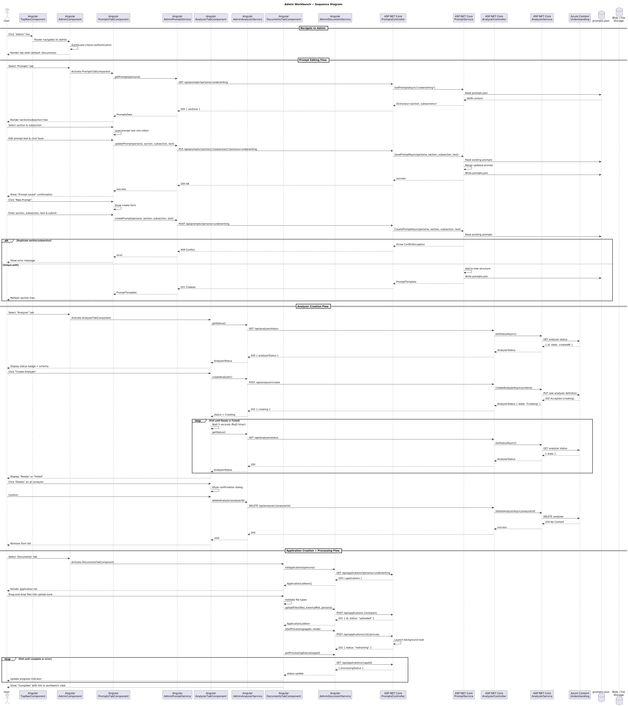

# Admin Workbench

## Overview

This document describes the Admin Workbench behavior for the WorkbenchIQ rewrite targeting **.NET 8 (ASP.NET Core)** on the backend and **Angular 17+** on the frontend. The Admin Workbench is the central administrative interface that consolidates document management, prompt editing, policy configuration, Azure Content Understanding analyzer setup, and glossary maintenance into a single multi-tab page.

The design also covers the top-level navigation shell (TopNav, LandingPage, WorkbenchView) that frames the entire application.

### Key behaviors carried forward

| Behavior | Current implementation | .NET / Angular design |
|---|---|---|
| Multi-tab admin page | React `AdminPage` with `documents`, `prompts`, `policies`, `analyzer`, `glossary` tabs | Angular `AdminModule` with lazy-loaded tab components under `/admin` route |
| Document upload + processing | Drag-and-drop file upload, background extraction + analysis, status polling | `DocumentsTabComponent` with `AdminDocumentService`; `AdminController.UploadAndProcess` triggers `IDocumentProcessingService` |
| Prompt management | `getPrompts`, `updatePrompt`, `createPrompt`, `deletePrompt` per persona/section/subsection | `PromptsController` with `IPromptService`; `PromptsTabComponent` with section/subsection tree |
| Policy CRUD | `getPolicies`, `createPolicy`, `updatePolicy`, `deletePolicy` with category filter | `PoliciesController` with `IPolicyService`; `PoliciesTabComponent` with category filter |
| Analyzer management | `getAnalyzerStatus`, `getAnalyzerSchema`, `listAnalyzers`, `createAnalyzer`, `deleteAnalyzer` | `AnalyzerController` with `IAnalyzerService`; `AnalyzerTabComponent` with status/schema panels |
| Glossary management | `GlossaryManager` React component with category + term CRUD | `GlossaryTabComponent` delegates to existing `GlossaryModule` components |
| Top navigation | `TopNav` with persona selector, links to Home/Admin/Customers/Login | `TopNavComponent` standalone component with `RouterLink` navigation and `PersonaSelectorComponent` |
| Landing page | `LandingPage` with app list, create button, search, grid/list view, persona selector | `LandingPageComponent` standalone component with `ApplicationListService` |
| Workbench view | `WorkbenchView` with document preview, extracted fields, analysis results, chat sidebar | `WorkbenchComponent` with child components: `DocumentPreviewComponent`, `ExtractedFieldsPanelComponent`, `AnalysisResultsPanelComponent`, `ChatSidebarComponent` |
| Processing status polling | `useEffect` interval polling `getApplication` until status complete | `AdminDocumentService.pollProcessingStatus$()` using RxJS `timer` + `switchMap` with exponential backoff |
| Persona-scoped prompts | Prompts loaded/saved per persona via query parameter | `IPromptService` accepts persona as route/query parameter; Angular service passes current persona from `PersonaStore` |

---

## Architecture diagrams

### C4 Context

### C4 Container

### C4 Component

### Class diagram

### Sequence diagram

---

## Backend components (.NET 8 / ASP.NET Core)

### AdminController

Thin controller that groups admin-specific endpoints not covered by dedicated controllers (e.g., policy reindexing, index stats). Most admin behavior is split into focused controllers.

| Endpoint | Method | Description |
|---|---|---|
| `POST /api/admin/policies/reindex` | POST | Trigger full policy reindex into vector store |
| `GET /api/admin/policies/index-stats` | GET | Return policy index statistics |

### PromptsController

Manages persona-scoped prompt templates used by the LLM analysis pipeline.

| Endpoint | Method | Description |
|---|---|---|
| `GET /api/prompts?persona={id}` | GET | Load all prompts for a persona (section/subsection tree) |
| `GET /api/prompts/{section}/{subsection}?persona={id}` | GET | Load a single prompt by section and subsection |
| `PUT /api/prompts/{section}/{subsection}?persona={id}` | PUT | Update an existing prompt |
| `POST /api/prompts?persona={id}` | POST | Create a new prompt for a section/subsection |
| `DELETE /api/prompts/{section}/{subsection}?persona={id}` | DELETE | Delete a prompt |

### AnalyzerController

Manages Azure Content Understanding custom analyzers.

| Endpoint | Method | Description |
|---|---|---|
| `GET /api/analyzer/status` | GET | Return current analyzer status (id, state, creation date) |
| `GET /api/analyzer/schema` | GET | Return the field extraction schema for the active analyzer |
| `GET /api/analyzer/list` | GET | List all available analyzers |
| `POST /api/analyzer/create` | POST | Create a new custom analyzer with the configured field schema |
| `DELETE /api/analyzer/{analyzerId}` | DELETE | Delete an analyzer by id |

### PoliciesController

CRUD for underwriting policies. Extends the existing policy management module with admin-specific operations.

| Endpoint | Method | Description |
|---|---|---|
| `GET /api/policies?category={cat}` | GET | List policies, optionally filtered by category |
| `GET /api/policies/{policyId}` | GET | Get a single policy by id |
| `POST /api/policies` | POST | Create a new policy |
| `PUT /api/policies/{policyId}` | PUT | Update an existing policy |
| `DELETE /api/policies/{policyId}` | DELETE | Delete a policy |

### IPromptService / PromptService

Business logic for loading, saving, and validating prompt templates.

| Method | Description |
|---|---|
| `GetPromptsAsync(persona)` | Load all prompts for a persona; falls back to defaults if file missing |
| `GetPromptAsync(persona, section, subsection)` | Load a single prompt by path |
| `SavePromptAsync(persona, section, subsection, text)` | Save/update a prompt; creates section structure if needed |
| `CreatePromptAsync(persona, section, subsection, text)` | Create a new prompt; validates uniqueness |
| `DeletePromptAsync(persona, section, subsection)` | Remove a prompt from the tree |

### IAnalyzerService / AnalyzerService

Wraps the Azure Content Understanding REST API for analyzer lifecycle management.

| Method | Description |
|---|---|
| `GetStatusAsync()` | Query the CU API for current analyzer state |
| `GetSchemaAsync()` | Retrieve the field schema definition from the active analyzer |
| `ListAnalyzersAsync()` | List all analyzers under the configured CU resource |
| `CreateAnalyzerAsync(schema)` | Create a new custom analyzer with the provided field schema |
| `DeleteAnalyzerAsync(analyzerId)` | Delete an analyzer; validates it is not the active one |

### Domain models

#### PromptTemplate

| Property | Type | Description |
|---|---|---|
| `Section` | `string` | Top-level grouping (e.g., `"application_summary"`, `"medical_summary"`) |
| `Subsection` | `string` | Specific prompt within the section (e.g., `"demographics"`, `"cardiovascular"`) |
| `Text` | `string` | The prompt text sent to the LLM |
| `Persona` | `string` | Persona this prompt belongs to |

#### AnalyzerStatus

| Property | Type | Description |
|---|---|---|
| `AnalyzerId` | `string` | Unique analyzer identifier |
| `State` | `string` | Current state: `Creating`, `Ready`, `Failed` |
| `CreatedAt` | `DateTimeOffset` | Analyzer creation timestamp |
| `FieldCount` | `int` | Number of fields in the schema |

#### AnalyzerSchema

| Property | Type | Description |
|---|---|---|
| `AnalyzerId` | `string` | Analyzer this schema belongs to |
| `Fields` | `List<FieldDefinition>` | Field definitions with name, type, and description |

#### FieldDefinition

| Property | Type | Description |
|---|---|---|
| `Name` | `string` | Field name as extracted |
| `Type` | `string` | Data type: `string`, `number`, `date`, `boolean` |
| `Description` | `string` | Human-readable description of what the field captures |

---

## Frontend components (Angular 17+)

### AdminModule

Lazy-loaded feature module at route `/admin`. Contains five tab components, each loaded on demand within a `mat-tab-group` or equivalent tab container.

### AdminRoutingModule

| Route | Component | Guard |
|---|---|---|
| `/admin` | `AdminComponent` (shell) | `AuthGuard` |
| `/admin/documents` | `DocumentsTabComponent` | `AuthGuard` |
| `/admin/prompts` | `PromptsTabComponent` | `AuthGuard` |
| `/admin/policies` | `PoliciesTabComponent` | `AuthGuard` |
| `/admin/analyzer` | `AnalyzerTabComponent` | `AuthGuard` |
| `/admin/glossary` | `GlossaryTabComponent` | `AuthGuard` |

Tab selection maps to child routes; the default redirect is `/admin/documents`.

### DocumentsTabComponent

Handles file upload (drag-and-drop zone), triggers background processing, and polls for status updates. Displays the application list with status badges.

| Input/Output | Type | Description |
|---|---|---|
| `applications` | `ApplicationListItem[]` | Bound from parent admin shell |
| `applicationCreated` | `EventEmitter<string>` | Emits new application id after upload |

### PromptsTabComponent

Tree-based editor for section/subsection prompts. Supports viewing, editing, creating, and deleting prompts scoped to the current persona.

### PoliciesTabComponent

CRUD table for underwriting policies with a category dropdown filter. Inline editing with save/cancel and delete confirmation dialog.

### AnalyzerTabComponent

Displays analyzer status, field schema viewer (read-only table), analyzer list with create/delete actions. Status auto-refreshes during analyzer creation.

### WorkbenchComponent

Main analysis view displayed when a user selects an application from the landing page. Contains a three-panel layout:

| Panel | Component | Description |
|---|---|---|
| Left | `DocumentPreviewComponent` | PDF/image preview with page navigation and highlighted extraction regions |
| Center | `ExtractedFieldsPanelComponent` | Table of extracted fields with confidence scores and source page links |
| Right | `AnalysisResultsPanelComponent` | LLM analysis results organized by section, with expandable subsections |
| Drawer | `ChatSidebarComponent` | Slide-out chat panel for Ask IQ conversations |

### TopNavComponent

Application-wide navigation header. Standalone component used by all pages.

| Element | Description |
|---|---|
| Logo / app title | Links to home (`/`) |
| Persona selector | `PersonaSelectorComponent` dropdown, updates `PersonaStore` |
| Navigation links | Home, Admin, Customers, Login -- highlighted based on active route |
| Application selector | Shown only in workbench view; dropdown of applications |
| User menu | Shown when auth enabled; displays username and logout link |

### LandingPageComponent

Home page at `/`. Displays the application list with search, grid/list toggle, and a create-application button (drag-and-drop upload). Deep-links into `WorkbenchComponent` when an application is selected.

### Angular services

#### AdminDocumentService

| Method | Description |
|---|---|
| `uploadFiles(files, externalRef, persona)` | POST multipart form to `/api/applications` |
| `startProcessing(appId, mode)` | POST to `/api/applications/{id}/process` |
| `pollProcessingStatus$(appId)` | RxJS `timer(0, 3000).pipe(switchMap(...))` polling until terminal status |
| `listApplications(persona)` | GET `/api/applications?persona={id}` |

#### AdminPromptService

| Method | Description |
|---|---|
| `getPrompts(persona)` | GET `/api/prompts?persona={id}` |
| `getPrompt(persona, section, subsection)` | GET `/api/prompts/{section}/{subsection}` |
| `updatePrompt(persona, section, subsection, text)` | PUT `/api/prompts/{section}/{subsection}` |
| `createPrompt(persona, section, subsection, text)` | POST `/api/prompts` |
| `deletePrompt(persona, section, subsection)` | DELETE `/api/prompts/{section}/{subsection}` |

#### AdminAnalyzerService

| Method | Description |
|---|---|
| `getStatus()` | GET `/api/analyzer/status` |
| `getSchema()` | GET `/api/analyzer/schema` |
| `listAnalyzers()` | GET `/api/analyzer/list` |
| `createAnalyzer()` | POST `/api/analyzer/create` |
| `deleteAnalyzer(id)` | DELETE `/api/analyzer/{id}` |

---

## Key design decisions

1. **Separate controllers over monolithic AdminController.** The current Python implementation uses a single `api_server.py` with all routes. The .NET rewrite splits into `PromptsController`, `AnalyzerController`, `PoliciesController`, and a thin `AdminController` for cross-cutting admin operations. This improves testability and follows ASP.NET Core conventions.

2. **Lazy-loaded Angular module with child routes.** Each admin tab is a child route under `/admin`, enabling code-splitting. The tab selection is URL-driven, supporting deep-linking (e.g., `/admin/analyzer`).

3. **RxJS polling over `setInterval`.** The current React implementation uses `useEffect` with polling refs. The Angular rewrite uses `timer` + `switchMap` + `takeWhile` for processing status polling, which is cancellable and composable.

4. **AuthGuard on admin routes.** The current implementation checks auth status in the component. The .NET/Angular design uses a route guard that redirects to `/login` if the user is unauthenticated, preventing the admin shell from rendering at all.

5. **PersonaStore as single source of truth.** All admin tabs read the current persona from an injected `PersonaStore` (NgRx signal store or simple BehaviorSubject service), eliminating prop-drilling.

6. **Reuse of existing modules.** The Glossary tab delegates to `GlossaryEditorComponent` and `TermSearchComponent` from the Glossary Management module (see `docs/10-glossary-management/`). The Policies tab reuses policy models from the Policy Management module (see `docs/11-policy-management/`).
