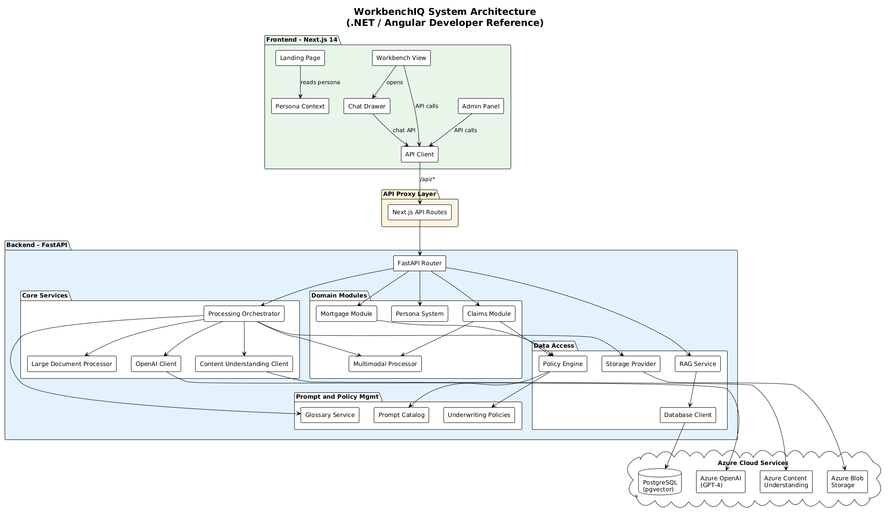

# WorkbenchIQ Developer Guide

## For .NET / Angular Developers

This guide explains the WorkbenchIQ architecture, workflows, and codebase using terminology and patterns familiar to .NET and Angular developers. Throughout this documentation, you will find ".NET equivalent" callouts that map Python/Next.js concepts to their .NET/Angular counterparts.

---

## What is WorkbenchIQ?

WorkbenchIQ is a Microsoft accelerator providing an **AI-powered multi-persona workbench** for insurance underwriters, claims processors, and mortgage analysts. It combines Azure AI Content Understanding and Azure AI Foundry to streamline document-heavy workflows.

### Key Capabilities

| Capability | Description |
|-----------|------------|
| Document Intelligence | Extracts structured fields from PDFs, images, and videos using Azure Content Understanding |
| LLM Analysis | Generates structured summaries and assessments using Azure OpenAI (GPT-4) |
| Risk Assessment | Evaluates applications against underwriting/claims policies with auditable citations |
| Conversational AI | "Ask IQ" chat interface with RAG-enhanced policy retrieval |
| Multi-Persona | Supports 5+ business verticals from a single codebase |

### Technology Stack Comparison

| Layer | WorkbenchIQ | .NET/Angular Equivalent |
|-------|------------|------------------------|
| Backend Framework | **FastAPI** (Python) | ASP.NET Core Web API |
| Frontend Framework | **Next.js 14** (React/TypeScript) | Angular 17+ |
| Styling | **Tailwind CSS** | Angular Material / Bootstrap |
| State Management | **React Context** | NgRx / Injectable Services |
| ORM / Data Access | **asyncpg** (raw SQL) | Entity Framework Core |
| DI Container | Manual wiring in `config.py` | `IServiceCollection` / `Program.cs` |
| Configuration | Environment variables + `@dataclass` | `appsettings.json` + `IOptions<T>` |
| API Proxy | Next.js API Routes (`[...path]/route.ts`) | Angular `proxy.conf.json` / YARP |
| Background Jobs | `asyncio` tasks | `IHostedService` / Hangfire |
| Testing | **pytest** | xUnit / NUnit |
| Package Manager | **pip** / **uv** (Python), **npm** (JS) | NuGet / npm |

---

## System Architecture



The system follows a **layered architecture** similar to Clean Architecture in .NET:

1. **Presentation Layer** (Frontend) - Next.js pages and React components
2. **API Proxy** - Next.js API routes forward requests to the backend
3. **Application Layer** (Backend API) - FastAPI routes and processing orchestration
4. **Domain Layer** - Persona system, policy engines, mortgage/claims modules
5. **Data Access Layer** - Storage providers, database clients, RAG services
6. **External Services** - Azure Content Understanding, Azure OpenAI, Azure Blob Storage

---

## Guide Structure

| Document | Description |
|----------|------------|
| [01 - Project Structure](01-project-structure.md) | Directory layout and file organization |
| [02 - Backend Architecture](02-backend-architecture.md) | FastAPI backend, configuration, and dependency management |
| [03 - Frontend Architecture](03-frontend-architecture.md) | Next.js frontend, components, and state management |
| [04 - Data Flow & Workflows](04-data-flow-workflows.md) | End-to-end processing workflows with sequence diagrams |
| [05 - Persona System](05-persona-system.md) | Multi-tenant persona architecture |
| [06 - Storage & Database](06-storage-database.md) | Repository pattern, storage providers, and RAG |
| [07 - AI Integration](07-ai-integration.md) | Azure Content Understanding and OpenAI integration |
| [08 - Domain Modules](08-domain-modules.md) | Claims, mortgage, and multimodal processing |
| [09 - Testing](09-testing.md) | Test organization and strategies |
| [10 - Build & Deploy](10-build-deploy.md) | Local development setup, build, and deployment |

---

## Quick Start

```bash
# 1. Clone the repository
git clone <repo-url>
cd WorkbenchIQ

# 2. Set up Python backend
pip install -r requirements.txt
cp .env.example .env    # Edit with your Azure credentials

# 3. Start backend (equivalent to: dotnet run)
uvicorn api_server:app --reload --port 8000

# 4. Set up frontend (in a new terminal)
cd frontend
npm install
npm run dev             # Starts on http://localhost:3000
```

> **For .NET developers:** `uvicorn` is the equivalent of Kestrel. `--reload` is like `dotnet watch`. The `api_server:app` syntax means "import the `app` object from `api_server.py`", similar to how `Program.cs` configures the app pipeline.
