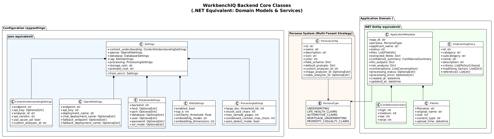
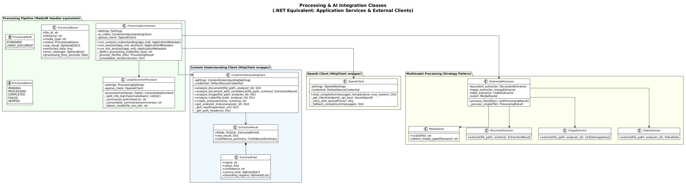

# 02 - Backend Architecture

## Overview

The backend is a **FastAPI** application (Python equivalent of ASP.NET Core Web API). All API logic lives in `api_server.py` with domain modules in `app/`.

> **.NET equivalent:** Think of `api_server.py` as `Program.cs` + all your controllers combined into one file. Sub-modules in `app/claims/` and `app/mortgage/` are like separate `Controller` classes registered via `app.include_router()` (equivalent to `builder.MapControllers()`).

## Class Diagrams

### Core Domain Classes



### Processing & AI Integration



---

## Configuration System

### How Settings Work

In .NET, you use `appsettings.json` + `IOptions<T>`. In WorkbenchIQ, configuration uses **Python dataclasses** populated from **environment variables**.

```
.NET Way:                              Python Way (WorkbenchIQ):
─────────                              ────────────────────────
appsettings.json                       .env file
  → IOptions<OpenAISettings>             → OpenAISettings.from_env()
  → builder.Services.Configure<T>()     → Settings() dataclass
  → Constructor injection               → Direct import / parameter passing
```

**File:** `app/config.py`

| Dataclass | .NET Equivalent | Key Fields |
|-----------|----------------|------------|
| `Settings` | Root `IConfiguration` | Aggregates all sub-settings |
| `ContentUnderstandingSettings` | `IOptions<CUSettings>` | endpoint, api_key, analyzer_id, use_azure_ad |
| `OpenAISettings` | `IOptions<OpenAISettings>` | endpoint, deployment_name, fallback_endpoint |
| `DatabaseSettings` | `ConnectionStrings` section | backend (json/postgresql), host, port |
| `RAGSettings` | Custom options | enabled, top_k, similarity_threshold |
| `ProcessingSettings` | Custom options | large_doc_threshold_kb, chunk_size_chars |

### Environment Variables

Equivalent to your `.NET` `appsettings.Development.json` / Azure App Configuration:

```bash
# Azure Content Understanding (like Azure.AI.FormRecognizer config)
AZURE_CONTENT_UNDERSTANDING_ENDPOINT=https://...
AZURE_CONTENT_UNDERSTANDING_API_KEY=...
AZURE_CONTENT_UNDERSTANDING_USE_AZURE_AD=true

# Azure OpenAI (like Azure.AI.OpenAI config)
AZURE_OPENAI_ENDPOINT=https://...
AZURE_OPENAI_API_KEY=...
AZURE_OPENAI_DEPLOYMENT_NAME=gpt-4-1

# Storage (like Azure.Storage.Blobs config)
STORAGE_BACKEND=local          # or azure_blob
UW_APP_STORAGE_ROOT=data
```

---

## FastAPI Application Structure

### Application Initialization

```python
# api_server.py - equivalent to Program.cs

app = FastAPI(title="WorkbenchIQ API")

# CORS middleware (equivalent to app.UseCors())
app.add_middleware(CORSMiddleware, ...)

# Sub-routers (equivalent to app.MapControllers())
app.include_router(claims_router, prefix="/api/claims")
app.include_router(rag_router, prefix="/api/rag")

# Startup event (equivalent to IHostedService.StartAsync)
@app.on_event("startup")
async def startup_event():
    init_storage_provider(...)    # DI registration equivalent
    if settings.database.backend == "postgresql":
        await init_pool(settings.database)
```

### Route Definitions

FastAPI routes use Python decorators, similar to ASP.NET attributes:

```python
# Python (FastAPI)                    # C# (ASP.NET Core)
@app.get("/api/applications")        # [HttpGet("api/applications")]
async def list_applications(         # public async Task<IActionResult>
    page: int = 1,                   #     ListApplications(int page = 1,
    per_page: int = 20               #     int perPage = 20)
):                                   # {
    apps = storage.list_apps()       #     var apps = await _repo.ListAsync();
    return {"applications": apps}    #     return Ok(new { Applications = apps });
                                     # }
```

### Key API Endpoints

| Method | Endpoint | Purpose | .NET Equivalent |
|--------|---------|---------|-----------------|
| `GET` | `/api/applications` | List apps with pagination | `ApplicationsController.Index()` |
| `POST` | `/api/applications` | Create app with file upload | `ApplicationsController.Create()` |
| `GET` | `/api/applications/{id}` | Get app details | `ApplicationsController.Get(id)` |
| `DELETE` | `/api/applications/{id}` | Delete app | `ApplicationsController.Delete(id)` |
| `POST` | `/api/applications/{id}/extract` | Start content extraction | `ProcessingController.Extract(id)` |
| `POST` | `/api/applications/{id}/analyze` | Run LLM analysis | `ProcessingController.Analyze(id)` |
| `POST` | `/api/applications/{id}/risk-analysis` | Policy evaluation | `RiskController.Evaluate(id)` |
| `POST` | `/api/applications/{id}/chat` | Send chat message | `ChatController.Send(id)` |
| `GET` | `/api/personas` | List personas | `PersonaController.Index()` |
| `GET/PUT/POST/DELETE` | `/api/prompts/*` | Prompt CRUD | `PromptsController.*()` |
| `GET/POST/PUT/DELETE` | `/api/policies/*` | Policy CRUD | `PoliciesController.*()` |
| `POST` | `/api/rag/index` | Index policies for RAG | `RAGController.Index()` |
| `GET` | `/api/rag/stats` | RAG index statistics | `RAGController.Stats()` |

### Background Processing

WorkbenchIQ uses `asyncio` tasks for long-running operations. In .NET, you'd use `IHostedService`, `BackgroundService`, or a queue like Hangfire.

```python
# Python (WorkbenchIQ)                    # C# (.NET)
@app.post("/api/apps/{id}/extract")       # [HttpPost("{id}/extract")]
async def extract(id: str):               # public async Task<IActionResult> Extract(string id)
    asyncio.create_task(                   # {
        run_extraction_background(id)      #     _backgroundQueue.Enqueue(
    )                                      #         () => _processor.ExtractAsync(id));
    return {"status": "accepted"}          #     return Accepted();
                                           # }
```

**Status polling:** The frontend polls `GET /api/applications/{id}` every 3 seconds to check `processing_status` (values: `"extracting"`, `"analyzing"`, `"error"`, `null`).

---

## Authentication

### Azure AD Integration

The backend uses `azure.identity.DefaultAzureCredential` for Azure service authentication, equivalent to `Azure.Identity` in .NET:

```python
# Python                                  # C#
from azure.identity import (              # using Azure.Identity;
    DefaultAzureCredential               #
)                                        # var credential =
credential = DefaultAzureCredential()    #     new DefaultAzureCredential();
```

**Credential chain** (same as .NET):
1. Environment variables (`AZURE_CLIENT_ID`, `AZURE_TENANT_ID`, `AZURE_CLIENT_SECRET`)
2. Managed Identity (when running in Azure)
3. Azure CLI (`az login`)
4. Interactive browser (if enabled)

**Token caching:** Tokens are cached in memory with a 60-second buffer before expiry, similar to how `TokenCredential` works in the .NET Azure SDK.

---

## Error Handling

FastAPI uses HTTP exception classes similar to ASP.NET:

```python
# Python                                  # C#
from fastapi import HTTPException         # using Microsoft.AspNetCore.Mvc;
raise HTTPException(                      # return NotFound(
    status_code=404,                      #     new { Error = "App not found" }
    detail="Application not found"        # );
)
```

### Retry Strategy

The OpenAI client implements exponential backoff with automatic fallback:

1. Try primary endpoint
2. On 429 (rate limit): retry with exponential backoff (configurable)
3. If all retries fail: try fallback endpoint (different Azure OpenAI resource)
4. If fallback fails: raise exception

> **.NET equivalent:** This is similar to using Polly retry policies with `HttpClientFactory`.

---

## Dependency Management

### requirements.txt (equivalent to PackageReference in .csproj)

Key dependencies:

| Package | Version | .NET Equivalent | Purpose |
|---------|---------|-----------------|---------|
| `fastapi` | 0.115.0+ | ASP.NET Core | Web framework |
| `uvicorn` | 0.32.0+ | Kestrel | ASGI server |
| `pydantic` | 2.9.0+ | FluentValidation / DataAnnotations | Data validation |
| `azure-identity` | latest | Azure.Identity | Azure AD auth |
| `azure-storage-blob` | latest | Azure.Storage.Blobs | Blob storage |
| `openai` | 1.50.0+ | Azure.AI.OpenAI | OpenAI client |
| `asyncpg` | 0.31.0+ | Npgsql / EF Core | PostgreSQL driver |
| `tiktoken` | latest | (no direct equiv) | Token counting |
| `pgvector` | latest | Pgvector.EntityFrameworkCore | Vector search |

### pyproject.toml (equivalent to .csproj metadata)

Contains project metadata, optional dev dependencies (`black`, `ruff`, `pytest`), and build configuration.
