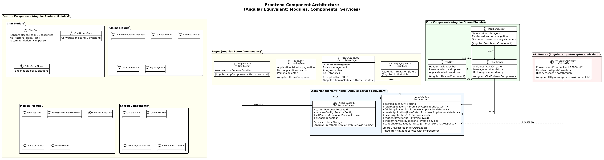

# 03 - Frontend Architecture

## Overview

The frontend is a **Next.js 14** application using React 18, TypeScript, and Tailwind CSS. For Angular developers, this maps closely to an Angular 17+ application with standalone components.

## Component Architecture



---

## Key Concept Mapping

### Routing

| Next.js (WorkbenchIQ) | Angular Equivalent |
|-----------------------|-------------------|
| `src/app/page.tsx` | `HomeComponent` + `{ path: '', component: HomeComponent }` |
| `src/app/admin/page.tsx` | `AdminComponent` + `{ path: 'admin', component: AdminComponent }` |
| `src/app/layout.tsx` | `AppComponent` with `<router-outlet>` |
| File-based routing (automatic) | `app-routing.module.ts` (explicit) |
| `Link` from `next/link` | `routerLink` directive |

**Example mapping:**

```tsx
// Next.js (src/app/admin/page.tsx)        // Angular (admin.component.ts)
export default function AdminPage() {      // @Component({ template: '...' })
  return <div>Admin Panel</div>            // export class AdminComponent { }
}                                          //
// Route: /admin (automatic from folder)   // { path: 'admin', component: AdminComponent }
```

### State Management

WorkbenchIQ uses **React Context** for persona state. The Angular equivalent is an **Injectable service with BehaviorSubject** or **NgRx Store**.

```tsx
// React Context (PersonaContext.tsx)       // Angular Service
const PersonaContext = createContext<       // @Injectable({ providedIn: 'root' })
  PersonaContextType                       // export class PersonaService {
>();                                       //   private persona$ =
                                           //     new BehaviorSubject<PersonaId>('underwriting');
export function PersonaProvider({          //
  children                                 //   currentPersona$ = this.persona$.asObservable();
}) {                                       //
  const [persona, setPersona] =            //   setPersona(p: PersonaId) {
    useState<PersonaId>('underwriting');    //     this.persona$.next(p);
                                           //     localStorage.setItem('selectedPersona', p);
  useEffect(() => {                        //   }
    const saved = localStorage             // }
      .getItem('selectedPersona');
    if (saved) setPersona(saved);
  }, []);
  // ...
}
```

### API Client

The API client (`lib/api.ts`) is equivalent to an Angular `HttpClient` service:

```typescript
// Next.js (lib/api.ts)                    // Angular (api.service.ts)
export function getMediaBaseUrl() {        // @Injectable()
  if (typeof window !== 'undefined') {     // export class ApiService {
    // Smart URL resolution                //   constructor(private http: HttpClient) {}
    const host = window.location.hostname; //
    if (host.includes('azurewebsites')) {   //   private baseUrl = environment.apiUrl;
      return deriveAzureUrl(host);         //
    }                                      //   getApplications(): Observable<App[]> {
    return 'http://localhost:8000';         //     return this.http.get<App[]>(
  }                                        //       `${this.baseUrl}/api/applications`
}                                          //     );
                                           //   }
export async function fetchApplications()  // }
{
  const res = await fetch(
    `${getMediaBaseUrl()}/api/applications`
  );
  return res.json();
}
```

**Key difference:** Next.js uses `fetch()` directly. Angular uses `HttpClient` with `Observable`. WorkbenchIQ's API client handles Azure URL derivation automatically (no hardcoded URLs needed).

### API Proxy

Next.js API routes act as a reverse proxy, forwarding frontend `/api/*` requests to the backend at port 8000. This is equivalent to Angular's `proxy.conf.json`:

```typescript
// Next.js: src/app/api/[...path]/route.ts

// Catches ALL /api/* requests and forwards to backend
export async function GET(request: NextRequest) {
  const backendUrl = `${BACKEND_URL}${request.nextUrl.pathname}`;
  const response = await fetch(backendUrl);
  return new Response(response.body, { status: response.status });
}
```

```json
// Angular equivalent: proxy.conf.json
{
  "/api": {
    "target": "http://localhost:8000",
    "secure": false,
    "changeOrigin": true
  }
}
```

---

## Component Organization

### Page Components (Route-level)

| Component | File | Purpose | Angular Equivalent |
|-----------|------|---------|-------------------|
| Landing Page | `app/page.tsx` | App list, creation, persona selector | `HomeComponent` |
| Admin Panel | `app/admin/page.tsx` | Prompts, glossary, policies, RAG | `AdminModule` |
| Login | `app/login/page.tsx` | Auth (future) | `AuthModule` |
| Root Layout | `app/layout.tsx` | Wraps entire app in providers | `AppComponent` |

### Core Layout Components

| Component | File | Purpose | Angular Equivalent |
|-----------|------|---------|-------------------|
| `WorkbenchView` | `components/WorkbenchView.tsx` | Main workbench with tabs + panels | `DashboardComponent` |
| `TopNav` | `components/TopNav.tsx` | Header bar with persona selector | `HeaderComponent` |
| `ChatDrawer` | `components/ChatDrawer.tsx` | Slide-out Ask IQ chat panel | `MatSidenav` child component |

### Feature Components

**Chat Module** (`components/chat/`):
- `ChatCards.tsx` - Renders structured JSON responses (risk factors, policies, recommendations)
- `ChatHistoryPanel.tsx` - Conversation listing and switching
- `PolicyDetailModal.tsx` - Expandable policy citation viewer

**Claims Module** (`components/claims/`):
- `AutomotiveClaimsOverview.tsx` - Claims dashboard
- `DamageViewer.tsx` - Image damage area visualization with bounding boxes
- `EvidenceGallery.tsx` - Photo/video evidence viewer
- `ClaimsSummary.tsx` - Assessment summary card
- `EligibilityPanel.tsx` - Coverage eligibility display

**Medical/Underwriting Components:**
- `BodyDiagram.tsx` - Interactive human body figure with clickable regions
- `BodySystemDeepDiveModal.tsx` - Detailed medical system view
- `AbnormalLabsCard.tsx` - Lab result cards with interpretation
- `LabResultsPanel.tsx` - Lab results table
- `PatientHeader.tsx` - Patient demographics
- `CitableValue.tsx` - Values with source page citations
- `CitationTooltip.tsx` - Hover tooltips showing source document and page

**Shared Components:**
- `ChronologicalOverview.tsx` - Timeline event display
- `BatchSummariesPanel.tsx` - Large document batch summary viewer

---

## TypeScript Types

**File:** `lib/types.ts`

Key interfaces (Angular equivalent: `models/*.ts`):

```typescript
// Core domain types
interface ApplicationMetadata {
  app_id: string;
  persona: PersonaType;
  applicant_name: string;
  status: string;
  files: FileInfo[];
  extracted_fields: Record<string, ExtractedField>;
  confidence_summary: ConfidenceSummary;
  llm_outputs: Record<string, any>;
  risk_analysis: RiskAnalysis;
  processing_status: string | null;
}

interface ExtractedField {
  name: string;
  value: any;
  confidence: 'High' | 'Medium' | 'Low';
  source_text?: string;
}

interface RiskAnalysis {
  findings: RiskFinding[];
  applied_policies: PolicyCitation[];
  recommendation: string;
  rationale: string;
}
```

---

## Styling

WorkbenchIQ uses **Tailwind CSS** (utility-first) rather than a component library like Angular Material.

```tsx
// Tailwind (WorkbenchIQ)                 // Angular Material
<div className="flex items-center        // <mat-toolbar color="primary">
  gap-4 p-4 bg-blue-600 text-white">     //   <span>Title</span>
  <h1 className="text-xl font-bold">     //   <button mat-icon-button>
    Title                                 //     <mat-icon>menu</mat-icon>
  </h1>                                   //   </button>
  <button className="p-2 rounded         // </mat-toolbar>
    hover:bg-blue-700">
    Menu
  </button>
</div>
```

**Key files:**
- `frontend/tailwind.config.js` - Theme customization
- `frontend/src/app/globals.css` - Base styles and Tailwind directives
- `frontend/postcss.config.js` - PostCSS plugin configuration

---

## Build & Development

| Command | Purpose | Angular Equivalent |
|---------|---------|-------------------|
| `npm run dev` | Development server with hot reload | `ng serve` |
| `npm run build` | Production build | `ng build --configuration production` |
| `npm start` | Start production server | `node server.js` / nginx serve |
| `npm run lint` | ESLint check | `ng lint` |

**Development server:** Runs on `http://localhost:3000` and proxies API calls to `http://localhost:8000` (the FastAPI backend).
