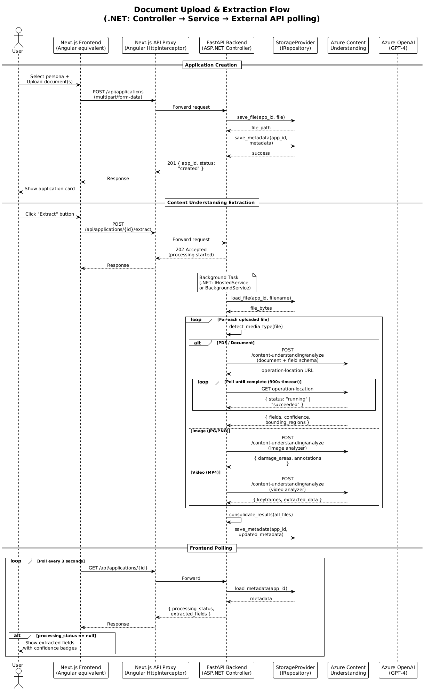
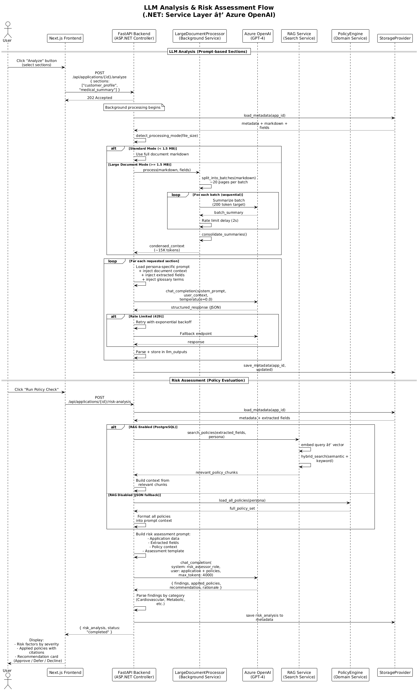
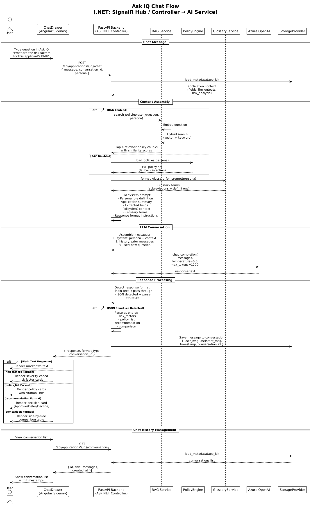
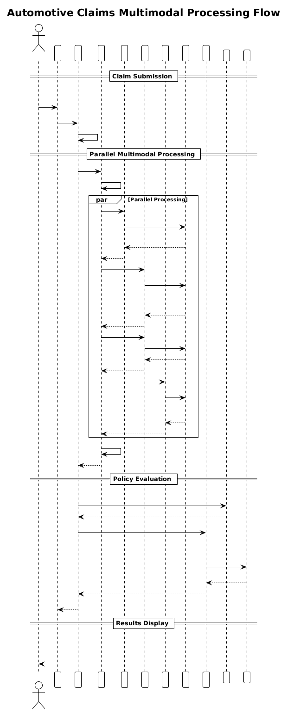

# 04 - Data Flow & Workflows

## Overview

This document describes the end-to-end workflows in WorkbenchIQ. Each workflow is illustrated with a sequence diagram showing the interaction between components.

> **.NET mapping:** These workflows follow the same patterns as ASP.NET Controller → Service → External API → Repository, with background processing similar to `IHostedService` / `BackgroundService`.

---

## Workflow 1: Document Upload & Extraction

This is the primary workflow where a user uploads insurance documents and the system extracts structured fields using Azure Content Understanding.



### Steps

1. **Application Creation**
   - User selects a persona (underwriting, claims, mortgage) and uploads PDF/image/video files
   - Frontend sends `POST /api/applications` with `multipart/form-data`
   - Backend saves files to storage (local disk or Azure Blob) and creates `metadata.json`
   - Returns `app_id` to frontend

2. **Content Understanding Extraction**
   - User clicks "Extract" button
   - Frontend sends `POST /api/applications/{id}/extract`
   - Backend returns `202 Accepted` immediately and starts a background task
   - For each uploaded file:
     - Detects media type (document, image, video)
     - Routes to appropriate Azure Content Understanding analyzer
     - Calls Azure CU API and polls for completion (up to 900s timeout)
     - Extracts fields with confidence scores (High/Medium/Low)
   - Consolidates results from all files
   - Saves raw results and updated metadata

3. **Frontend Polling**
   - Frontend polls `GET /api/applications/{id}` every 3 seconds
   - Checks `processing_status` field (`"extracting"` → `null` when done)
   - Displays extracted fields with confidence badges

### .NET Equivalent Pattern

```csharp
// ASP.NET Controller
[HttpPost("{id}/extract")]
public async Task<IActionResult> Extract(string id)
{
    // Start background processing
    _backgroundJobQueue.Enqueue(async token =>
    {
        var files = await _storage.GetFilesAsync(id);
        foreach (var file in files)
        {
            var result = await _contentUnderstanding.AnalyzeAsync(file);
            await _storage.SaveResultAsync(id, result);
        }
    });

    return Accepted();
}
```

---

## Workflow 2: LLM Analysis & Risk Assessment

After extraction, the system uses Azure OpenAI to generate structured analysis and evaluate risk against underwriting policies.



### Steps

#### LLM Analysis

1. User clicks "Analyze" and selects sections (e.g., customer_profile, medical_summary)
2. Backend loads the extracted markdown and fields
3. **Processing mode detection:**
   - Documents < 1.5 MB: **Standard mode** (send full document to LLM)
   - Documents >= 1.5 MB: **Large document mode** (progressive summarization)
4. For large documents:
   - Split into ~20-page batches
   - Summarize each batch sequentially (with rate limit delays)
   - Consolidate all batch summaries into ~15K tokens
5. For each requested section:
   - Load persona-specific prompt template
   - Inject document context, extracted fields, and glossary terms
   - Call Azure OpenAI (temperature=0.0 for consistency)
   - Parse structured JSON response
   - Store in `llm_outputs`
6. Save updated metadata

#### Risk Assessment

1. User clicks "Run Policy Check"
2. Backend loads extracted fields and application data
3. **Policy context assembly:**
   - If RAG enabled: Hybrid search (semantic + keyword) for relevant policy chunks
   - If RAG disabled: Load all policies and inject into prompt
4. Call Azure OpenAI with risk assessment prompt:
   - Application data + extracted fields + policy context
   - LLM evaluates each applicable policy
   - Returns findings with severity, policy citations, and rationale
5. Frontend displays:
   - Risk factors grouped by category (Cardiovascular, Metabolic, etc.)
   - Applied policies with clickable citations
   - Recommendation card (Approve / Defer / Decline)

### Large Document Processing Detail

```
Standard Mode (< 1.5 MB):
  Document (500 KB) → Full markdown → Single LLM call → Analysis

Large Document Mode (>= 1.5 MB):
  Document (3 MB) → Split into 8 batches
    → Batch 1 → LLM → Summary 1 (200 tokens)
    → Batch 2 → LLM → Summary 2 (200 tokens)
    → ...
    → Batch 8 → LLM → Summary 8 (200 tokens)
  → Consolidate all summaries → ~15K tokens → Final LLM call → Analysis
```

> **.NET equivalent:** This is similar to the Scatter-Gather pattern using `Task.WhenAll()` for parallel batch processing, or `Channel<T>` for sequential with backpressure.

---

## Workflow 3: Ask IQ Chat

The conversational AI feature allows users to ask questions about their application with RAG-enhanced policy context.



### Steps

1. User opens the Ask IQ drawer and types a question
2. Backend assembles context:
   - **Application context:** Extracted fields, LLM outputs, risk analysis
   - **Policy context:** RAG search results or full policy fallback
   - **Glossary:** Domain terminology for the current persona
3. Builds conversation messages:
   - System prompt with persona role + context
   - Chat history (prior messages in this conversation)
   - New user message
4. Calls Azure OpenAI (temperature=0.3 for natural responses)
5. Detects response format:
   - **Plain text:** Rendered as markdown
   - **risk_factors:** Rendered as severity-coded cards
   - **policy_list:** Rendered as policy cards with citation links
   - **recommendation:** Rendered as decision card (Approve/Defer/Decline)
   - **comparison:** Rendered as side-by-side table
6. Saves message to conversation history

### Chat Response Format Detection

The backend inspects the LLM response for JSON structure:

```python
# Simplified response format detection
response_text = llm_response["choices"][0]["message"]["content"]

try:
    parsed = json.loads(response_text)
    if "risk_factors" in parsed:
        return {"format": "risk_factors", "data": parsed}
    elif "policies" in parsed:
        return {"format": "policy_list", "data": parsed}
    elif "recommendation" in parsed:
        return {"format": "recommendation", "data": parsed}
except json.JSONDecodeError:
    return {"format": "text", "data": response_text}
```

---

## Workflow 4: Automotive Claims (Multimodal)

The claims workflow processes multiple media types (documents, images, videos) in parallel.



### Steps

1. Claims adjuster uploads:
   - Accident report (PDF)
   - Damage photos (JPG/PNG)
   - Dashcam video (MP4)

2. **Parallel multimodal processing:**
   - Documents → Field extraction (claimant info, dates, descriptions)
   - Images → Damage area detection (region, severity, bounding boxes)
   - Videos → Keyframe extraction (timestamps, descriptions)

3. **Policy evaluation:**
   - RAG search for relevant claims policies
   - Claims policy engine assesses:
     - Damage assessment
     - Liability determination
     - Fraud red flags
     - Coverage verification
     - Payout estimation

4. **Results display:**
   - Damage areas overlaid on photos
   - Evidence gallery (photos + video keyframes)
   - Eligibility panel
   - Assessment summary with payout recommendation

### .NET Equivalent

```csharp
// Parallel processing with Task.WhenAll
var tasks = files.Select(file => file.MediaType switch
{
    "document" => _docExtractor.ExtractAsync(file),
    "image" => _imgExtractor.ExtractAsync(file),
    "video" => _vidExtractor.ExtractAsync(file),
    _ => throw new NotSupportedException()
});

var results = await Task.WhenAll(tasks);
var aggregated = _aggregator.Aggregate(results);
```

---

## Data Flow Summary

```
User Upload → Storage → Azure Content Understanding → Extracted Fields
                                                           ↓
                                               Azure OpenAI (GPT-4)
                                                    ↓           ↓
                                             LLM Analysis   Risk Assessment
                                                    ↓           ↓
                                               llm_outputs   risk_analysis
                                                    ↓           ↓
                                               Frontend Display (React components)
                                                    ↓
                                               Ask IQ Chat (RAG + conversation)
```

### Status State Machine

```
Application Status:
  created → extracting → extracted → analyzing → completed
       ↘         ↘            ↘          ↘
        error    error       error      error

Processing Status:
  null → "extracting" → null
  null → "analyzing"  → null
  null → "extracting" → "error"
```
