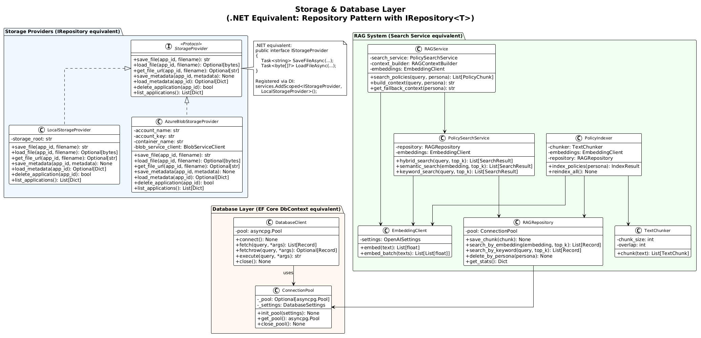

# 06 - Storage & Database

## Overview

WorkbenchIQ implements the **Repository Pattern** with pluggable storage backends and an optional PostgreSQL database for vector search (RAG).

> **.NET equivalent:** This maps directly to `IRepository<T>` registered via DI, where you can swap between `LocalFileRepository` and `AzureBlobRepository` by changing configuration — exactly like switching between `InMemoryDatabase` and `SqlServer` in Entity Framework Core.

## Class Diagram



---

## Storage Providers

### Interface (Protocol)

**File:** `app/storage_providers/base.py`

```python
@runtime_checkable
class StorageProvider(Protocol):
    def save_file(app_id: str, filename: str) -> str
    def load_file(app_id: str, filename: str) -> Optional[bytes]
    def get_file_url(app_id: str, filename: str) -> Optional[str]
    def save_metadata(app_id: str, metadata: Dict) -> None
    def load_metadata(app_id: str) -> Optional[Dict]
    def delete_application(app_id: str) -> bool
    def list_applications() -> List[Dict]
```

> **.NET equivalent:**
> ```csharp
> public interface IStorageProvider
> {
>     Task<string> SaveFileAsync(string appId, string filename);
>     Task<byte[]?> LoadFileAsync(string appId, string filename);
>     Task<string?> GetFileUrlAsync(string appId, string filename);
>     Task SaveMetadataAsync(string appId, Dictionary<string, object> metadata);
>     Task<Dictionary<string, object>?> LoadMetadataAsync(string appId);
>     Task<bool> DeleteApplicationAsync(string appId);
>     Task<List<Dictionary<string, object>>> ListApplicationsAsync();
> }
> ```

### Local Storage Provider

**File:** `app/storage_providers/local.py`

Stores data on the local filesystem:

```
data/applications/
├── {app_id_1}/
│   ├── metadata.json          ← Application metadata
│   ├── files/
│   │   ├── document1.pdf      ← Uploaded files
│   │   └── document2.pdf
│   └── cu_raw_result.json     ← Azure CU extraction results
├── {app_id_2}/
│   └── ...
```

### Azure Blob Storage Provider

**File:** `app/storage_providers/azure_blob.py`

Stores data in Azure Blob Storage:

```
workbenchiq-data (container)
├── applications/{app_id}/metadata.json
├── files/{app_id}/document1.pdf
└── cu_results/{app_id}/raw_result.json
```

**Features:**
- Automatic retry (3x)
- Connection timeout (30s)
- SAS URL generation for file access
- Automatic container creation

### Provider Selection

Selected via the `STORAGE_BACKEND` environment variable:

```python
# Equivalent to DI registration in Program.cs
if os.getenv("STORAGE_BACKEND") == "azure_blob":
    provider = AzureBlobStorageProvider(
        account_name=os.getenv("AZURE_STORAGE_ACCOUNT_NAME"),
        account_key=os.getenv("AZURE_STORAGE_ACCOUNT_KEY"),
        container_name=os.getenv("AZURE_STORAGE_CONTAINER_NAME")
    )
else:
    provider = LocalStorageProvider(
        storage_root=os.getenv("UW_APP_STORAGE_ROOT", "data")
    )
```

> **.NET equivalent:**
> ```csharp
> // Program.cs
> if (builder.Configuration["STORAGE_BACKEND"] == "azure_blob")
>     builder.Services.AddScoped<IStorageProvider, AzureBlobStorageProvider>();
> else
>     builder.Services.AddScoped<IStorageProvider, LocalStorageProvider>();
> ```

---

## Database Layer

### Overview

The database is **optional** and only used when RAG (Retrieval-Augmented Generation) is enabled. When disabled, all data is stored as JSON files.

| Backend | Use Case | Configuration |
|---------|---------|---------------|
| `json` (default) | Development, simple deployments | `DATABASE_BACKEND=json` |
| `postgresql` | RAG-enabled deployments with vector search | `DATABASE_BACKEND=postgresql` |

### Connection Pooling

**File:** `app/database/pool.py`

Uses `asyncpg` (async PostgreSQL driver) with connection pooling:

```python
# Equivalent to EF Core's DbContext with pooling
class ConnectionPool:
    _pool: Optional[asyncpg.Pool] = None

    async def init_pool(settings: DatabaseSettings):
        _pool = await asyncpg.create_pool(
            host=settings.host,
            port=settings.port,
            database=settings.database,
            user=settings.user,
            password=settings.password,
            ssl=settings.ssl_mode,
            min_size=2,
            max_size=10
        )
```

> **.NET equivalent:**
> ```csharp
> builder.Services.AddDbContext<AppDbContext>(options =>
>     options.UseNpgsql(connectionString, o =>
>         o.UseVector()));  // pgvector extension
> ```

### Database Client

**File:** `app/database/client.py`

```python
class DatabaseClient:
    async def fetch(query: str, *args) -> List[Record]:
        async with pool.acquire() as conn:
            return await conn.fetch(query, *args)

    async def execute(query: str, *args) -> str:
        async with pool.acquire() as conn:
            return await conn.execute(query, *args)
```

> **Note:** WorkbenchIQ uses raw SQL via `asyncpg`, not an ORM. This is like using Dapper instead of Entity Framework Core.

---

## RAG System (Retrieval-Augmented Generation)

### Purpose

RAG improves chat accuracy by retrieving only the most relevant policy sections rather than injecting ALL policies into the LLM context (which can exceed token limits).

### Architecture

```
User Question
    ↓
Embed question → vector (1536 dimensions)
    ↓
Hybrid Search
├── Semantic Search (pgvector HNSW index)
│   → Cosine similarity on embeddings
└── Keyword Search (pg_trgm GIN index)
    → Trigram matching on text
    ↓
Top-K relevant policy chunks
    ↓
RAG Context Builder
    → Assemble context within token budget
    ↓
Inject into LLM prompt
```

### Key Components

| Component | File | Purpose |
|-----------|------|---------|
| `RAGService` | `app/rag/service.py` | Unified interface |
| `PolicySearchService` | `app/rag/search.py` | Hybrid search |
| `EmbeddingClient` | `app/rag/embeddings.py` | Azure OpenAI embeddings |
| `RAGContextBuilder` | `app/rag/context.py` | Token-aware context assembly |
| `RAGRepository` | `app/rag/repository.py` | PostgreSQL CRUD |
| `PolicyIndexer` | `app/rag/indexer.py` | Policy chunking & indexing |
| `TextChunker` | `app/rag/chunker.py` | Text chunking (500 tokens, 50 overlap) |

### Indexing Pipeline

```
Policy JSON file
    ↓
TextChunker (500 tokens per chunk, 50 token overlap)
    ↓
EmbeddingClient (text-embedding-3-small → 1536-dim vectors)
    ↓
RAGRepository.save_chunk()
    ↓
PostgreSQL table with:
  - id (UUID)
  - persona (VARCHAR)
  - policy_id (VARCHAR)
  - chunk_text (TEXT)
  - embedding (vector(1536))  ← pgvector type
  - metadata (JSONB)
```

### Search Strategy

**Hybrid search** combines two approaches:

1. **Semantic search:** Embed the query, find nearest vectors via cosine similarity (pgvector HNSW index)
2. **Keyword search:** Trigram matching on chunk text (pg_trgm GIN index)
3. **Merge & rank:** Combine results, deduplicate, rank by relevance

### Fallback Strategy

If RAG is disabled or PostgreSQL is unavailable, the system falls back to loading ALL policies from the JSON file and injecting them directly into the LLM prompt. This works for smaller policy sets but can exceed token limits for large ones.

### Configuration

```bash
# Enable RAG
RAG_ENABLED=true
RAG_TOP_K=5                        # Number of chunks to retrieve
RAG_SIMILARITY_THRESHOLD=0.5       # Minimum similarity score

# Embedding model
EMBEDDING_MODEL=text-embedding-3-small
EMBEDDING_DIMENSIONS=1536

# PostgreSQL (required for RAG)
DATABASE_BACKEND=postgresql
POSTGRESQL_HOST=your-server.postgres.database.azure.com
POSTGRESQL_DATABASE=workbenchiq
```

> **.NET equivalent:** RAG is similar to using Azure AI Search with vector search, or a custom implementation using `Pgvector.EntityFrameworkCore` for EF Core + PostgreSQL vector queries.
