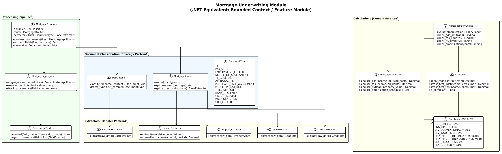

# 08 - Domain Modules

## Overview

WorkbenchIQ has three specialized domain modules, each implementing a **bounded context** pattern (DDD terminology). In .NET terms, these are like separate **Feature Modules** or **Areas** with their own controllers, services, and domain models.

---

## Automotive Claims Module

**Directory:** `app/claims/`

This module processes automotive insurance claims with **multimodal** support (documents, images, videos).

### Architecture

```
app/claims/
├── api.py         ← FastAPI router (ClaimsController)
├── engine.py      ← Policy evaluation engine
├── policies.py    ← Claims policy loader
├── search.py      ← Policy search service
├── indexer.py     ← Policy chunk indexer
└── chunker.py     ← Text chunking

app/multimodal/
├── processor.py       ← Parallel multimodal orchestration
├── repository.py      ← Damage area storage
├── mime_detector.py   ← Content type detection
├── router.py          ← Media type routing
├── aggregator.py      ← Result aggregation
└── extractors/
    ├── document_extractor.py  ← PDF field extraction
    ├── image_extractor.py     ← Damage area detection
    └── video_extractor.py     ← Keyframe extraction
```

### Processing Pipeline

```
Claim Upload
├── For each file:
│   ├── detect_media_type() → document | image | video
│   └── Route to appropriate extractor
│
├── Document (PDF):
│   └── Azure CU → claimant_name, date, location, description
│
├── Image (JPG/PNG):
│   └── Azure CU (image analyzer) → damage_areas[]
│       Each: { region, severity, bounding_box }
│
├── Video (MP4):
│   └── Azure CU (video analyzer) → keyframes[]
│       Each: { timestamp, description, frame_data }
│
├── Aggregate results
│
└── Policy Engine evaluation:
    ├── Damage assessment
    ├── Liability determination
    ├── Fraud detection (red flags)
    ├── Coverage verification
    └── Payout estimation
```

### Key Data Structures

```python
@dataclass
class DamageArea:
    region: str          # "front_bumper", "driver_door"
    severity: str        # "minor", "moderate", "major", "total_loss"
    description: str     # Free-text description
    bounding_box: List   # [x, y, width, height] on image
    confidence: float    # 0.0 - 1.0

@dataclass
class ClaimAssessment:
    damage_areas: List[DamageArea]
    total_severity: str
    liability: str
    fraud_score: float
    coverage_eligible: bool
    payout_estimate: float
    policy_citations: List[PolicyCitation]
```

### .NET Equivalent

```csharp
// Claims bounded context
namespace WorkbenchIQ.Claims
{
    // Controller
    [ApiController]
    [Route("api/claims")]
    public class ClaimsController : ControllerBase
    {
        private readonly IMultimodalProcessor _processor;
        private readonly IClaimsPolicyEngine _engine;

        [HttpPost]
        public async Task<IActionResult> Submit([FromForm] ClaimSubmission model)
        {
            var results = await _processor.ProcessFilesAsync(model.Files);
            var assessment = await _engine.EvaluateAsync(results);
            return Ok(assessment);
        }
    }

    // Strategy pattern for extractors
    public interface IMediaExtractor
    {
        Task<ExtractionResult> ExtractAsync(IFormFile file);
    }

    public class DocumentExtractor : IMediaExtractor { }
    public class ImageExtractor : IMediaExtractor { }
    public class VideoExtractor : IMediaExtractor { }
}
```

---

## Mortgage Underwriting Module

**Directory:** `app/mortgage/`

This module handles Canadian mortgage underwriting following **OSFI B-20 guidelines** (Office of the Superintendent of Financial Institutions).

### Class Diagram



### Architecture

```
app/mortgage/
├── processor.py       ← Document processing & normalization
├── router.py          ← Document type classification
├── calculator.py      ← GDS/TDS ratio calculations
├── aggregator.py      ← Multi-document aggregation
├── policy_engine.py   ← Mortgage policy evaluation
├── provenance.py      ← Field source tracking
├── stress_test.py     ← OSFI B-20 stress testing
├── doc_classifier.py  ← Document type detection
├── constants.py       ← Regulatory thresholds
├── risk_analysis.py   ← Risk scoring
├── storage.py         ← Mortgage-specific storage
├── extractors/        ← Specialized field extractors
│   ├── borrower_extractor.py
│   ├── income_extractor.py
│   ├── loan_extractor.py
│   ├── property_extractor.py
│   └── credit_extractor.py
└── rag/               ← Mortgage-specific RAG
```

### Document Types

The mortgage module classifies and processes 13+ document types:

| Category | Document Types |
|----------|---------------|
| Income | T4, Pay Stub, Employment Letter, Notice of Assessment, T1 General |
| Property | Appraisal Report, Purchase/Sale Agreement, Property Tax Bill, Title Search |
| Financial | Bank Statement, Credit Report, RRSP Statement, Gift Letter |

### OSFI B-20 Regulatory Thresholds

```python
# app/mortgage/constants.py
GDS_LIMIT = 0.39               # Gross Debt Service ratio max: 39%
TDS_LIMIT = 0.44               # Total Debt Service ratio max: 44%
LTV_CONVENTIONAL = 0.80        # Loan-to-Value for conventional: 80%
LTV_INSURED = 0.95             # Loan-to-Value for insured: 95%
MAX_AMORT_INSURED = 25          # Max amortization (insured): 25 years
MAX_AMORT_UNINSURED = 30        # Max amortization (uninsured): 30 years
MQR_FLOOR = 0.0525             # Minimum Qualifying Rate floor: 5.25%
MQR_BUFFER = 0.02              # MQR buffer above contract rate: 2.0%
```

### Processing Pipeline

```
1. Document Upload
   ├── Classify each document (T4, Appraisal, Pay Stub, etc.)
   └── Route to appropriate extractor

2. Field Extraction (per document)
   ├── BorrowerExtractor → name, DOB, SIN, employment
   ├── IncomeExtractor → gross income, employment income, other income
   ├── PropertyExtractor → address, appraised value, property type
   ├── LoanExtractor → amount, rate, amortization, term
   └── CreditExtractor → credit score, liabilities, payment history

3. Aggregation
   ├── Consolidate fields from multiple documents
   ├── Resolve conflicts (e.g., income from T4 vs pay stub)
   └── Track provenance (which field came from which document + page)

4. Calculations
   ├── GDS = (mortgage + taxes + heating) / gross income
   ├── TDS = (GDS costs + other debts) / gross income
   ├── LTV = loan amount / appraised value
   └── Stress Test: MQR = max(contract_rate + 2%, 5.25%)

5. Policy Evaluation
   ├── Check GDS ≤ 39%
   ├── Check TDS ≤ 44%
   ├── Check LTV limits
   ├── Check amortization limits
   ├── Stress test with MQR
   └── Generate findings with pass/fail/warning
```

### Provenance Tracking

Every extracted field records where it came from:

```python
@dataclass
class FieldSource:
    field_name: str          # "gross_income"
    value: Any               # 85000.00
    source_document: str     # "2024-T4.pdf"
    page_number: int         # 1
    confidence: str          # "High"
    extraction_method: str   # "azure_cu" or "llm_inference"
```

This enables auditable decision trails — critical for regulatory compliance.

---

## Multimodal Processing Module

**Directory:** `app/multimodal/`

This shared module handles image and video processing for the claims system.

### Media Type Routing

```python
def detect_media_type(filename: str) -> str:
    extension = filename.rsplit('.', 1)[-1].lower()
    if extension in ('pdf', 'doc', 'docx'):
        return 'document'
    elif extension in ('jpg', 'jpeg', 'png', 'gif', 'bmp', 'tiff'):
        return 'image'
    elif extension in ('mp4', 'avi', 'mov', 'mkv', 'wmv'):
        return 'video'
    return 'unknown'
```

### Parallel Processing

Files are processed in parallel using Python's `ThreadPoolExecutor`:

```python
# Simplified parallel processing
with ThreadPoolExecutor(max_workers=4) as executor:
    futures = {
        executor.submit(process_single, file): file
        for file in files
    }
    results = []
    for future in as_completed(futures):
        results.append(future.result())
```

> **.NET equivalent:**
> ```csharp
> var tasks = files.Select(f => ProcessSingleAsync(f));
> var results = await Task.WhenAll(tasks);
> ```

### Processing Results

```python
@dataclass
class ProcessingResult:
    file_id: str
    filename: str
    media_type: str              # 'document', 'image', 'video'
    status: ProcessingStatus     # PENDING, PROCESSING, COMPLETED, FAILED
    analyzer_id: Optional[str]
    raw_result: Optional[Dict]
    extracted_data: Any          # DocumentFields | List[DamageArea] | VideoData
    error_message: Optional[str]
    processing_time_seconds: float
    retry_count: int
```

---

## Glossary System

**File:** `app/glossary.py`

The glossary system manages domain terminology per persona:

### Features

- **Full CRUD** for terms and categories
- **Persona-specific** glossaries
- **Search** by term, abbreviation, or category
- **Prompt injection** — glossary terms are formatted and injected into LLM prompts to ensure consistent terminology usage

### Data Structure

```json
{
  "version": "1.0",
  "personas": {
    "underwriting": {
      "name": "Life Insurance Underwriting",
      "categories": [
        {
          "id": "medical_terms",
          "name": "Medical Terms",
          "terms": [
            {
              "abbreviation": "BP",
              "meaning": "Blood Pressure",
              "context": "cardiovascular assessment",
              "examples": ["SBP > 140 mmHg indicates hypertension"]
            }
          ]
        }
      ]
    }
  }
}
```

### API Endpoints

```
GET    /api/glossary                   → List all glossaries
GET    /api/glossary/{persona}         → Get persona glossary
POST   /api/glossary/{persona}/terms   → Add term
PUT    /api/glossary/{persona}/terms/{abbr}  → Update term
DELETE /api/glossary/{persona}/terms/{abbr}  → Delete term
POST   /api/glossary/{persona}/categories    → Add category
```

---

## Policy Management

**File:** `app/underwriting_policies.py`

### Policy Structure

```python
@dataclass
class UnderwritingPolicy:
    id: str                  # "CVD-BP-001"
    category: str            # "Cardiovascular"
    subcategory: str         # "Blood Pressure"
    name: str                # "Hypertension Risk Assessment"
    description: str
    criteria: List[PolicyCriteria]   # Evaluation rules
    modifying_factors: List[Dict]    # Adjustments
    references: List[str]            # Medical references
```

### Policy Files

| File | Persona | Content |
|------|---------|---------|
| `life-health-underwriting-policies.json` | Underwriting | Medical risk policies |
| `life-health-claims-policies.json` | Life/Health Claims | Claims processing rules |
| `automotive-claims-policies.json` | Automotive Claims | Damage/liability policies |
| `property-casualty-claims-policies.json` | P&C Claims | Property/casualty rules |
| `mortgage-underwriting-policies.json` | Mortgage | OSFI B-20 guidelines |

### Policy Evaluation Flow

1. Load all policies for the current persona
2. Format policies into LLM-readable text
3. Send to Azure OpenAI with application data
4. LLM evaluates each applicable policy
5. Returns findings with policy ID citations

```json
{
  "findings": [
    {
      "policy_id": "CVD-BP-001",
      "category": "Cardiovascular",
      "finding": "Elevated blood pressure (SBP 142 mmHg)",
      "severity": "moderate",
      "action": "Request additional medical records",
      "rationale": "Stage 1 hypertension per AHA guidelines"
    }
  ],
  "recommendation": "Defer",
  "rationale": "Multiple moderate risk factors require further investigation"
}
```
